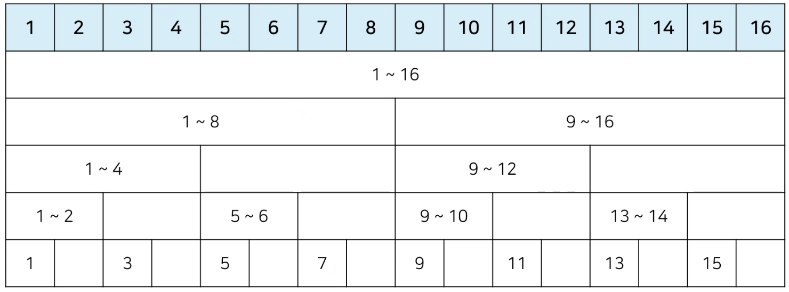

# 바이너리 인덱스 트리


## 1. 문제

1. 데이터의 업데이트가 가능한 상황에서의 구간 합 (Interval Sum) 문제

- [문제 링크](https://www.acmicpc.net/problem/2042)


## 2. 바이너리 인덱스 트리란?

- 2진법 인덱스 구조를 활용해 구간 합 문제를 효과적으로 해결해 줄 수 있는 자료구조

- 펜윅 트리(fenwick tree)라고도 한다.

- 0이 아닌 마지막 비트를 찾는 방법

  - 특정한 숫자 K의 0이 아닌 마지막 비트를 찾기 위해서 K & -K를 계산하면 된다.

- K & -K 계산 (파이썬)

  - ```python
    n = 8
    
    for i in range(n+1):
        print(i, "의 마지막 비트:", (i & -i))
    ```


## 3. 바이너리 인덱스 트리 구조 만들기

- 0이 아닌 마지막 비트 = 내가 저장하고 있는 값들의 개수



- 특정 값을 변경할 때 : 0이 아닌 마지막 비트만큼 더하면서 구간들의 값을 변경
- 1부터 N까지의 합(누적 합) 구하기 : 0이 아닌 마지막 비트만큼 빼면서 구간들의 값의 합 계산


## 4. 코드 구현 (파이썬)

```python
import sys

input = sys.stdin.readline

# 데이터 개수(n), 변경 횟수(m), 구간 합 계산 횟수(k)
n, m, k = map(int, input().split())

# 전체 데이터의 개수는 최대 1,000,000개
arr = [0] * (n + 1)
tree = [0] * (n + 1)

# i번째 수까지의 누적 합을 계산하는 함수
def prefix_sum(i):
    result = 0
    while i > 0:
        result += tree(i)
        # 0이 아닌 마지막 비트만큼 빼가면서 이동
        i -= (i & -i)
    return result

# i번째 수를 dif만큼 더하는 함수
def update(i, dif):
    while i <= n:
        tree[i] += dif
        i += (i & -i)

# start부터 end까지의 구간 합을 계산하는 함수
def interval_sum(start, end):
    return prefix_sum(end) - prefix_sum(start - i)

for i in range(1, n + 1):
    x = int(input())
    arr[i] = x
    update(i, x)

for i in range(m + k):
    a, b, c = map(int, input().split())
    # 업데이트(update) 연산인 경우
    if a == 1:
        update(b, c - arr[b]) # 바뀐 크기(dif)만큼 적용
        arr[b] = c
    # 구간 합 (interval sum) 연산인 경우
    else:
		print(interval_sum(b, c))
```

