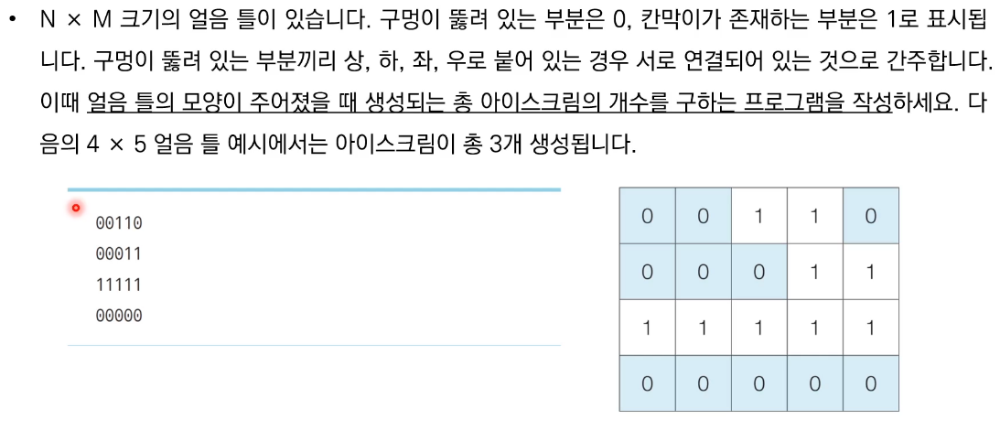
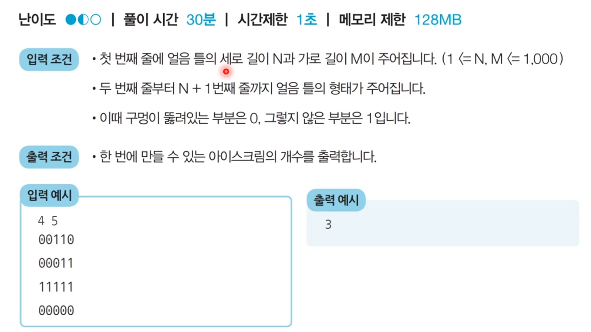
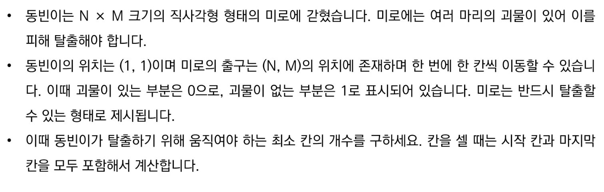
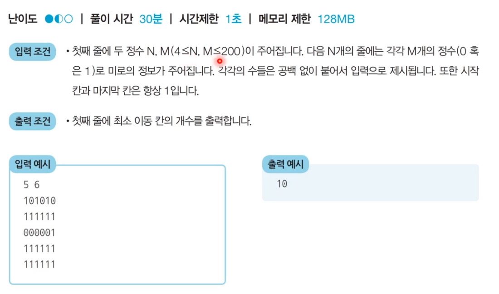

# DFS, BFS 기초 문제


## 1. DFS 문제 풀이


### 1) 문제 : 음료수 얼려 먹기: 문제 설명






### 2) 문제 해결 아이디어

- DFS, BFS로 해결할 수 있다.
- 얼음을 얼릴 수 있는 공간이 상, 하, 좌, 우로 연결되어있다고 표현할 수 있으므로 그래프 형태로 모델링 할 수 있습니다.

- 해결 방법
  1. 특정한 지점의 주변 상, 하, 좌, 우를 살펴본 뒤에 주변 지점 중에서 값이 '0'이면서 아직 방문하지 않은 지점이 있다면 해당 지점을 방문.
  2. 방문한 지점에서 다시 상, 하, 좌, 우를 살펴보면서 방문을 진행하는 과정을 반복하면, 연결된 모든 지점을 방문할 수 있다.
  3. 모든 노드에 대해서 1~2번의 과정을 반복하며, 방문하지 않은 지점의 수를 카운트한다.


### 3) 문제 해결 코드(파이썬)

```python
# DFS로 특정 노드를 방문하고 연결된 모든 노드들도 방문
def dfs(x, y):
    # 주어진 범위를 벗어나는 경우에는 즉시 종료
    if x <= -1 or x >= n or y <= -1 or y >= m:
        return False
    # 현재 노드를 아직 방문하지 않았다면
    if graph[x][y] == 0:
        # 해당 노드를 방문 처리
        graph[x][y] = 1
        # 상, 하, 좌, 우의 위치들도 모두 재귀적으로 호출
        dfs(x - 1, y)
        dfs(x, y - 1)
        dfs(x + 1, y)
        dfs(x, y + 1)
        return True
    return False

# N, M을 공백을 기준으로 구분하여 입력 받기
n, m = map(int, input().split())

# 2차원 리스트의 맵 정보 입력 받기
graph = []
for i in range(n):
    graph.append(list(map(int, input())))

# 모든 노드(위치)에 대하여 음료수 채우기
result = 0
for i in range(n):
    for j in range(m):
        # 현재 위치에서 DFS 수행
        if dfs(i, j) == True:
            result += 1

print(result) # 정답 출력
```


## 2. BFS 문제 풀이


### 1) 문제 : 미로 탈출






### 2) 문제 해결 아이디어

- BFS는 시작 지점에서 가까운 노드부터 차례대로 그래프의 모든 노드를 탐색한다.
- 상, 하, 좌, 우로 연결된 모든 노드로의 거리가 1로 동일하다.
  - 따라서 (1, 1) 지점부터 BFS를 수행하여 모든 노드의 최단 거리 값을 기록하면 해결할 수 있다.


### 3) 문제 해결 코드(파이썬)

```python
from collections import deque

# BFS 메서드 구현
def bfs(x, y):
    # 큐(Queue) 구현을 위해 deque 라이브러리 사용
    queue = deque()
    queue.append((x, y))
    # 큐가 빌 때까지 반복하기
    while queue:
        x, y = queue.popleft()
        # 현재 위치에서 4가지 방향으로의 위치 확인
        for i in range(4):
            nx = x + dx[i]
            ny = y + dy[i]
            # 미로 찾기 공간을 벗어난 경우 무시
            if nx < 0 or nx >= n or ny < 0 or ny >= m:
                continue
            # 벽인 경우 무시
            if graph[nx][ny] == 0:
                continue
            # 해당 노드를 처음 방문하는 경우에만 최단 거리 기록
            if graph[nx][ny] == 1:
                graph[nx][ny] = graph[nx][ny] + 1
                queue.append((nx, ny))
        # 가장 오른쪽 아래까지의 최단 거리 반환
        return graph[n - 1][m - 1]

# N, M을 공백을 기준으로 구분하여 입력 받기
n, m = map(int, input().split())
# 2차원 리스트의 맵 정보 입력 받기
graph = []
for i in range(n):
    graph.append(list(map(int, input())))

# 이동할 네 가지 방향 정의(상, 하, 좌, 우)
dx = [-1, 1, 0, 0]
dy = [0, 0, -1, 1]

# BFS를 수행한 결과 출력
print(bfs(0, 0))
```

