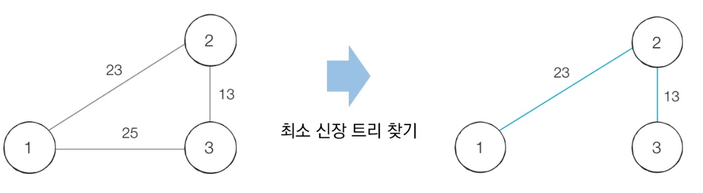

# 크루스칼 알고리즘 : 최소 신장 트리를 찾는 알고리즘


## 1. 신장 트리

- 그래프에서 모든 노드를 포함하면서 사이클이 존재하지 않는 부분 그래프를 의미한다.
  - 모든 노드가 포함되어 서로 연결되면서 사이클이 존재하지 않는다는 조건은 트리의 조건.


## 2. 최소 신장 트리

- 최소한의 비용으로 구성되는 신장 트리




## 3. 크루스칼 알고리즘

- 대표적인 최소 신장 트리 알고리즘
- 그리디 알고리즘으로 분류됨
- 동작
  1. 간선 데이터를 비용에 따라 오름차순으로 정렬한다.
  2. 간선을 하나씩 확인하며 현재의 간선이 사이클을 발생시키는지 확인.
     1. 사이클이 발생하지 않는 경우 최소 신장 트리에 포함.
     2. 사이클이 발생하는 경우 최소 신장 트리에 포함시키지 않음.
  3. 모든 간선에 대하여 2번의 과정을 반복한다.


## 4. 크루스칼 알고리즘 코드 구현(파이썬)

```python
# 특정 원소가 속한 집합을 찾기
def find_parent(parent, x):
    # 루트 노드가 아니라면, 루트 노드를 찾을 때까지 재귀적으로 호출
    if parent[x] != x:
        parent[x] = find_parent(parent, parent[x])
    return parent[x]

# 두 원소가 속한 집합을 합치기
def union_parent(parent, a, b):
    a = find_parent(parent, a)
    b = find_parent(parent, b)
    if a < b:
        parent[b] = a
    else:
        parent[a] = b

# 노드의 개수와 간선(Union 연산)의 개수 입력 받기
v, e = map(int, input().split())
parent = [0] * (v + 1) # 부모 테이블 초기화하기

# 모든 간선을 담을 리스트와, 최종 비용을 담을 변수
edges = []
result = 0

# 부모 테이블상에서, 부모를 자기 자신으로 초기화
for i in range(1, v + 1):
    parent[i] = i

# 모든 간선에 대한 정보를 입력 받기
for _ in range(e):
    a, b, cost = map(int, input().split())
    # 비용순으로 정렬하기 위해서 튜플의 첫 번째 원소를 비용으로 설정
    edges.append((cost, a, b))

# 간선을 비용순으로 정렬
edges.sort()

# 간선을 하나씩 확인하며
for edge in edges:
    cost, a, b = edge
    # 사이클이 발생하지 않는 경우에만 집합에 포함
    if find_parent(parent, a) != find_parent(parent, b):
        union_parent(parent, a, b)
        result += cost

print(result)
```

- 성능 분석
  - 간선의 개수가 E개 일 때, O(ElogE)의 시간 복잡도를 가진다.
  - 간선의 정렬을 수행하는 부분에서 걸리는 시간이 O(ElogE)이다.