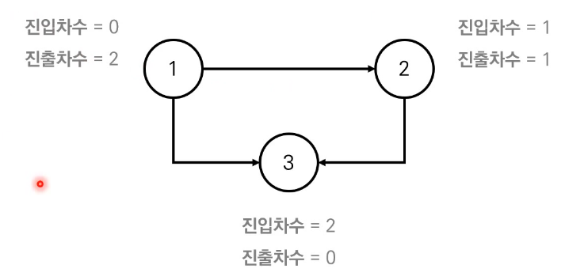

# 위상 정렬: 방향성을 거스르지 않도록 전체 노드를 나열하기


## 1. 위상 정렬이란?

- **사이클이 없는 방향 그래프**의 모든 노드를 방향성에 거스르지 않도록 순서대로 나열하는 것.
- ex) 선수과목을 고려한 학습 순서 결정


## 2. 진입차수와 진출차수

- 진입차수(Indegree) : 특정한 노드로 들어오는 간선의 개수
- 진출차수(Outdegree) : 특정한 노드에서 나가는 간선의 개수




## 3. 위상 정렬 알고리즘

- 위상 정렬 알고리즘은 DFS 또는 Queue를 통해서 구현할 수 있다.

- 알고리즘 동작 과정
  1. 진입차수가 0인 모든 노드를 큐에 넣는다.
  2. 큐가 빌 때까지 다음의 과정을 반복한다.
     1. 큐에서 원소를 꺼내 해당 노드에서 나가는 간선을 그래프에서 제거한다.
     2. 새롭게 진입차수가 0이 된 노드를 큐에 넣는다.
  3. 결과적으로 각 노드가 큐에 들어온 순서가 위상 정렬을 수행한 결과와 같다.


## 4. 위상 정렬 특징

- 위상 정렬은 DAG에 대해서만 수행 가능하다.
  - DAG (Direct Acyclic Graph): 순환하지 않는 방향 그래프
- 위상 정렬에는 여러 가지 답이 존재할 수 있다.
  - 한 단계에서 큐에 새롭게 들어가는 원소가 2개 이상인 경우 여러 가지 답이 존재한다.
- !!모든 원소를 방문하기 전에 큐가 빈다면 사이클이 존재한다고 판단할 수 있다.
  - 사이클에 포함된 원소 중에서 어떠한 원소도 큐에 들어가지 못한다.
- 스택을 활용한 DFS를 이용해 위상 정렬을 수행할 수 있다.


## 5. 위상 정렬 알고리즘 구현 코드 (파이썬)

```python
from collections import deque # 큐 이용

# 노드의 개수와 간선의 개수를 입력 받기
v, e = map(int, input().split())
# 모든 노드에 대한 진입차수는 0으로 초기화
indegree = [0] * (v + 1)
# 각 노드에 연결된 간선 정보를 담기 위한 연결 리스트 초기화
graph = [[] for i in range(v + 1)]

# 방향 그래프의 모든 간선 정보를 입력 받기
for _ in range(e):
    a, b = map(int, input().split())
    graph[a].append(b) # 정점 A에서 B로 이동 가능
    # 진입 차수를 1 증가
    indegree[b] += 1

# 위상 정렬 함수
def topology_sort():
    result = [] # 알고리즘 수행 결과를 담을 리스트
    q = deque() # 큐 기능을 위한 deque 라이브러리 사용

    # 처음 시작할 때는 진입차수가 0인 노드를 큐에 삽입
    for i in range(1, v + 1):
        if indegree[i] == 0:
            q.append(i)

    # 큐가 빌 때까지 반복
    while q:
        # 큐에서 원소 꺼내기
        now = q.popleft()
        result.append(now)
        # 해당 원소와 연결된 노드들의 진입차수에서 1 빼기
        for i in graph[now]:
            indegree[i] -= 1
            # 새롭게 진입차수가 0이 되는 노드를 큐에 삽입
            if indegree[i] == 0:
                q.append(i)

    # 위상 정렬을 수행한 결과 출력
    for i in result:
        print(i, end=' ')

topology_sort()
```


## 6. 위상 정렬 알고리즘 성능 분석

- 위상 정렬을 위해 차례대로 모든 노드를 확인하며 각 노드에서 나가는 간선을 차례대로 제거해야 한다.
  - 따라서 위상 정렬 알고리즘의 시간 복잡도는 O(V + E)이다.