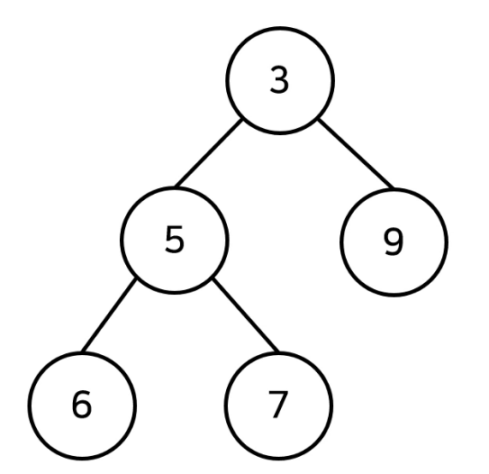

# 우선순위 큐(Priority Queue)


## 1. 우선순위 큐란?

- 우선순위 큐는 우선순위가 가장 높은 데이터를 가장 먼저 삭제하는 자료구조이다.


## 2. 구현 방법

1. 리스트를 이용
   - 시간 복잡도
     - 삽입 : O(1)
     - 삭제 : O(n)
2. 힙(heap)을 이용
   - 시간 복잡도
     - 삽입 : O(logN)
     - 삭제 : O(logN)
   - 단순히 N개의 데이터를 힙에 넣었다가 꺼내는 작업은 정렬과 동일(시간복잡도 : O(NlogN))


## 3. 힙(Heap)의 특징

- 완전 이진 트리 자료구조의 일종
- 힙에서는 항상 루트 노드(root node)를 제거한다.
- 최소 힙(min heap)
  - 루트 노드가 가장 작은 값을 가짐.
  - 값이 작은 데이터가 우선적으로 제거



- 최대 힙(max heap)
  - 루트 노드가 가장 큰 값을 가짐
  - 값이 큰 데이터가 우선적으로 제거


## 4. 완전 이진 트리 (Complete Binary Tree)

- 루트 노드부터 시작하여 왼쪽 자식 노드, 오른쪽 자식 노드 순서대로 데이터가 차례대로 삽입되는 트리(tree)


## 5. 최소 힙 구성 함수 : Min-Heapify()

- 상향식

  - 부모 노드로 거슬러 올라가며, 부모보다 자신의 값이 더 작은 경우에 위치를 교체한다.

- 시간 복잡도

  - 새로운 원소가 삽입되었을 때 *O(logN)*의 시간 복잡도로 힙 성질을 유지할 수 있다.

  - 원소가 제거되었을 때 *O(logN)*의 시간 복잡도로 힙 성질을 유지할 수 있다.
    - 가장 마지막 노드가 루트 노드의 위치에 오도록 한다.
    - 이후에 루트 노드에서부터 하향식으로(더 작은 자식 노드로) Heapify()를 진행한다.


## 6. 코드 예시(파이썬)

```python
import sys
import heapq

input = sys.stdin.readline

def heapsort(iterable):
    h = []
    result = []
    # 모든 원소를 차례대로 힙에 삽입
    for value in iterable:
        heapq.heappush(j, value)
    # 힙에 삽입된 모든 원소를 차례대로 꺼내어 담기
    for i range(len(h)):
        result.append(heapq.heappop(h))
    return result

n = int(input())
arr = []

for i in range(n):
    arr.append(int(input()))
    
res = heapsort(arr)

# 오름차순으로 정렬된 원소가 출력된다.
for i in range(n):
    print(res[i])
```

- 기본적으로 min-heap()