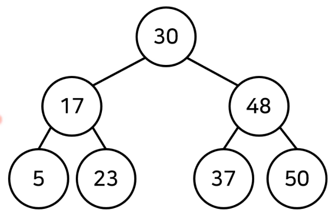

# 트리(Tree)


## 1. 트리(Tree) 자료구조란?

- 트리는 가계도와 같은 계층적인 구조를 표현할 때 사용할 수 있는 자료구조
- 트리에 관한 용어
  - 루트 노드(root node) : 부모가 없는 최상위 노드
  - 단말 노드(leaf node) : 자식이 없는 노드
  - 크기(size) : 트리에 포함된 모든 노드의 개수
  - 깊이(depth) : 루트 노드부터의 거리
  - 높이(height) : 깊이 중 최댓값
  - 차수(degree) : 각 노드의 (자식 방향) 간선 개수
- 기본적으로 트리의 크기가 N일 때, 간선의 개수는 N - 1 개이다.


## 2. 이진 탐색 트리(Binary Search Tree)

- 이진 탐색이 동작할 수 있도록 고안된 효율적인 탐색이 가능한 자료구조의 일종
- 이진 탐색 트리의 특징 : 왼쪽 자식 노드 < 부모 노드 < 오른쪽 자식 노드
  - 부모 노드보다 왼쪽 자식 노드가 작다.
  - 부모 노드보다 오른쪽 자식 노드가 크다.




### 1) 이진 탐색 트리의 데이터 조회

1. 루트 노드부터 방문하여 탐색을 진행한다.
2. 찾는 원소가 루트 노드보다 크면 오른쪽, 아니면 왼쪽으로 진행
3. 이동 후 현재의 노드의 값과 비교 - 원소를 찾을 때까지 2번을 반복한다.

단, 이진 탐색트리가 이상적인 구조여야 빠른 탐색이 가능하다.(왼쪽과 오른쪽의 균일한 분포)


## 3. 트리의 순회(Tree Traversal)

- 트리 자료구조에 포함된 노드를 특정한 방법으로 한 번씩 방문하는 방법
- 순회 방법
  - 전위 순회(pre-order traverse) : 루트 먼저 방문
  - 중위 순회(in-order traverse) : 왼쪽 자식을 방문한 뒤에 루트 방문
  - 후위 순회(post-order traverse) : 오른쪽 자식을 방문한 뒤에 루트를 방문


## 4. 트리 순회 코드 구현(파이썬)

```python
class Node:
    def __init__(self, data, left_node, right_node):
        self.data = data
        self.left_node = left_node
        self.right_node = right_node
        
# 전위 순회
def pre_order(node):
    print(node.data, end=' ')
    if node.left_node != None:
        pre_order(tree[node.left_node])
    if node.right_node != None:
        pre_order(tree[node.right_node])
        
# 중위 순회
def in_order(node):
    print(node.data, end=' ')
    if node.left_node != None:
        in_order(tree[node.left_node])
    if node.right_node != None:
        in_order(tree[node.right_node])

# 후위 순회
def post_order(node):
    print(node.data, end=' ')
    if node.left_node != None:
        post_order(tree[node.left_node])
    if node.right_node != None:
        post_order(tree[node.right_node])

n = int(input()) # 노드의 개수
tree = {}

for i in range(n):
    data, left_node, right_node = input().split()
    if left_node = "None":
        left_node = None
    if right_node == "None":
        right_node = None
    tree[data] = Node(data, left_node, right_node)

pre_order(tree['A'])
print()
in_order(tree['A'])
print()
post_order(tree['A'])
```

