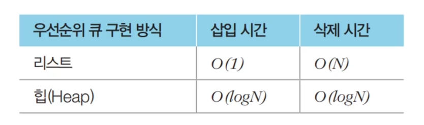

# 힙(Heap)

- 우선순위 큐를 구현하기 위해 사용하는 자료구조 중 하나
- 최소 힙과 최대 힙이 있다.
- 다익스트라 최단 경로 알고리즘을 포함하여 다양한 알고리즘에 사용된다.

- 시간 복잡도

  


### 1) 최소 힙 구현 코드(파이썬)

```python
import heapq

# 오름차순 힙 정렬(Heap Sort)
def heapsort(iterable):
    h = []
    result = []
    # 모든 원소를 차례대로 힙에 삽입
    for value in iterable:
        heapq.heappush(h, value)
    # 힙에 삽입된 모든 원소를 차례대로 꺼내어 담기
    for i in range(len(h)):
        result.append(heapq.heappop(h))
    return result

result = heapsort([1, 3, 5, 7, 9, 2, 4, 8, 0])
print(result)
```

<실행결과>

[0, 1, 2, 3, 4, 5, 7, 8, 9]


### 2) 최대 힙 구현 코드

```python
import heapq

# 내림차순 힙 정렬(Heap Sort)
def heapsort(iterable):
    h = []
    result = []
    # 모든 원소를 차례대로 힙에 삽입
    for value in iterable:
        heapq.heappush(h, -value)
    # 힙에 삽입된 모든 원소를 차례대로 꺼내어 담기
    for i in range(len(h)):
        result.append(-heapq.heappop(h))
    return result

result = heapsort([1, 3, 5, 7, 9, 2, 4, 8, 0])
print(result)
```

<실행결과>

[9, 8, 7, 5, 4, 3, 2, 1, 0]

