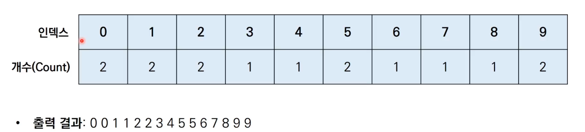

# 정렬 - 2


## 1. 퀵 정렬

- 기준 데이터를 설정하고 그 기준보다 큰 데이터와 작은 데이터의 위치를 바꾸는 방법
- 병합 정렬과 더불어 대부분의 프로그래밍 언어의 정렬 라이브러리의 근간이 되는 알고리즘
- 가장 기본적인 퀵 정렬은 첫 번째 데이터를 기준 데이터(Pivot)로 설정

- 시간 복잡도 : O(NlogN)
  - 최악의 경우에는 O(N**2)의 시간 복잡도를 가진다.
  - 이미 정렬된 배열에 대해서 첫 번째 원소를 피벗으로 삼고, 퀵 정렬을 수행하면 1개의 원소만 분할되어 퀵 정렬이 반복되기 때문에 최악의 경우 수행 횟수가 N**2이 된다.


## 1) 퀵 정렬 코드(파이썬)

```python
array = [5, 7, 9, 0, 3, 1, 6, 2, 4, 8]

def quick_sort(array, start, end):
    if start >= end: # 원소가 1개인 경우 종료
        return
    pivot = start # 피벗은 첫 번째 원소로 지정
    left = start + 1
    right = end
    while(left <= right):
        # 피벗보다 큰 데이터를 찾을 때까지 반복
        while(left <= end and array[left] <= array[pivot]):
            left += 1
        # 피벗보다 작은 데이터를 찾을 때까지 반복
        while(right > start and array[right] >= array[pivot]):
            right -= 1
        if(left > right): # 엇갈렸다면 작은 데이터와 피벗을 교체
            array[right], array[pivot] = array[pivot], array[right]
        else: # 엇갈리지 않았다면 작은 데이터와 큰 데이터 교체
            array[left], array[right] = array[right], array[left]
    # 분할 이후 왼쪽 부분과 오른쪽 부분에서 각각 정렬 수행
    quick_sort(array, start, right - 1)
    quick_sort(array, right + 1, end)

quick_sort(array, 0, len(array) - 1)
print(array)
```

< 실행결과 >

[0, 1, 2, 3, 4, 5, 6, 7, 8, 9]


## 2) 퀵 정렬 코드 2 (파이썬) 장점 활용

- 퀵 정렬 코드를 좀 더 간결하게 작성

```python
array = [5, 7, 9, 0, 3, 1, 6, 2, 4, 8]

def quick_sort(array):
    # 리스트가 하나 이하의 원소만을 담고 있다면 종료
    if len(array) <= 1:
        return array
    pivot = array[0] # 피벗은 첫 번째 원소
    tail = array[1:] # 피벗을 제외한 리스트

    left_side = [x for x in tail if x <= pivot] # 분할된 왼쪽 부분
    right_side = [x for x in tail if x > pivot] # 분할된 오른쪽 부분

    # 분할 이후 왼쪽 부분과 오른쪽 부분에서 각각 정렬 수행하고, 전체 리스트 반환
    return quick_sort(left_side) + [pivot] + quick_sort(right_side)

print(quick_sort(array))
```

< 실행결과 >

[0, 1, 2, 3, 4, 5, 6, 7, 8, 9]


## 2. 계수 정렬

- 특정한 조건이 부합할 때만 사용할 수 있지만 매우 빠르게 동작하는 정렬 알고리즘
- 데이터의 크기 범위가 제한되어 정수 형태로 표현할 수 있을 때 사용 가능
- 시간 복잡도
  - 데이터의 개수가 N, 데이터(양수) 중 최댓값이 K일 때 최악의 경우에도 수행 시간 O(N + K)를 보장한다.




### 1) 계수 정렬 코드(파이썬)

```python
# 모든 원소의 값이 0보다 크거나 같다고 가정
array = [7, 5, 9, 0, 3, 1, 6, 2, 9, 1, 4, 8, 0, 5, 2]
# 모든 범위를 포함하는 리스트 선언(모든 값은 0으로 초기화)
count = [0] * (max(array) + 1)

for i in range(len(array)):
    count[array[i]] += 1 # 각 데이터에 해당하는 인덱스의 값 증가

for i in range(len(count)): # 리스트에 기록된 정렬 정보 확인
    for j in range(count[i]):
        print(i, end=' ') # 띄어쓰기를 구분으로 등장한 횟수만큼 인덱스 출력
```

< 실행결과 >

0 0 1 1 2 2 3 4 5 5 6 7 8 9 9 

- 시간 복잡도, 공간 복잡도 : O(N + K)
- 만약 데이터가 0과 999,999로 단 2개만 존재하는 경우 매우 비효율적이다.
- 계수 정렬은 동일한 값을 가지는 데이터가 여러 개 등장할 때 효과적으로 사용할 수 있다. ex. 성적 정렬