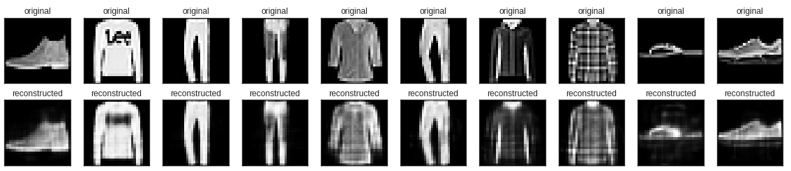

## 1. 인코딩(encoding)과 디코딩(decoding)

- 인코딩-디코딩 아키텍쳐는 통신, 암호, 전자 등 다양한 분야에 적용되는 일반적인 프레임워크
- 인코더는 입력 샘플을 잠재 공간, 즉 인코더에 의해 정의된 숨겨진 구조화된 값 집합에 매핑하는 함수
- 디코더는 이 잠재 공간의 요소를 사전 정의된 타겟 도메인으로 매핑하는 여함수 (복구)
- ex) 이미지와 오디오 압축 포맷
  - JPEG 도구는 미디어 파일을 가벼운 이진파일로 압축하여 인코딩하고, 표시할 때 픽셀 값을 복원하기 위해 디코딩한다.


- 입력을 저차원 잠재공간으로 인코딩한 후 디코딩하여 복원하는 네트워크로 이미지를 입력받아 인코더 모듈을 사용하여 잠재 벡터 공간으로 매핑하고, 디코더 모듈을 사용하여 원본 이미지와 동일한 차원으로 복원하여 출력
- 원본 입력을 재구성하는 방법으로 학습한다.
- 고전적인 방식은 구조화가 잘된 잠재 공간을 만들지 못하고, 압축도 뛰어나지 않다는 한계가 존재했다.


## 2. Fashon MNIST Dataset을 이용한 AE 실습

### 1) 패키지 로드

```python
import tensorflow as tf
from tensorflow.keras.datasets import fashion_mnist
from tensorflow.keras.models import Model
from tensorflow.keras.layers import Dense, Flatten, Reshape
from tensorflow.keras.losses import MeanSquaredError
import numpy as np
import matplotlib.pyplot as plt
plt.style.use('seaborn-white')
```

### 2) Data Load

```python
(x_train, _), (x_test, _) = fashion_mnist.load_data()
```

- x의 값을 target 값으로도 이용할 것이기 때문에 y 값은 받지 않는다.

```python
# 정규화
x_train = x_train.astype('float32') / 255.
x_test = x_test.astype('float32') / 255.


print(x_train.shape)
print(x_test.shape)
```


### 3) 모델 정의

- 이미지를 64차원 잠재 벡터로 압축하는 encoder 및 잠재 공간에서 원본 이미지를 재구성하는 decoder 라는 두 개의 Dense layer로 Auto encoder 정의
- Keras Model Subclassing API를 사용

```python
latent_dim = 64 # 64 차원

class Autoencoder(Model):
  def __init__(self, latent_dim):
    super(Autoencoder, self).__init__()

    self.latent_dim = latent_dim
    # 인코더 정의
    self.encoder = tf.keras.Sequential([Flatten(), Dense(latent_dim, activation='relu')])
    # 디코더 정의
    self.decoder = tf.keras.Sequential([Dense(784, activation='sigmoid'), Reshape((28, 28))])
  
  def call(self, x):
    encoded = self.encoder(x)
    decoded = self.decoder(encoded)
    return decoded
```

### 4) 모델 생성 및 컴파일

```python
autoEncoder = Autoencoder(latent_dim)
autoEncoder.compile(optimizer='adam', loss=MeanSquaredError())
```

### 5) 모델 학습

- x_train을 입력과 타겟 모두로 사용하여 모델을 훈련
- encoder는 데이터 세트를 784 차원에서 잠재 공간으로 압축하는 방법을 배우고, decoder는 원본 이미지를 재구성하는 방법을 배운다.

```python
autoEncoder.fit(x_train, x_train,
                epochs=10,
                shuffle=True,
                validation_data=(x_test, x_test))
```


### 6) 모델 테스트

```python
encoded_imgs = autoEncoder.encoder(x_test).numpy() # 이미지 인코딩
decoded_imgs = autoEncoder.decoder(encoded_imgs).numpy() # 이미지 디코딩
```

```python
n = 10
plt.figure(figsize = (20, 4))

for i in range(n):
  ax = plt.subplot(2, n, i+1)
  plt.imshow(x_test[i])
  plt.title('original')
  plt.gray()
  ax.get_xaxis().set_visible(False)
  ax.get_yaxis().set_visible(False)

  ax = plt.subplot(2, n, i+1+n)
  plt.imshow(decoded_imgs[i])
  plt.title('reconstructed')
  plt.gray()
  ax.get_xaxis().set_visible(False)
  ax.get_yaxis().set_visible(False)

plt.show()
```



### 7) 평가

- 이미지 디코딩 시 디테일한 부분까지 복원하지 못했지만 어느정도 복원이 된 것을 확인할 수 있다.