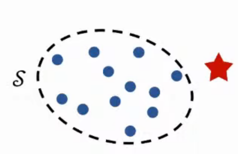
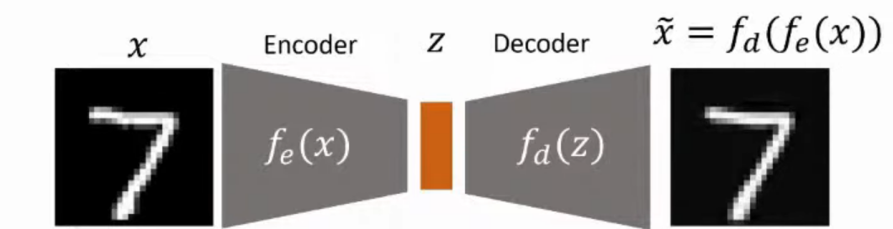
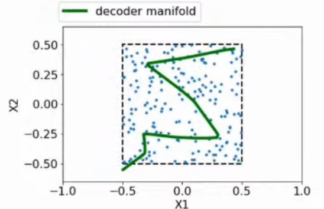
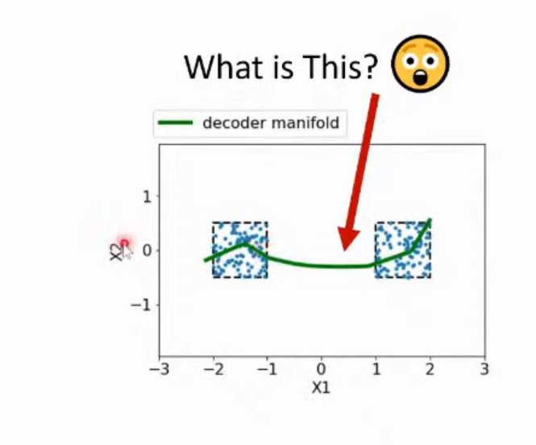

# 모두가 잘 알고있다고 생각하지만 그렇지 않은 AutoEncoder 기반 이상치 탐지

## 1. 서론

- Supervised 방식의 이상치 탐지 학습

  - 예상치 못한 Oulier에 대해서 탐지하지 못한다.

  - 따라서 Unsupervised 방식의 학습을 기반으로 한다.

- Unsupervised 방식의 이상치 탐지 학습

  - 정상 데이터의 확률분포를 토대로 일정 범위를 벗어나면 이상치로 탐지 -> 어느정도 준수한 성능을 보인다.
  - 공장의 불량품 탐지, X-Ray 사진 이상 탐지 등 여러 분야에서 사용될 수 있다.

## 2. Oulier란?

- 학습데이터와 다른 것은 Outlier

- DNN은 매우 높은 확신을 가지고 잘못된 예측을 하는 경우가 있다.

  - ex) Tesla의 Autopilot car crash 사건
    - 도로에 트럭이 넘어져 있는 상황이 학습데이터에 포함되지 않음. -> Oulier에 대해서 판단을 유보해야했으나, 하늘이라고 잘못 예측함.

- 수학적 정의

  - 정상 데이터의 확률분포를 토대로 Outlier 판단

    - 범주를 벗어나면 이상 데이터로 판단한다.

      

  - 정해놓은 Threshold을 기준으로 이상치 판단

  - 하지만 문제는 정상 데이터의 확률분포를 구해야한다.

- Oulier Dection Function

  - 가장 기본적인 접근법은 확률을 기반으로 접근하는 방법
  - AutoEncoder 기반의 이상치 탐지는 확률론을 따르지 않는다.

## 3. AutoEncoder 이상치 탐지

### (1) AutoEncoder의 원리

- AutoEncoder은 원본 데이터와 디코딩 데이터의 Reconstruction Error를 최소화하도록 학습이된다.

  

### (2) AutoEncoder를 통한 이상치 탐지

- 원본에 대한 Reconstruction Error가 너무 크다면 Outlier로 탐지한다.
- *가정* : **AutoEncoder에서 Outlier는 Reconstruction이 잘 되지 않을 것!**
- 결론 : **참이 아니다**

### (3)  AutoEncoder 구조에 대해서

- AutoEncoder는 기본적으로 터틀넥 구조를 가진다.
  - 왜 차원이 작아져야 하는가?
    - 항등함수가 되어서 Reconstruction Error가 0이 나오게 될 확률이 높아서, Outlier Detection을 잘 할 수 없다.
    - 하지만, 차원을 높이는 경우도 존재한다. => 항등함수가 되는 것을 피하기 위해서!! (하지만 그렇다고 무조건 Identity Mapping이 잘 되는 것은 아님)
  - AutoEncoder의 Encoder Decoder의 구조가 꼭 같아야할까?
    - X. 목적 task에 맞게 설계하면 된다.
  - 복잡도는 어느정도로 하는 것이 적당한가?
    - 충분히 복잡하게 하는 것이 좋지만, 너무 복잡하게 하면 Overfitting 문제가 발생할 수 있다.
    - AutoEncoder의 Overfitting은 학습데이터가 아닌 데이터에 대해서 Reconstruction을 잘 하지 못한다.

- Decoder Manifold

  - 지정된 모든 X를 Decoder로 Reconstruction한 결과로, 모든 Reconstruction은 Manifold 내의 값으로만 Reconstruction 된다.

    

  - 즉, Manifold가 경계선 내에 존재하도록 학습하는 것이 이상치 탐지를 위한 목적이다.

  - 하지만, 두 개의 경계를 지정하고 학습을 하니

    

    다음과 같이 Outlier의 영역에도 Manifold가 그어지는 것을 확인 할 수 있다. 이렇게 되면 이상치를 탐지하는데 문제가 생기게 된다.

  - 즉, 두 영역 사이는 Outlier로 판단을 해야하는데, 저렇게 Manifold가 그어지면 그 선에 있는 값은 Outlier로 판단하지 못한다.

### (4) 이상치를 Reconstruction하는 경우

1. Cluster 구조의 데이터
   - 두 Cluster를 Reconstruction 하기위해서는 그 사이를 지나갈 수 밖에 없다.
2. 정상데이터에서 일부분만 없는 경우
   - 정상 데이터의 일부분이라도 이미 학습된 데이터의 범위에 속하기 때문에 Reconstruction을 할 수 있다.

---

## [Reference]

- [Demo - Outlier-reconstruction](https://swyoon.github.io/outlier-reconstruction/)

