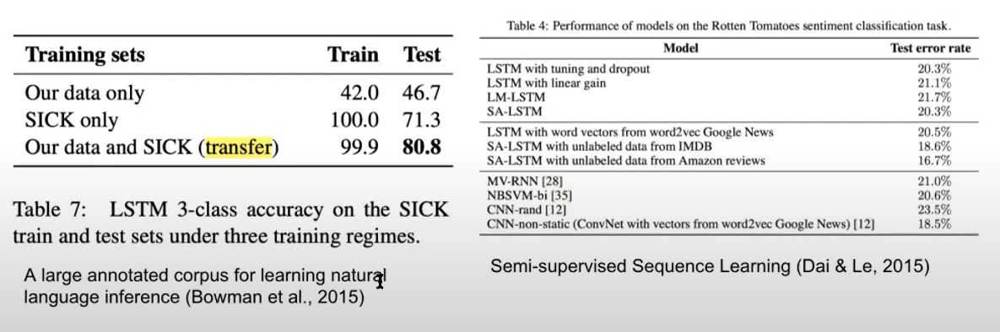
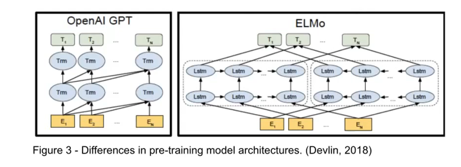
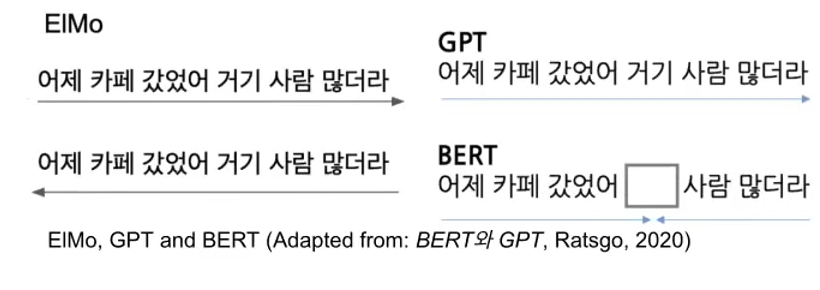
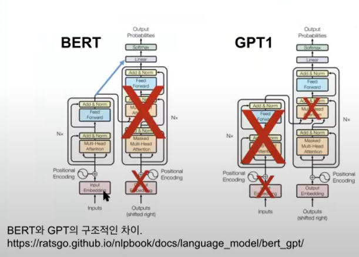
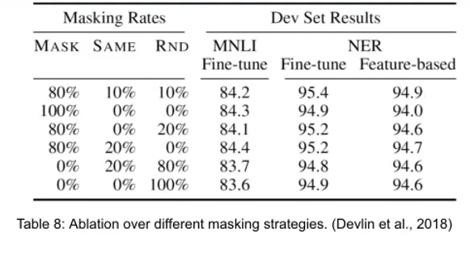

# BERT 논문 분석

> 해당 분석에서는 *BERT: Pre-training of Deep Bidirectional Transformers for Language Understanding* 논문을 분석하고 BERT를 이해한다. 

## 1. Pre-Training이란?

- Pre-Training은 사전학습을 의미한다.

### 1) Pre-Training을 하는 이유

> Pre-Training을 하는 이유는 Pre-Training된 모델에 fine-tunning을 하는 것이 처음부터 학습시키는 것보다 성능이 우수하기 때문이다. 비유를 하자면 갓난아기를 처음부터 가르치는 것과 초등학생을 가르치는 것의 차이이다.

해당 자료를 참고하면 한번의 학습을 했을 때보다, Pre-Training된 모델을 fine-tunning하는 것이 성능이 더 좋게 나오는 것을 확인할 수 있다.

- Pre-Training의 두 가지 접근법

  - ELMo
    - downstream task를 참고용으로만 사용 -> ELMo의 파라미터를 변화시키는데는 사용하지 않음.
  - GPT1
    - downstream tasks를 학습할 떄, downstream tasks의 일부분이 GPT1가 된다. -> 파라미터가 변화한다.

- ELMo와 GPT1의 한계

  - GPT1
    - Unidirectionality constraint 문제
    - 미래를 미리 내다볼 수 없다. 즉, 학습에 과거의 정보만 이용한다.
  - ELMo
    - Shallow bidirectionality 문제
    - 최종적인 출력은 bidirectionality하지만, 내부의 Layer들은 unidirectionality하다.

  

- 두 문제를 해결하는 것이 바로 BERT

  - Masked Language Model을 도입하여 해결
  - Next Sentence Prediction을 도입하여 효과적인 Pre-training을 제안

  

  해당 자료를 보면, ELMo는 단어를 예측할 때, 처음 -> 끝, 끝 -> 처음으로 진행하면서만 예측이 가능하고, GPT는 처음 -> 끝으로만 진행하면서 예측을한다.

   반면에, BERT는 양방향에서 동시에 진행하여 예측을 한다.

## 2. BERT

### (1) BERT Architecture

- Transformer의 Encoder을 가져와서 쌓아올린 구조이다. (GPT는 반대로 Decoder의 구조를 가져와서 쌓아올림)

- 구조차이

  

### (2) BERT : Input and Output

- 입력
  - 전처리된 문장
- 출력
  - Contextualised word embedding
  - ELMo와 차이점
    - BERT는 Multi Head Attention을 사용하기 때문에, 더 deeply bidirectional한 임베딩을 얻을 수 있다. 즉, 각 단어의 임베딩 벡터는 맥락을 반영한다.

### (3) BERT의 전처리

> BERT의 임베딩은 다음 3가지 임베딩의 합으로 이루어져있다.

1. Token embeddings
   - 각 단어에 대한 벡터
   - WordPiece embedding을 사용한다.
   - Subword Tokenization의 한 방법 (ex. playing -> play##ing)
2. Segment embeddings
   - 각 문장의 쌍을 구분지을 수 있는 정보를 제공한다.
   - 문장이 하나만 들어갈 경우는 ``sentence A embedding``만 사용한다.
3. Positional Embedding
   - Multi Head Attention은 Bidirectional하기 때문에 방향성이 없다.
   - 따라서 방향성에 대한 정보를 제공하기 위한 임베딩이다.

- 입력 전처리
  - 모든 문장의 첫번째 토큰은 ``[CLS]`` 이다.
    - CLS는 transformer 전체층을 다 거치고 나면 전체 token sequence의 맥락이 반영된 벡터를 출력한다.
  - Segemet Embedding을 할시, 문장 쌍을 구분할 수 있도록 ``[SEP]`` 토큰을 두 문장 사이에 넣어준다. 만약, 하나의 문장만 있다면 문장의 끝에만 [SEP]을 추가한다.  
  - 주의 :  BERT의 입력에는 Token embeddings, Segment embeddings, Positional Embedding을 합한 값이 입력으로 들어간다.

### (4) BERT의 Pre-Train 과정

> BERT의 훈련은 Pre-Training step 과 Fine-tuning step으로 나뉜다.
>
>  
>
> Pre-Training 과정에서는 Masked Language Modeling과, Next Sentence Prediction을 수행한다.

1. **Masked Language Modeling** 이란?

   - 문장 내부의 관계를 사전 학습하는 것

   - 방법

     - 문장 속 토큰의 15%를 랜덤하게 [MASK]하고, 마스킹된 토큰을 예측한다.
       - 15%? MLM task에 이용되는 단어
         - 15% 의 80% = MASK, 약 12%
         - 15% 10% = SAME, 약 1.5%
           - Fine-tuning에서는 [MASK] 토큰이 없기 때문에 어느정도는 둔다. (논문에서는 100% 마스킹시 성능이 하락한다고 나옴.)
         - 15% 10% = RND, 약 1.5%
           - Denoising task
           - 일부로 Noise를 준 후 제거하는 방법의 task를 취하여 성능 향상

     

   - Masked Language Model classifier

     - 전체 vocabulary에 대한 로짓 분포를 출력하는 FFN(피드포워드 신경망) softmax를 사용해 확률분포를 얻고, 해당 확률붙포와 원-핫 벡터 라벨 사이의 cross entropy loss를 구해서 MLM 모델을 최적화한다.

   - Output

     - 해당 task를 통해 BERT 사전훈련에서 deeply bidirectional이 이루어진다.
     - 총 12개의 Layer를 거쳐서 과거-미래를 모두 참조하여 가중치가 학습된다.

2. **Next Sentence Prediction** 이란?
   - 내부 문장의 관계를 사전학습
     - 이러한 task는 QA 또는 Natural language inference(NLI)와 같이 두 문장의 관계를 이해하는 것이 중요하다.
   - 방법
     - 두 문장을 이어 붙여 이것이 원래의 corpus 다음에 이어진 문장인지를 맞추는 binarized next sentence prediction task를 수행
   - Output
     - Next Sentence Prediction의 정확도를 97%-98%가 되도록 사전학습을 진행한 결과, QA나 NLI에 의미있는 성능 향상을 보였다.

### (5) BERT의 fine-tuning

> MLM, NSP를 수행한 후 목표로 하는 downstream task에 맞게 Fine-tuning을 진행한다.

- 구조는 그대로 사용하고, 목적에 맞는 토큰을 추가하여 task에 맞게 진행한다.

- **즉, BERT는 어떠한 downstream task에도 상관없이 fine-tuning 과정이 일관된 구조로 진행된다**

- GPT 대비 사전학습 가중치를 더 효과적으로 사용한다.

---

## [Reference]

- [Youtube - 김유빈 : BERT 논문 리뷰](https://www.youtube.com/watch?v=moCNw4j2Fkw)
- [BERT: Pre-training of Deep Bidirectional Transformers for Language Understanding](https://arxiv.org/pdf/1810.04805v2.pdf)