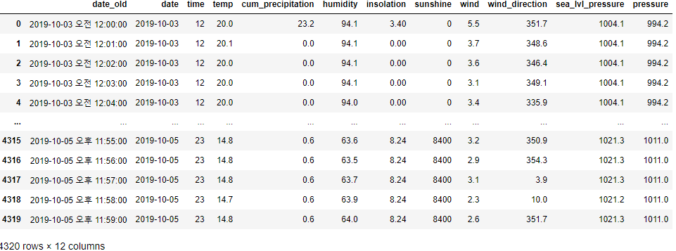
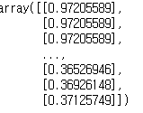
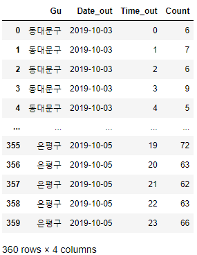
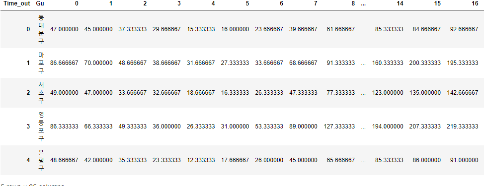
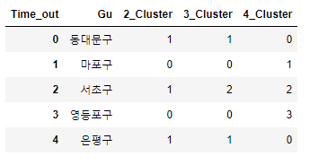

# 머신러닝 : 군집분석

---

### * 정규화

- 각 데이터의 수치의 크기가 너무 차이나는 경우, 한 변수가 결과를 좌우하기 때문에 그것을 방지하기 위해 0~1로 표현하는 정규화를 수행한다.

  

### 예시 코드

```python
import pandas as pd
weather = pd.read_csv('weather.csv')
weather
```



```python
from sklearn.preprocessing import MinMaxScaler
import pandas as pd
import numpy as np

weather = pd.read_csv('weather.csv')
X = np.array(weather.humidity).reshape(-1, 1)
scaler = MinMaxScaler()
X_scaled = scaler.fit_transform(X)
X_scaled
```




- 정규화 결과
  - 모든 값을 0과 1사이의 값으로 변환
  - 절대값 경중의 문제를 극복


### * K-means 클러스터링

- 데이터에 종속변수가 없는 비지도학습으로 유사한 것끼리 군집을 형성하는 기법
- 유사성 측정의 기준이 되는 Feature를 정하는 것과 몇 개의 그룹으로 나눌 것인지 K값을 정해주는 것이 중요
- 클러스터 결과가 항상 만족스러운 것은 아닐 수 있으며 K값을 변경하며 분석 목적에 맞는 결과를 도출


---

## 군집화 코드 예시 : 대여건수가 비슷한 시간대의 구들을 찾기

1. 구별, 일별, 시간대별 대여 횟수 집계

```python
n_bike = pd.pivot_table(bike_data2, index = ['Gu', 'Date_out', 'Time_out'], values = 'Distance', aggfunc=len)
n_bike = n_bike.reset_index()
n_bike.rename(columns = {'Distance' : 'Count'}, inplace=True)
n_bike
```



2. 다시 pivot table로 집계

   ```python
   n_bike2 = pd.pivot_table(n_bike, index='Gu', columns='Time_out', values='Count', aggfunc=np.mean)
   n_bike2 = n_bike2.reset_index()
   n_bike2
   ```

   

   3일 치의 평균값을 계산해서 구별, 시간대별, 평균값 평균 대여 횟수를 요약한 테이블 생성(0~23시)


3. K-means 학습

   ```python
   from sklearn import cluster
   
   X = n_bike2.iloc[0:5, 1:25]
   y = n_bike2.Gu
   km2 = cluster.KMeans(n_clusters = 2).fit(X)
   km3 = cluster.KMeans(n_clusters = 3).fit(X)
   km4 = cluster.KMeans(n_clusters = 4).fit(X)
   ```

   군집의 개수에 따른 값의 결과를 비교하기위해 2~4개의 군집으로 나눔


4. 결과 확인

   ```python
   n_bike2['2_Cluster'] = km2.labels_
   n_bike2['3_Cluster'] = km3.labels_
   n_bike2['4_Cluster'] = km4.labels_
   n_bike2[['Gu', '2_Cluster', '3_Cluster', '4_Cluster']]
   ```

   

   - 분석
     - 구별로 24시간의 시간대별 대여 횟수가 비슷한 패턴을 보이는 경우에 같은 군집으로 군집화하도록 하여 만들어낸 결과
     - 2_Cluster
       - 동대문구, 서초구, 은평구 : 0
       - 마포구, 영등포구 : 1
     - 3_Cluster
       - 서초구 : 2
       - 동대문구, 은평구 : 1
       - 마포구, 영등포구 : 0
     - 4_Cluster
       - 동대문구, 은평구 : 0
       - 마포구 : 1
       - 서초구 : 2
       - 영등포구 : 3