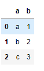
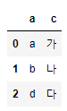
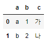
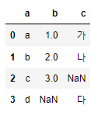
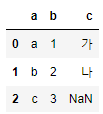
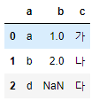

# 데이터 결합


## 1. DataFrame의 결합 방법

- 테이블 결합시 join type과 key에 유의
- key : 두 테이블 간에 공통으로 존재하여 연결고리 역할
  - 두 테이블의 결합 기준 정의
  - 하나 혹은 복수의 공통 컬럼 지정 가능
- join Type : Output 테이블에 값을 채우는 방법
  - ``merge()`` 함수를 통해서 join
  - 4가지 join type(merge 메소드의 how의 파라미터 값)
    1. inner : 교집합
    2. left : 왼쪽 테이블에 있는 데이터 기준으로 오른쪽 테이블을 가져온다
    3. right : 오른쪽 테이블에 있는 데이터 기준으로 왼쪽 데이터를 가져온다
    4. outer : 합집합


### 1) join 예시 코드

- df1 정의

  ```python
  df1 = pd.DataFrame({'a' : ['a', 'b', 'c'], 'b' : [1, 2, 3]})
  ```

  

- df2 정의

  ```python
  df2 = pd.DataFrame({'a' : ['a', 'b', 'd'], 'c' : ['가', '나', '다']})
  ```

  

1. inner 

   ```python
   pd.merge(df1, df2, how = 'inner', on = 'a')
   ```

   

   on : 양쪽에 동일한 key 컬럼이 있을 경우 하나로 표현(컬럼이 다르면 left_on, right_on 사용)

2. outer

   ```python
   pd.merge(df1, df2, how = 'outer', on = 'a')
   ```

   

   두 테이블을 모두 합하여 보여줌 -> 비어있는 cell이 생긴다

3. left

   ```python
   pd.merge(df1, df2, how = 'left', on = 'a')
   ```

   

   왼쪽 테이블을 기준 오른쪽 테이블 결합

4. right

   ```python
   pd.merge(df1, df2, how = 'right', on = 'a')
   ```

   

   오른쪽 테이블을 기준 왼쪽 테이블 결합


### 2) 실제 코드에 적용

1. 합병할 데이터 가져오기

   ```python
   # 구에 대한 정보를 담은 Data
   stations = pd.read_csv('stations.csv')
   ```

2. 데이터 합치기

   ```python
   bike_data2 = pd.merge(bike_data, stations, left_on = 'Station_no_out', right_on = 'ID')
   ```

   ``pd.merge(왼쪽 테이블, 오른쪽 테이블, left_on : 왼쪽테이블에서 key값으로 사용될 컬럼, right_on : 오른쪽 테이블에서 key값으로 사용될 컬럼)``

   

