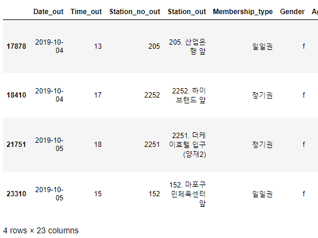
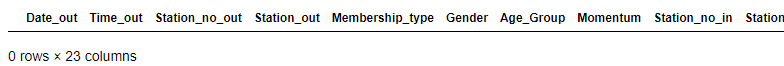
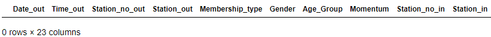
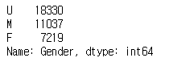
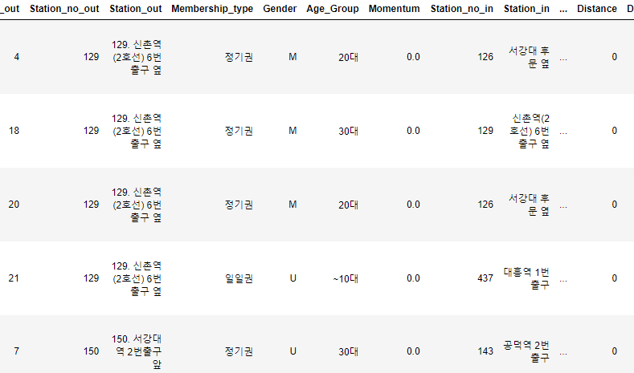
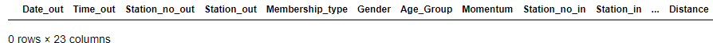
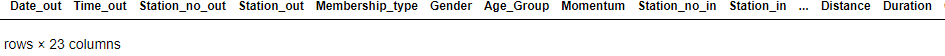
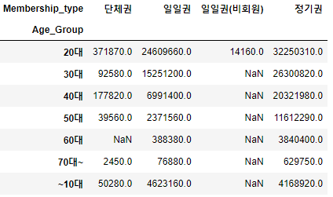
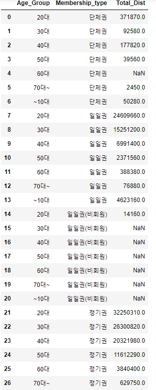

# 탐색적 데이터 분석 및 데이터 전처리

---

## * 사용 메소드

- 인덱서(loc)
  - 형식 : [행 인덱싱 값, 열 인덱싱 값]
  - 특정 위치의 값을 찾아 변경하고 싶을 때, 인덱서로 찾음
  - 조건, 이름을 넣어 **특정 행을 찾아낼 때** 사용

---

## * 탐색적 데이터 분석에 빈번히 활용되는 함수

- value_counts()
  - 특정 컬럼 내용을 구성하는 값과 각 값의 빈도를 보여준다
- pivot_table
  - 데이터를 원하는 기준으로 요약 정리하는 방법
- melt
  - pivot에 의해 요약 테이블로 바꾸었던 모양을 다시 요약 전 테이블처럼 만드는 작업

---

## * 예시 코드

### 1. 소문자로 표기된 성별을 대문자로 바꾸기

1. 소문자(f)로 표기된 데이터 확인

   ```python
   bike_data2[bike_data2.Gender == 'f']
   ```

   

2. 대문자(F)로 변경 및 확인

   ```python
   bike_data2.loc[bike_data2.Gender == 'f', 'Gender'] = 'F'
   bike_data2[bike_data2.Gender == 'f']
   ```

   

3. 소문자(m)로 표기된 데이터 대문자(M)으로 변경 및 확인

   ```python
   bike_data2.loc[bike_data2.Gender == 'm', 'Gender'] = 'M'
   bike_data2[bike_data2.Gender == 'm']
   ```

   

4. value_counts() 메서드로 확인

   ```python
   bike_data2.Gender.value_counts()
   ```

   


### 2. 자전거를 대여했으나 이동거리가 0인 비정상 데이터 제거

1. Distance가 0인 데이터 확인

   ```python
   bike_data2[bike_data2.Distance == 0]
   ```

   

2. Distance가 0인 데이터의 Duration 최대값 확인

   ```python
   bike_data2.loc[bike_data2.Distance == 0, 'Duration'].max()
   ```

   실행결과 : 214

3. Distance가 0인 데이터 제거

   ```python
   bike_data2 = bike_data2[bike_data2.Distance != 0]
   ```

4. Distance가 0인 데이터 제거가 완료되었는지 확인

   ```python
   bike_data2[bike_data2.Distance == 0]
   ```

   

5. Duration이 0인 데이터가 남아있는지 확인

   ```python
   bike_data2[bike_data2.Duration == 0]
   ```

   


### 3. 데이터 요약 및 복구

#### 1) 데이터 요약(pivot)

1. 데이터 요약 : Age_Group을 인덱스로 Mebership_type을 열, 값은 Distance이고 표현형식은 합계로

   ```python
   pd.pivot_table(bike_data2, index = 'Age_Group', columns = 'Membership_type', values = 'Distance', aggfunc = np.sum)
   ```

   

#### 2) 데이터 복구(unpivot)

1. pivot table의 값을 받는 변수 생성

   ```python
   bike_pivot = pd.pivot_table(bike_data2, index = 'Age_Group', columns = 'Membership_type', values = 'Distance', aggfunc = np.sum)
   ```

2. 인덱스 재지정

   ```python
   bike_pivot = bike_pivot.reset_index()
   ```

3. 자료 재구성 : 채택한 분석 방법 -> 필요한 입력 데이터 구조

   ```python
   pd.melt(bike_pivot, id_vars = 'Age_Group', value_vars = ['단체권', '일일권', '일일권(비회원)', '정기권'], var_name = 'Membership_type', value_name = 'Total_Dist')
   ```

   

   
