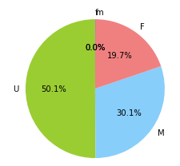
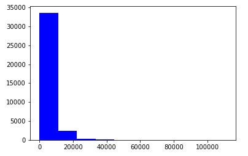
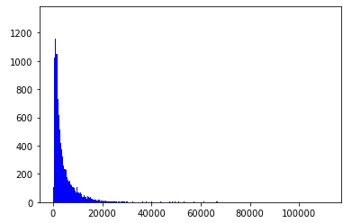
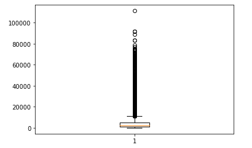
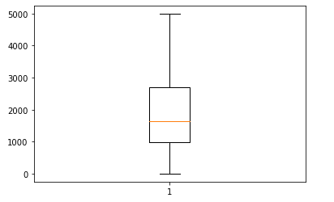
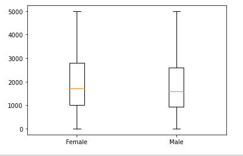
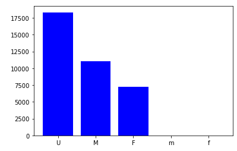
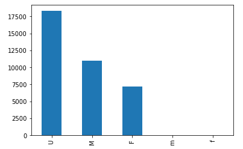

# 데이터 시각화


## 데이터 특성에 대한 이해

1. 다양한 통계 수치를 산출
   - 단, 통계만으로는 완벽하게 이해할 수 없다.
2. 데이터를 시각적으로 표현하여 빠르게 데이터를 이해한다.
   - 분석 결과를 효과적으로 전달하는 방법 중에 하나
   - 구체적인 분석에 앞서 데이터 전체에 대한 이해를 할 수 있다.
   - 수치 데이터로 확인할 수 없는 데이터의 특성을 확인할 수 있다.


---

## 파이썬으로 기본 그래프 그리기


#### 1. 시각화 패키지

- matplotlib.pyplot
  - plt.pie : 파이차트
    - sizes : 각 파이의 조각에 해당하는 항목의 크기를 수치로 표현
    - labels : 각 파이 조각 목록
    - colors : 지정하지 않으면 디폴트 색, 색 지정 가능
    - autopct : 자동으로 비율을 계산하여 소수점 한자리까지 표시하고 %를 붙임
    - startangle : 첫 번째 파이 조각의 시작 각도 지정
  - plt.hist : 히스토그램
    - 수치형 데이터를 필요로 함
    - 값을 적정한 크기로 나누어, 구간을 정해 x 축에 표시(개수는 y축)
  - plt.boxplot : 상자그림
  - plt.plot : 선 그래프
    - 날짜/시간 데이터가 포함된 데이터
      - 시간에 따른 데이터의 변화를 선 그래프로 표현 가능
      - 추세 변화, 반복 패턴 등을 시각적으로 확인 가능함
  - plt.bar : 막대 그래프
- seaborn

---

#### 2. 코드

1. 파이차트

   ```python
   labels = bike_data2.Gender.unique()
   sizes = bike_data2.Gender.value_counts()
   colors = ['yellowgreen', 'lightskyblue', 'lightcoral', 'blue', 'coral']
   plt.pie(sizes, labels = labels, colors = colors, autopct = '%1.1f%%', startangle = 90)
   plt.show()
   ```

   

2. 히스토그램

   1. 구간지정 x

      ```python
      plt.hist(bike_data2.Distance, color = 'blue')
      plt.show()
      ```

      

   2. 구간 지정 o

      ```python
      plt.hist(bike_data2.Distance, color = 'blue', bins = 1000)
      plt.show()
      ```

      

3. boxplot

   1. 범위지정 x

      ```python
      plt.boxplot(bike_data2.Distance)
      plt.show()
      ```

      

   2. 범위지정 o

      ```python
      under_5000 = bike_data2[bike_data2.Distance < 5000]
      plt.boxplot(under_5000.Distance)
      plt.show()
      ```

      

   3. 성별에 따라 나누기

      ```python
      under_5000 = bike_data2[bike_data2.Distance < 5000]
      plt.boxplot([under_5000.Distance[under_5000.Gender == 'F'], under_5000.Distance[under_5000.Gender == 'M']])
      plt.xticks([1, 2], ['Female', 'Male'])
      plt.show()
      ```

      

4. 선 그래프

   1. 1번 방법

      ```python
      plt.bar(labels, height = sizes, color = 'blue')
      plt.show()
      ```

      

   2. 2번 방법

      ```python
      bike_data2['Gender'].value_counts().plot(kind = 'bar')
      plt.show()
      ```

      

      