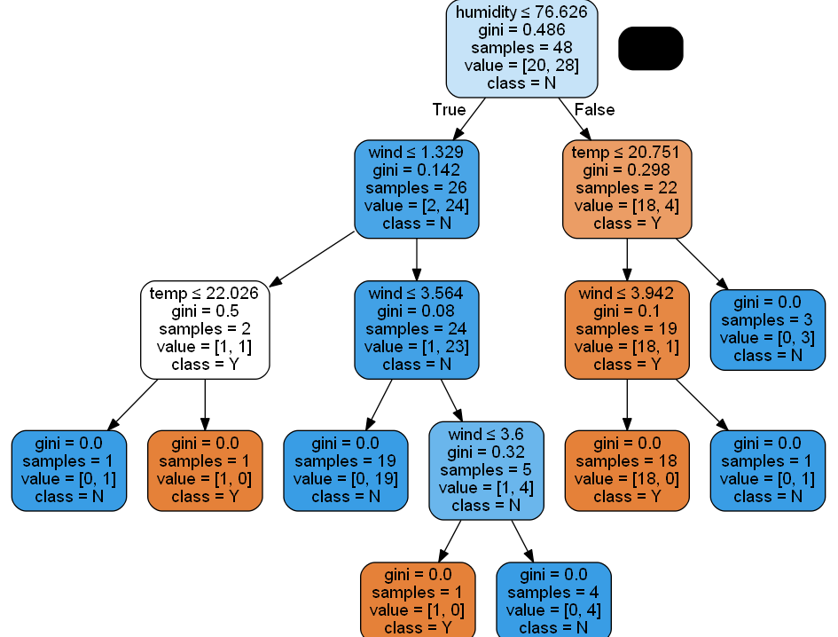
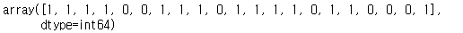
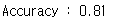
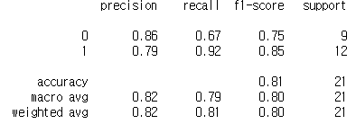

# 머신러닝 : 의사결정나무 분석

- 필요 패키지 설치
  - Anaconda Power shell
    - conda install pydot
    - conda install pydotplus
    - conda install graphviz
    - ! 오류시, 환경변수-path에 graphviz 위치 등록


- 의사결정나무
  - 의사결정나무의 출발점을 루트노드라 하며 기준이 되는 Feature의 기준 값에 따라 좌우로 분기
  - Stopping Rule에 따라 Split이 멈추었을 때 마지막 단계에 있는 노드를 'Leaf노드'라고 한다
  - 각 노드의 첫 줄에는 split의 기준이 되는 split feature와 split value가 제시되고 해당 노드의 class 값이 표시된다.
  - 예측 시에는 Root노드부터 시작해서 새로운 데이터를 한 행씩 Split Feature의 기준 값과 비교하고 좌우로 분기해 가면서 내려가다 보면 도달하는 Leaf 노드의 class가 해당 데이터의 예측 class가 된다.


---

## 코드 예시

1. 모델 학습

   ```python
   from sklearn import tree
   
   X = X_train
   y = y_train
   dTree = tree.DecisionTreeClassifier()
   dTreeModel = dTree.fit(X, y)
   dTreeModel.tree_
   ```

2. 결과 확인

   ```python
   from sklearn.tree import export_graphviz
   import pydotplus
   from IPython.display import Image
   
   dot_data = export_graphviz(dTreeModel, out_file=None,
                             feature_names=['cum_precipitation', 'humidity', 'temp', 'wind'],
                             class_names=('Y','N'), filled=True, rounded=True, special_characters=True)
   graph = pydotplus.graph_from_dot_data(dot_data)
   Image(graph.create_png())
   ```

   

   - 분석
     - 첫번째 노드 : 루트 노드
     - 각 노드의 첫 줄
       - 분류 기준 항목과 기준 값 (분류기준 : Feature)
     - 마지막 노드의 마지막 줄
       - 최종 분류 결과


3. 예측

   ```python
   dTreeModel.predict(X_test)
   ```

   


4. 정확도 확인

   ```python
   from sklearn.metrics import accuracy_score
   
   y_pred = dTreeModel.predict(X_test)
   print('Accuracy : %.2f'%accuracy_score(y_test, y_pred))
   ```

   

   ```python
   # 다른 방법(상세 내용)
   y_pred = dTreeModel.predict(X_test)
   print(classification_report(y_test, y_pred))
   ```

   

   - 분석
     - Accuracy가 로지스틱 회귀에 비해 낮아짐
       - 정확도는 데이터 마다 맞는 기법이 달라서 어느 기법이 우위에 있다고 판단할 수 없다.
       - 그러므로 여러가지 기법으로 작업해본 후 더 우수한 결과를 보이는 기법을 선택(Trial & Error)