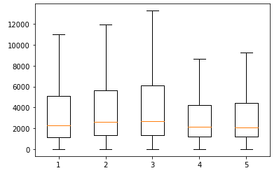
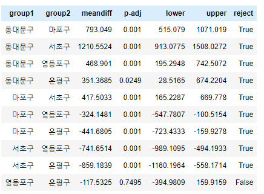

# 분산분석

---


- 3개 이상의 데이터 그룹을 비교하기 위해서는 분산분석(ANOVA)을 이용해야한다.
- t-test와 마찬가지로 평균을 이용하는 방법이다.


### * 분산분석의 단계

1. 등분산 분석
   - 여러 그룹의 분산이 같은가를 확인 -> 귀무가설(모든 그룹의 분산은 같다) 정의
   - 귀무가설을 기각하지 못해야 등분산 분석 가능
2. 분산 분석
   - 귀무가설(모든 그룹의 평균이 같다)
3. 사후 분석
   - 그룹 별 평균을 비교해 **평균이 같은 그룹과 다른 그룹을 구분**하여 알려줌

---

### * 코드 : 등분산 분석 - Bartlett's Test


1. 구별 데이터 지정

   ```python
   s_gu = bike_data2[bike_data2.Gu == '서초구']
   d_gu = bike_data2[bike_data2.Gu == '동대문구']
   e_gu = bike_data2[bike_data2.Gu == '은평구']
   ...
   ```

2. Bartlett's Test

   ```python
   from scipy import stats
   
   stats.bartlett(y_gu.Distance, m_gu.Distance, s_gu.Distance, d_gu.Distance, e_gu.Distance)
   ```

   ```
   BartlettResult(statistic=405.99591324805436, pvalue=1.4084240027307602e-86)
   ```

- 분석
  - p-value 값이 유의수준(0.05)보다 작으므로 귀무가설 기각
    - 즉 모든 그룹이 등분산이 아니다
      - 해결법
      - 비모수적 분석 방법 사용 : 평균, 분산, 표준편차 등 통계량에 근거한 추론 방법을 사용하지 않는 것
      - 데이터에 보완할 점 검토 : 데이터가 충분하지 않은 경우(이 데이터의 경우 3일 간의 데이터이므로 판단하기에 충분치 않다)

=> 본 코드에서는 귀무가설을 기각하지 못했지만 등분산 분석의 코드를 다루기 위해서 그대로 진행

3. One Way ANOVA

   ```python
   stats.f_oneway(y_gu.Distance, m_gu.Distance, s_gu.Distance, d_gu.Distance, e_gu.Distance)
   ```

   ```
   F_onewayResult(statistic=37.75546101206967, pvalue=1.4366160740892166e-31)
   ```

- 분석
  - p-value 값이 유의수준(0.05)보다 작으므로 귀무가설 기각
    - 모든 그룹의 평균은 같다 : 기각

4. Box plot으로 구의 거리 데이터 시각화

   ```python
   plot_data = [y_gu.Distance, m_gu.Distance, s_gu.Distance, d_gu.Distance, e_gu.Distance]
   plt.boxplot(plot_data, showfliers=False)
   plt.show()
   ```

   

5. 사후분석 : Tukey's HSD(Honestly Significant Difference) Test

   - 평균이 같은 그룹과 다른 그룹을 나누어 볼 수 있는 방법 중 하나
   - statmodels 패키지 필요

   ```python
   from statsmodels.stats.multicomp import pairwise_tukeyhsd
   
   hsd = pairwise_tukeyhsd(bike_data2.Distance, bike_data2.Gu)
   hsd.summary()
   ```

   

   - 분석
     - p-adj의 값이 0.05보다 작은 경우 reject의 값이 True, 아니면 False
     - 즉 reject가 False 이면 평균이 같다.

   