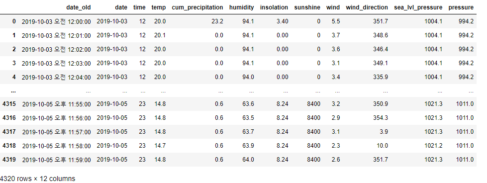
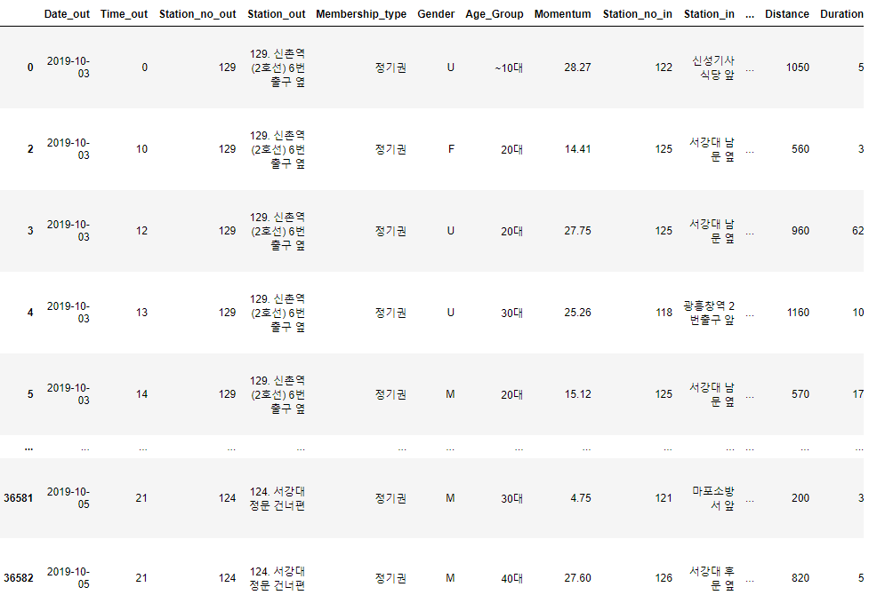
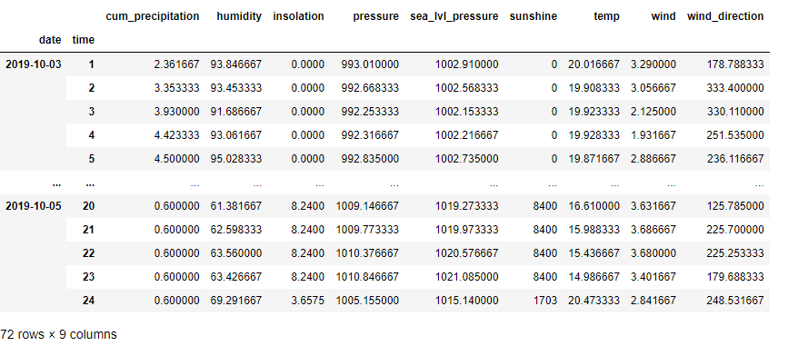
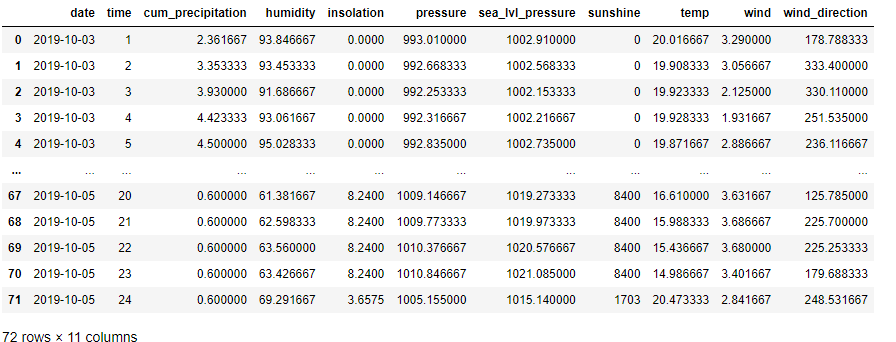
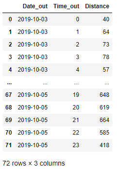
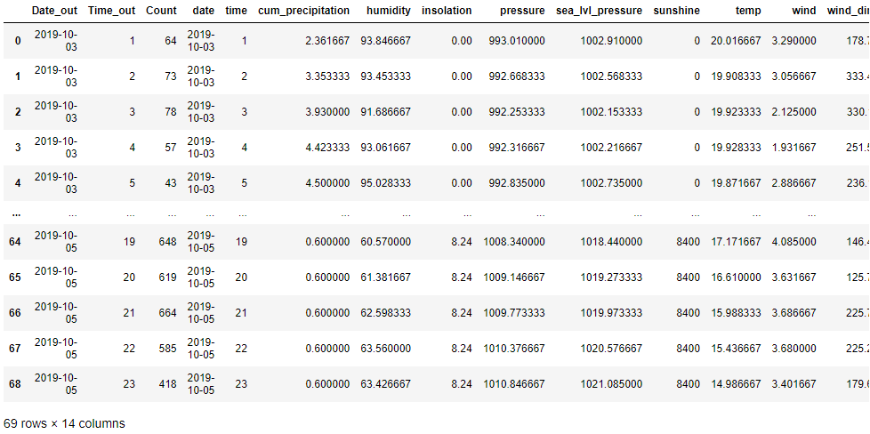
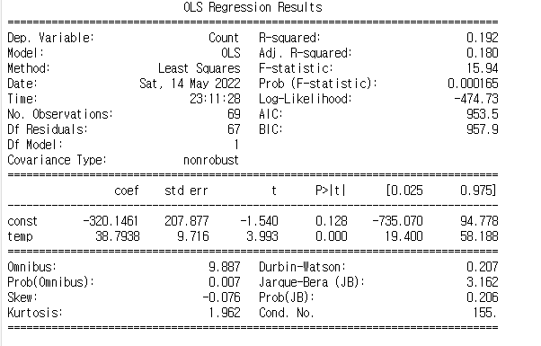

# 회귀 분석 : 수치형 변수


**목적**

- 데이터 관계 설명
- 예측


**정의**

- x와 y의 관계를 설명하는 y = ax 식을 찾는것

---

## 코드 : 날씨와 자전거 데이터의 회귀분석

- weather

  

- bike_data2

  

- weather : 시간단위 대여 건수 평균값 요약

  ```python
  new_weather = pd.pivot_table(weather, index = ['date', 'time'], values = ['temp', 'cum_precipitation', 'humidity', 'insolation', 'sunshine', 'wind', 'wind_direction', 'sea_lvl_pressure', 'pressure'], aggfunc = np.mean)
  new_weather
  ```

  

- 인덱스 재설정

  ```python
  new_weather = new_weather.reset_index()
  new_weather
  ```

  

- bike_data2 : 일자와 시간대 별로 대여건수 요약

  ```python
  new_bike = pd.pivot_table(bike_data2, index = ['Date_out', 'Time_out'], values = ['Distance'], aggfunc = len)
  new_bike = new_bike.reset_index()
  new_bike
  ```

  

- 열이름 재정의

  ```python
  new_bike.rename(columns = {'Distance' : 'Count'}, inplace = True)
  new_bike.columns
  ```

  ```
  Index(['Date_out', 'Time_out', 'Count'], dtype='object')
  ```

- 두 개의 데이터 테이블 결합

  ```python
  bike_weather = pd.merge(new_bike, new_weather, left_on = ['Date_out', 'Time_out'], right_on = ['date', 'time'])
  bike_weather
  ```

  

- 회귀분석 : stats.linregress 함수 이용

  ```python
  stats.linregress(bike_weather.temp, bike_weather.Count)
  ```

  ```
  LinregressResult(slope=38.793750423978715, intercept=-320.14608008876144, rvalue=0.4384055405346409, pvalue=0.00016471489031703914, stderr=9.71628875360514, intercept_stderr=207.87702698597948)
  ```

기울기 : slope=38.793750423978715

절편 : intercept=-320.14608008876144

=> 선형회귀식을 구성하는 값 : Count = 38.79 * temp - 320.146

p-value = 0.00016471489031703914 // 유의수준 0.05보다 작으므로 귀무가설 기각 = 회귀관계는 통계적으로 유의미하게 존재한다.

표준오차 : stderr=9.71628875360514

R 제곱(결정계수) : rvalue=0.4384055405346409


- R-squared 구하기

  - 회귀식이 실제 관찰된 값을 얼마나 설명하는지를 의미
  - 데이터 세트에 있는 x 값을 회귀식에 넣었을 때, 계산된 y 값이 실제 데이터에 존재하는 y 값 대비 얼마나 되는지를 말함
  - 설명력이라고도하고 0~1의 값을 가지고 1에 가까울 수록 좋은 회귀식

  ```python
  slop, intercept, r_value, p_value, std_err = stats.linregress(bike_weather.temp, bike_weather.Count)
  print("R-squared : %f"%r_value**2)
  ```

  ```
  R-squared : 0.192199
  ```

- statsmodel 패키지를 이용한 회귀 분석

  ```python
  import statsmodels.api as sm
  
  X0 = bike_weather.temp
  X1 = sm.add_constant(X0)
  y = bike_weather.Count
  model = sm.OLS(y, X1)
  result = model.fit()
  print(result.summary())
  ```

  

  - 장점
    - 명확한 결과값
    - 다양한 정보가 일목요연하게 표로 표시됨

  중요한 값

  **R-suared**

  **Prob (F-statistic)**

  - F 검정 통계량 추정치
  - 회귀식 전체에 대한 통계적 유의성을 검정한 p-value
  - p-value < 0.05 이므로 귀무가설 기각 -> 회귀식이 존재한다.

  **const**

  - 절편

  **temp**

  - 독립변수로 사용된 x 값

  **두 값의 coef** : 회귀식의 절편과 기울기

  -> 회귀식 : count = 38.7938 * temp - 320.1461

  **p-value(Prob(F-statistic))**을 확인

  - x 독립변수가 통계적으로 유의하게 종속변수 y의 변동에 영향을 주는지 확인
  - p-value > 유의수준 0.05 이면 유의하지 않은 변수

  ### F값에 대한 p-value

  - 통계적 유의성을 가지지 못할 경우 -> 회귀식을 처음부터 다시 고민해 보아야함

  ### t값에 대한 p-value

  - 통계적 유의성을 가지지 못할 경우 -> 해당 변수를 제외해야 하는지 고민

  ### coef : 계수값

  - 독립변수가 종속변수의 변화에 얼마나 영향을 주는지를 알 수 있는 기울기 값