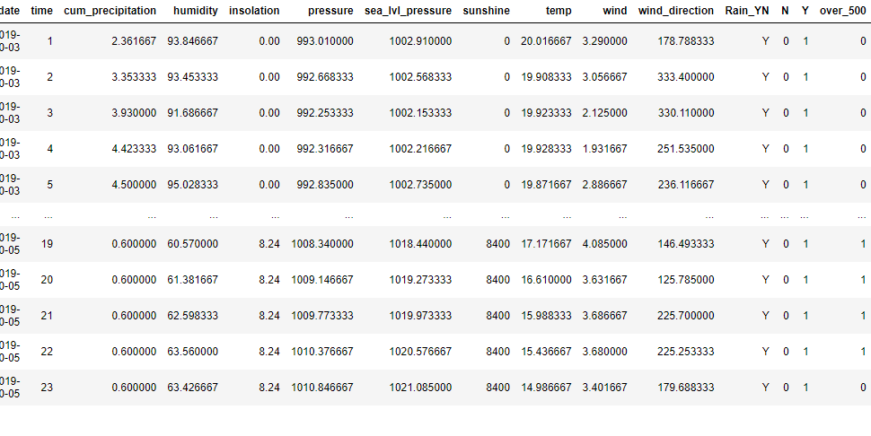
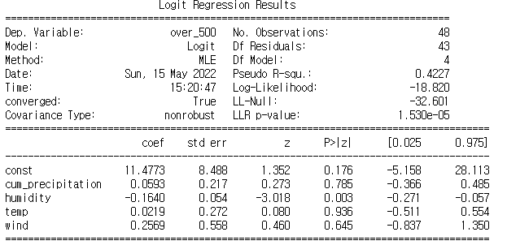
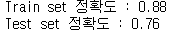
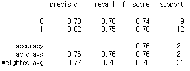

# 머신러닝 : 로지스틱 회귀 분석

- 의미
  - 종속변수가 범주형인 경우 사용하는 방법
  - 선형관계를 로그 및 역함수 변환을 통하여 분류로 변환한다.
- 프로세스
  - 1단계 : Train 함수를 이용하여 로지스틱 회귀분석 모델 생성
    - p-value 값을 확인하여 통계적 유의성을 확인한다.
  - 2단계 : Predict 함수를 활용하여 로지스틱 회귀분석 모델의 예측값을 계산
  - 3단계 : Evaluate 함수를 이용하여 예측 결과의 정확도 계산
    - accuracy, precision, recall, f1-score의 지표로 정확도를 확인할 수 있다.


---

## 코드 예시

1. 500건이 넘는지 아닌지를 표시하는 column 추가

   ```python
   bike_weather['over_500'] = 1
   bike_weather.loc[bike_weather.Count < 500, 'over_500'] = 0
   bike_weather
   ```

   


2. Train

   ```python
   # 데이터 세트 분리
   from sklearn.model_selection import train_test_split
   
   X = bike_weather[['cum_precipitation', 'humidity', 'temp', 'wind']]
   y = bike_weather.over_500
   X_train, X_test, y_train, y_test = train_test_split(X, y, test_size=0.3, random_state=123)
   
   import statsmodels.api as sm
   
   X1 = sm.add_constant(X_train)
   logit_model = sm.Logit(y_train, X1)
   result = logit_model.fit()
   print(result.summary())
   ```

   

   - 분석
     - Pseudo R-squ : 0.4227
       - 회귀분석이 아니므로, Pseudo라는 표현 사용
     - LLR p-value : 1.530e-05
       - 매우 작은 값이므로 통계적 유의성에 문제가 없다고 판단
     - 각 독립변수의 p-value
       - humidity를 제외한 다른 변수들의 통계적 유의성이 부족하다.
       - 머신러닝의 관점에서는 이러한 독립변수를 바로 제외하지는 않는다.


3. Predict, Evaluate

   ```python
   from sklearn.linear_model import LogisticRegression
   
   log_reg = LogisticRegression()
   log_reg.fit(X_train, y_train)
   print('Train set 정확도 : %.2f'%log_reg.score(X_train, y_train))
   print('Test set 정확도 : %.2f'%log_reg.score(X_test, y_test))
   ```

   

   - 좀더 상세한 정확도 확인

     ```python
     from sklearn.metrics import classification_report
     
     y_pred = log_reg.predict(X_test)
     print(classification_report(y_test, y_pred))
     ```

     

     - 분석
       - accuracy : 정답을 맞춘 개수를 전체로 나눈 값
       - precision : Y라고 예측한 것 중 실제 Y였던 경우의 확률
       - recall : Y인 케이스 중에 얼마나 Y라고 예측했는지의 값
       - f1-score : precision과 recall의 조화평균