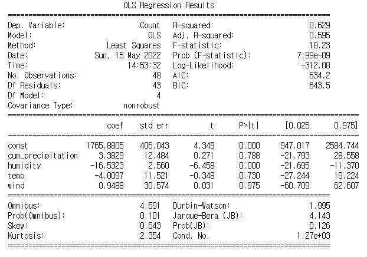
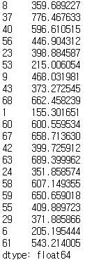
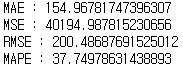
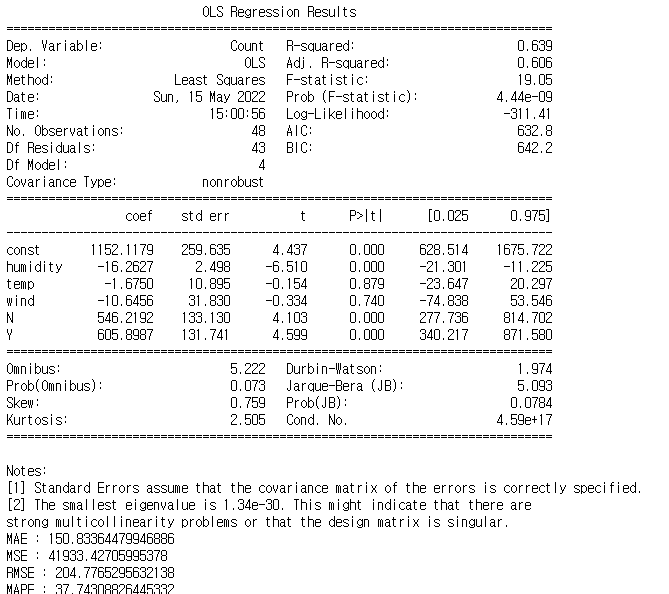

# 머신러닝 : 다중회귀분석 범주형 데이터

---

1. 다중회귀분석
   - 복수의 독립변수를 사용하는 회귀분석

1. 머신러닝

   - 많은 데이터를 사용해서 종속변수를 설명할 수 있는 특징, 패턴, 수식 등을 찾아내도록 하는 것이다.

   - 프로세스
     - 1단계 : 회귀분석 모델을 만든다
     - 2단계 : 회귀분석 모델을 활용하여 예측값을 계산한다.
     - 3단계 : 예측 결과의 정확도를 계산한다.

---

## 코드 예시

1. 데이터 set 분리 : sklearn 패키지 이용

   ```python
   from sklearn.model_selection import train_test_split
   
   X = bike_weather[['cum_precipitation', 'humidity', 'temp', 'wind']]
   y = bike_weather.Count
   X_train, X_test, y_train, y_test = train_test_split(X, y, test_size = 0.3, random_state = 123)
   ```

   test_size = 0.3

   - Test data set의 비율
   - 보편적인 비율은 Train set : Test set = 7:3 or 8:2


2. Train

   ```python
   import statsmodels.api as sm
   
   X1 = sm.add_constant(X_train)
   model = sm.OLS(y_train, X1)
   result = model.fit()
   print(result.summary())
   ```

   

   분석

   - p-value 값이 7.99e-09로 매우 작으므로 통계적 유의성이 있다고 판단.
   - 독립변수마다의 p-value는 humidity를 제외하고는 유의성이 있다고는 볼 수 없음
   - 설명력은 0.629로 양호 => 회귀분석은 어떤 변수와 함께 고려되는지에 따라 통계적 유의성이나 회귀계수의 크기 등이 완전히 다르게 나타날 수 있다.


3. Predict

   ```python
   X1 = sm.add_constant(X_test)
   pred = result.predict(X1)
   pred
   ```

   

   - add_constant
     - statsmodels의 OLS 회귀함수의 특성상 절편에 해당하는 값을 처리하기 위해서 적용해 주어야하는 단계


4. Evaluate

   ```python
   from sklearn import metrics
   
   print('MAE :', metrics.mean_absolute_error(y_test, pred))
   print('MSE :', metrics.mean_squared_error(y_test, pred))
   print('RMSE :', np.sqrt(metrics.mean_squared_error(y_test, pred)))
   print('MAPE :', np.mean(np.abs((y_test - pred) / y_test)) * 100)
   ```

   

   - 분석
     - MAPE : 37.75이므로 정확도가 62.26% 정도이다.(낮은 정확도) // 비교와 이해가 쉬운 수치


5. 새로운 열을 추가하여 one-hot-encoding 수행

   ```python
   bike_weather['Rain_YN'] = 'N'
   bike_weather.loc[bike_weather.cum_precipitation > 0, 'Rain_YN'] = 'Y'
   
   ohe = pd.get_dummies(bike_weather['Rain_YN'])
   
   bike_weather = pd.concat([bike_weather, ohe], axis = 1, sort = False)
   ```


6. 추가된 데이터로 머신러닝 프로세스 진행

   ```python
   # Train, predict, Eavaluate 수행
   from sklearn.model_selection import train_test_split
   
   X = bike_weather[['humidity', 'temp', 'wind', 'N', 'Y']]
   y = bike_weather.Count
   X_train, X_test, y_train, y_test = train_test_split(X, y, test_size=0.3, random_state = 123)
   
   import statsmodels.api as sm
   
   X1 = sm.add_constant(X_train)
   model = sm.OLS(y_train, X1)
   result = model.fit()
   print(result.summary())
   
   X1 = sm.add_constant(X_test)
   pred = result.predict(X1)
   
   from sklearn import metrics
   
   print('MAE :', metrics.mean_absolute_error(y_test, pred))
   print('MSE :', metrics.mean_squared_error(y_test, pred))
   print('RMSE :', np.sqrt(metrics.mean_squared_error(y_test, pred)))
   print('MAPE :', np.mean(np.abs((y_test - pred) / y_test)) * 100)
   ```

   

   단, Rain_YN_0과 Rain_YN_1은 함께 사용하지 않아도된다 : 똑같은 의미를 전달 == Drop Last