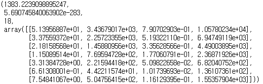
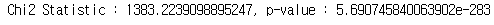

# 카이제곱 검정

---


**정의**

- 정규분포의 분산에 대한 확률분포
- 범주형 데이터를 분성하는데 이용


**카이제곱 독립성 검정**

- 두 개의 범주형 데이터 사용
- 하나의 범주형 데이터가 다른 하나의 범주형 데이터 값에 영향이 있는지 확인
- 두 범주형 변수 간의 연관성/독립성 여부 테스트


---

## 코드예시 : 연령대와 멤버십 타입의 연관성 파악


- 카이제곱 독립성 검정 
  - scipy.stats 패키지의 chi2_contingency 사용
  - 입력 값으로 요약표 같은 구조를 필요로 함


```python
from scipy.stats import chi2_contingency

crosstab = pd.crosstab(bike_data2.Age_Group, bike_data2.Membership_type)
chi2_contingency(crosstab)
```



필요부분만 추출

```python
result = chi2_contingency(crosstab)
print('Chi2 Statistic : {}, p-value : {}'.format(result[0], result[1]))
```



- 분석
  - p-value의 값이 매우 작음
  - 귀무가설 : Age_Group과 Membership_type은 독립적이다
  -  p-value의 값이 매우 작기 때문에 귀무가설을 기각
  - 결론 : Age_Group과 Membership_type은 연관성이 있다

