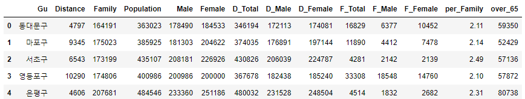
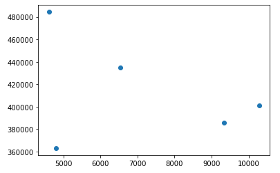
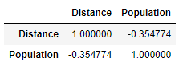

# 상관분석

---


**정의**

- 수치형 데이터 간의 관계를 분석하는 방법
- 산점도를 이용하여 시각적으로 파악가능
- 계량적 파악을 하는 방법
- 두 수치형 데이터 간의 직선적 관계를 알려줌
- 항상 2개의 변수에 대한 분석만 수행(2개씩 여러 번의 분석 수행)
- 수치형 데이터 사용만 가능하다.


**주의사항**

- 상관계수는 단순환 관련성에 대한 얘기로, 인과관계와는 별도의 개념이다.
- 상관계수가 데이터 안에 존재하는 진짜 상관성과 일치하지 않는 경우가 종종있다.


---

## 코드 : 구별의 인구와 구별 자전거 대여건수의 상관관계

- 상관관계 분석을 위한 테이블 구축

```python
dist_by_gu = pd.pivot_table(bike_data2, index = 'Gu', values = 'Distance', aggfunc = len)
dist_by_gu
```

```python
population = pd.read_csv('population_by_Gu.txt', sep='\t')
population
```

```python
by_gu = pd.merge(dist_by_gu, population, on = 'Gu')
by_gu
```




- 산점도를 통해서 상관관계 보기

  ```python
  plt.scatter(by_gu.Distance, by_gu.Population)
  plt.show()
  ```

  

  - 분석
    - 데이터가 적어 분석의 의미가 높지 않다
    - 너무 흩어져 있어 상관계수가 높지 않음을 알 수 있다.
    - 대체로 음의 관계를 가진다.


- 상관계수를 구하는 함수를 통해서 상관관계 분석

1. scipy.stats -> pearsonr 함수

```python
stats.pearsonr(by_gu.Distance, by_gu.Population)
```


첫번째 값 : 상관계수, 두번째 값 : p-value

상관계수가 음의 상관관계가 있다.

해당 값에서는 약한 상관관계

- -1부터 1사이의 값을 갖고, 절대값이 클수록 강한 상관관계가 있다.
- p-value의 값이 귀무가설을 기각할 수 없으므로 상관관계가 없다고 판단할 수 있다.


2. pandas의 corr() 함수

```python
by_gu = pd.merge(dist_by_gu, population, on = 'Gu')[['Gu', 'Distance', 'Population']]
by_gu.corr()
```



장점

- 데이터가 가지고 있는 모든 컬럼을 대상으로 상관계수를 구해서 보여줌 -> 대상이 많은경우 간편함