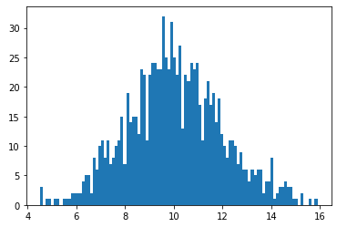
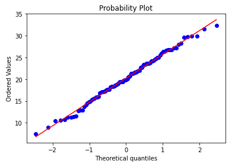
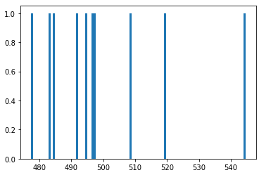
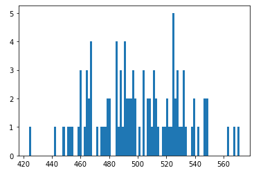
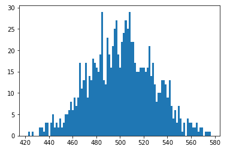
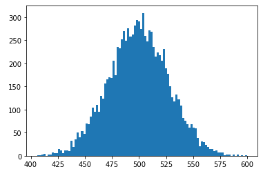

# 정규분포

---

- 정의 
  - 종모양의 좌우대칭의 분포
- 데이터 분석 관점의 정규분포
  - 현실문제를 푸는데 이용


#### * 중심극한정리

- 평균의 평균
- 반복적으로 표본을 뽑은 평균이 전체 평균에 가까워짐
- 모집단 전체에 대한 정보가 없어도 모집단에 대한 확률적 추론이 가능해진다.


#### * Q-Q plot

- X축 : 분포의 이론적인 값 표시
- Y축 : 사용한 데이터 값 표시
- 산점도를 그려 이론과 완벽하게 일치하는 빨간색 실선과 얼마나 유사한 모양이 나타나는지 비교하는 차트

---

## 코드

---

### 1. 히스토그램을 통한 정규분포 확인

```python
import matplotlib.pyplot as plt
import numpy as np

random_sample = np.random.normal(loc = 10, scale = 2, size = 1000)
plt.hist(random_sample, bins = 100)
plt.show()
```



### 2. Q-Q plot을 통한 확인

```python
# Q-Q plot
import numpy as np
import pylab
import scipy.stats as stats

norm_sample = np.random.normal(loc = 20, scale = 5, size = 100)
stats.probplot(norm_sample, dist = 'norm', plot = pylab)
pylab.show()
```

- np.random.normal() : # 무작위로 만든 샘플 데이터를 정규분포에 근사한 형태가 되도록 만드는 함수
  - loc : 평균
  - scale : 표준편차
  - size : 데이터의 개수



### 3. 중심극한정리 실험

: 반복횟수를 늘리면서 그래프의 변화 확인

- 기초코드

  ```python
  # 중심극한정리 실험
  import matplotlib.pyplot as plt
  import numpy as np
  import random
  
  avg_values = []
  for i in range(1, 11):
      random_sample = random.sample(range(1, 1000), 100) # 1~1000의 임의의 수를 100개 추출
      x = np.mean(random_sample) # 평균 계산
      avg_values.append(x) # 리스트에 추가
  
  plt.hist(avg_values, bins = 100)
  plt.show()
  ```

  실험의 형태는 기초코드에서 for문의 반복횟수만 바꿔준다.

1. 10회 반복

   

2. 100회 반복

   

3. 1000회 반복

   

4. 10000회 반복

   

*중심극한정리에 의해 임의 추출 집단의 평균 값이 전체 집단의 평균에 가까워지는 것을 알 수 있다.*