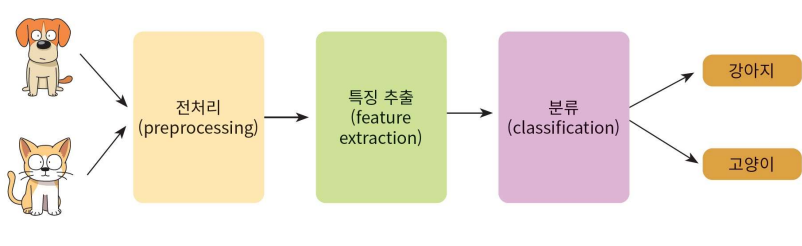
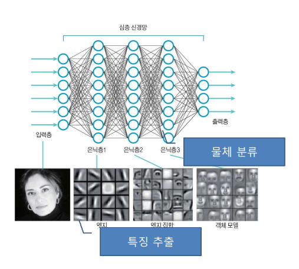
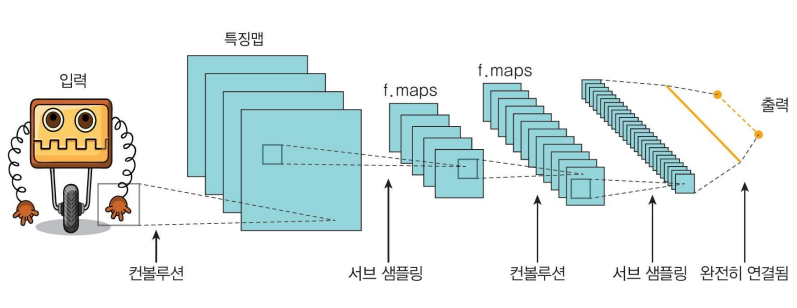
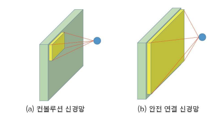
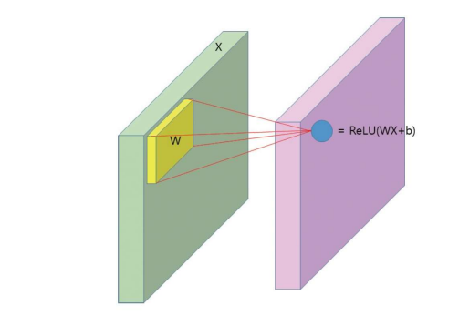
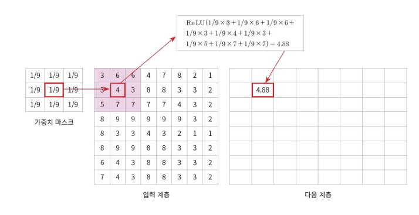
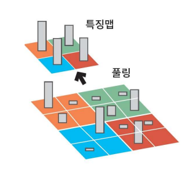
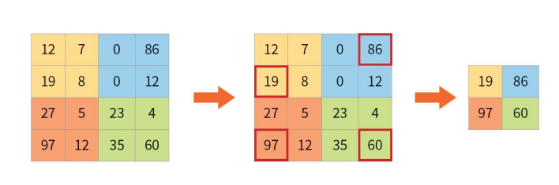
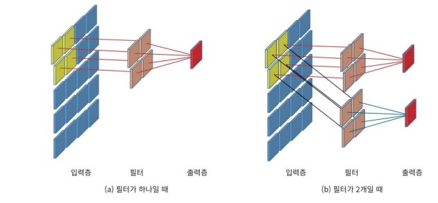

# CNN (Convolution Neural Network) 이론

## 1. CNN이란?

### 1) CNN의 출현

- CNN은 생물체의 영상 처리 구조에서 힌트를 얻어 출현하게 되었다.

### 2) CNN의 도식화

- 생물체는 여러 개의 특징을 통해서 물체를 분류한다.
- 생물체의 영상 처리 구조를 뉴럴 네트워크로 포함하면 다음과 같다.

- 해당 뉴럴 네크워크를 CNN으로 표현하면 다음과 같다.

### 3) CNN의 정의

### 4) CNN의 구성

- CNN은 하위 레이어의 노드들과 상위 레이어의 노드들이 부분적으로만 연결되어있다.

- CNN의 입력층

  - CNN의 입력층에는 Convolution 연산을 통하여 특징을 뽑아내는 특징맵(feature map)이 존재한다.

    - Convolution 연산이란, 주변 화소값들에 가중치를 곱해서 더한 후에 이것을 새로운 화소값으로 하는 연산이다.

      

      

  - 입력의 차원을 줄이는 풀링(Pooling) 연산을 적용한다.

    - Pooling은 일종의 서브 샘플링으로 입력 데이터의 크기를 줄이는 것이다.

      

      

    - Pooling의 장점

      - Layer의 size가 작아지므로 연산 속도가 빨라진다.
      - Layer의 size가 작아지는것은 Neural Network의 매개변수가 작아지는것이다. 즉, 과적합이 나올 가능성이 줄어든다.
      - 공간 상 물체의 이동에 대하여 둔감해진다.

  - Convolution Layer와 Pooling Layer가 여러 번 되풀이 된다.

  - Neural Network의 맨 끝에는 완전히 연결된 구조의 전통적인 분류 신경망이 존재하여 추출된 특징을 바탕으로 물체를 인식하게 된다.

  - CNN은 여러 개의 필터를 이용하며 필터의 값은 학습된다.

    
