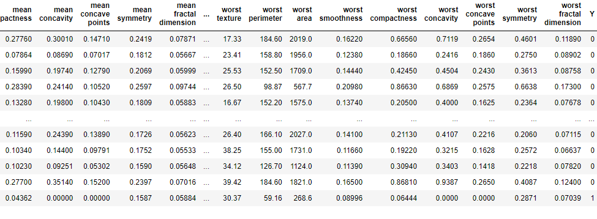
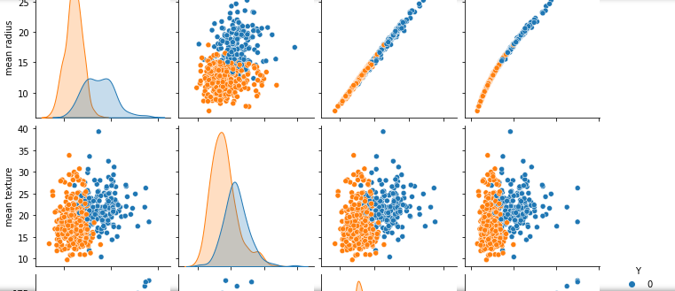
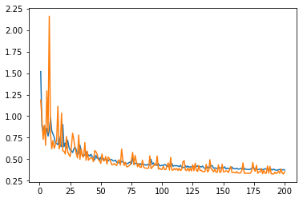

# 딥러닝 : 유방암 분류 문제

## 1. 데이터 분석

- 전체 데이터 로드

  ```python
  from sklearn.datasets import *
  import pandas as pd
  import numpy as np
  
  breast_cancer = load_breast_cancer()
  data = pd.DataFrame(breast_cancer.data, columns=breast_cancer.feature_names)
  t_data = pd.Series(breast_cancer.target, dtype='category')
  data['Y'] =  t_data
  data
  ```

  

- 시각화

  ```python
  import seaborn as sns
  import matplotlib.pyplot as plt
  
  for i in range(0, 29, 4):
      if i == 28:
          slice_data = data[[j for j in breast_cancer.feature_names[i:]]]
          slice_data['Y'] = pd.Series(breast_cancer.target, dtype='category')
      else: 
          slice_data = data[[j for j in breast_cancer.feature_names[i:i+4]]]
          slice_data['Y'] = pd.Series(breast_cancer.target, dtype='category')
      sns.pairplot(slice_data, hue='Y')
      plt.show()
  ```

  

  ... 이미지가 많으므로 생략.

- 피쳐선정

  - ['radius error', 'perimeter error', 'area error', 'mean concave points']

- 피쳐선정 이유

  - 기본적으로 특징이 명확한 피처
  - 'radius error', 'perimeter error', 'area error' : 평균, 오차, 오점 중 오차에 대한 접근이 각 피쳐의 특성을 명확하게 표현하여 다음과 같이 선정했다.
  - 'mean concave points' : 특징이 명확하다.


## 2. 모델 학습 및 결과

- 피쳐 정리 및 출력값 범주화, 데이터 분리

  ```python
  from tensorflow.keras.utils import to_categorical
  from sklearn.model_selection import train_test_split
  
  X_data = data[['radius error', 'perimeter error', 'area error', 'mean concave points']].values
  Y_data = to_categorical(data['Y'])
  
  t_x, tt_x, t_y, tt_y = train_test_split(X_data, Y_data, random_state = 42)
  ```

- 모델 생성 및 학습

  ```python
  import tensorflow as tf
  from tensorflow.keras.models import Sequential
  from tensorflow.keras.layers import Dense
  from tensorflow.keras import optimizers
  
  bcc_model = Sequential()
  bcc_model.add(Dense(2, input_dim=4, activation='sigmoid'))
  bcc_model.compile(optimizer=optimizers.SGD(learning_rate=0.01), loss='binary_crossentropy', metrics=['binary_accuracy'])
  bcc_history = bcc_model.fit(t_x, t_y, epochs=200, validation_data=(tt_x, tt_y))
  ```

- 결과확인

  ```python
  ec = range(1, len(bcc_history.history['binary_accuracy']) + 1)
  plt.plot(ec, bcc_history.history['loss'])
  plt.plot(ec, bcc_history.history['val_loss'])
  plt.show()
  ```

  

  