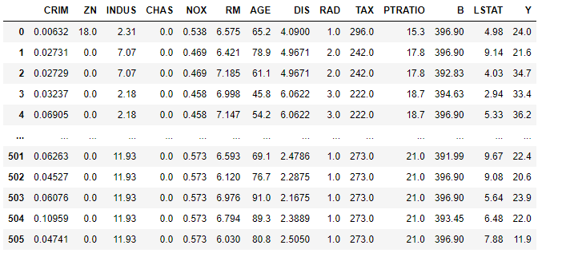
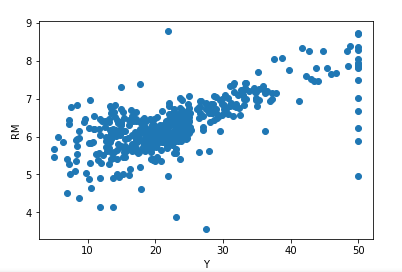
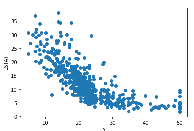

# 딥러닝 : 회귀문제 데이터 분석만

## 1. 데이터 로드

```python
from sklearn.datasets import *
import pandas as pd
import numpy as np

l_data = load_boston()
data = pd.DataFrame(l_data.data, columns=l_data.feature_names)
data['Y'] = pd.Series(l_data.target)
data
```



## 2. 데이터 분석 : 시각화

```python
import seaborn as sns
import matplotlib.pyplot as plt

for i in l_data.feature_names:
    plt.scatter(data['Y'], data[i])
    plt.xlabel('Y')
    plt.ylabel(i)
    plt.show()
```





- 결론
  - RIM, LSTAT 피처가 Y값에 대해 선형적인 형태를 가지므로 피처로 선택하기에 적합하다.