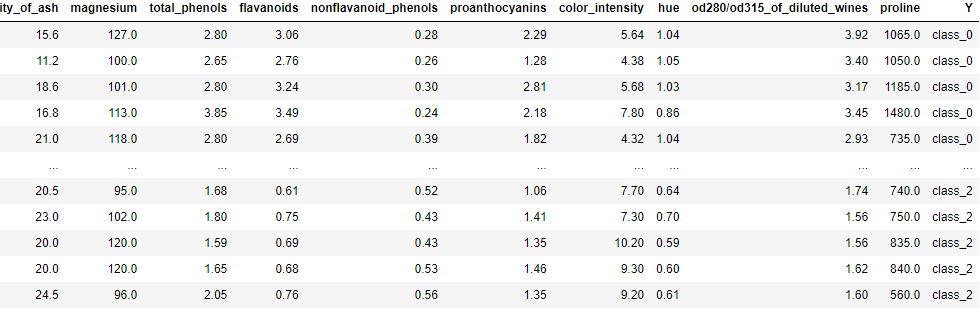
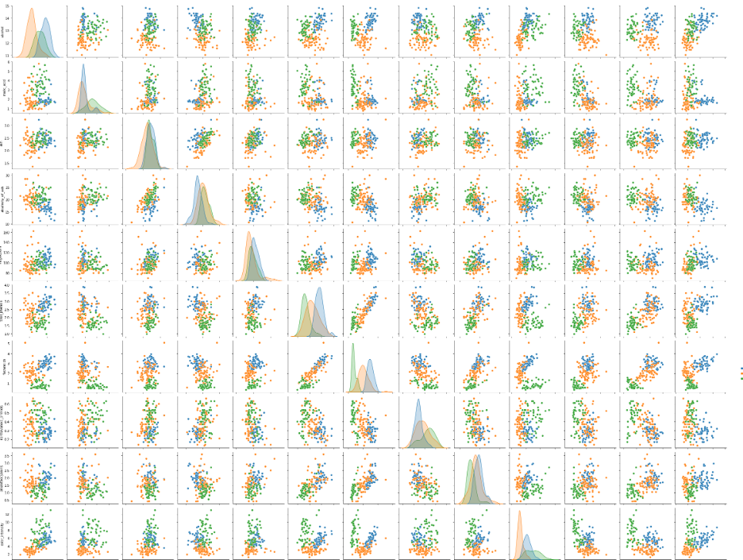
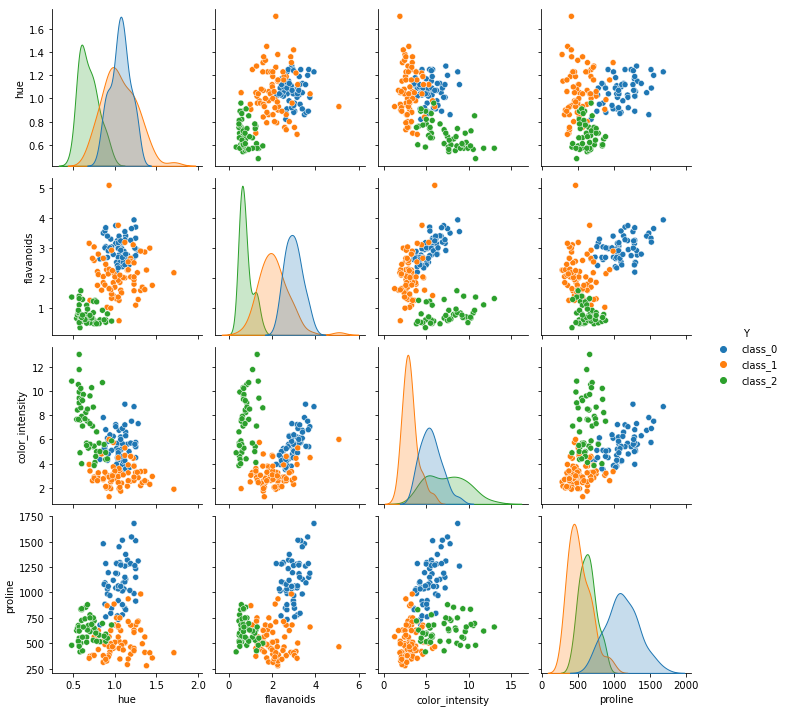
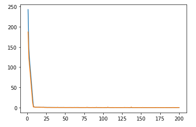

# 딥러닝 : 와인 데이터 분류 문제

---

## 1. 데이터 로드

```python
from sklearn.datasets import *
import pandas as pd

w_data = load_wine()
data = pd.DataFrame(w_data.data, columns=w_data.feature_names)

sy = pd.Series(w_data.target, dtype='category')
sy = sy.cat.rename_categories(w_data.target_names)

data['Y'] = sy
data
```



## 2. 데이터 분석 : 시각화

```python
import seaborn as sns
import matplotlib.pyplot as plt

sns.pairplot(data, hue='Y')
plt.show()
```



- 피쳐 선정

  - flavanoids : 3개의 클래스가 모두 특성을 갖는 피쳐이므로 선정
  - proline : class_0을 구분할 수 있는 특성을 갖는 피쳐이므로 선정
  - color_intensity : class_1을 구분할 수 있는 특성을 갖는 피쳐이므로 선정
  - hue : class_2를 구분할 수 있는 특성을 갖는 피쳐이므로 선정

- 선정된 피쳐 시각화

  ```python
  sns.pairplot(data, hue='Y', vars=['hue', 'flavanoids', 'color_intensity', 'proline'])
  plt.show()
  ```

  

  분류문제에서 피쳐는 특징을 구분할 수 있는 피쳐로 선택한다.

## 3. 데이터 전처리

- 피쳐 추출 및 출력값 범주화

  ```python
  import numpy as np
  from tensorflow.keras.utils import to_categorical
  
  X_data = data[['hue', 'flavanoids', 'color_intensity', 'proline']].values
  Y_data = data['Y'].replace(list(np.unique(data['Y'])), [0, 1, 2])
  Y_data = to_categorical(Y_data)
  ```

- 데이터 분리

  ```python
  from sklearn.model_selection import train_test_split
  
  t_x, tt_x, t_y, tt_y = train_test_split(X_data, Y_data, random_state = 42)
  ```

- 모델 생성 및 학습

  ```python
  import tensorflow as tf
  from tensorflow.keras.models import Sequential
  from tensorflow.keras.layers import Dense
  from tensorflow.keras import optimizers
  
  wc_model = Sequential()
  wc_model.add(Dense(3, input_dim=4, activation='softmax'))
  wc_model.compile(optimizer='adam', loss='categorical_crossentropy', metrics=['accuracy'])
  wc_history = wc_model.fit(t_x, t_y, epochs=200, batch_size=1, validation_data=(tt_x, tt_y))
  ```

- 결과확인

  ```python
  ec = range(1, len(wc_history.history['accuracy']) + 1)
  plt.plot(ec, wc_history.history['loss'])
  plt.plot(ec, wc_history.history['val_loss'])
  plt.show()
  ```

  

  