# 배치 정규화

- 배치 정규화를 하는 이유
  - 기울기의 폭발 or 소멸을 억제하여 학습 성능을 향상시키기 위함.

---

## 코드 예시 : iris 데이터 set을 활용하여 배치 정규화를 했을 때와 하지 않았을 때의 성능 비교

0. 패키지

   ```python
   import pandas as pd
   import numpy as np
   from sklearn.datasets import load_iris
   from sklearn.model_selection import train_test_split
   ```

1. 데이터 로드 및 데이터 프레임 변환

   ```python
   data = load_iris()
   df = pd.DataFrame(data.data, columns=data.feature_names)
   df
   ```

   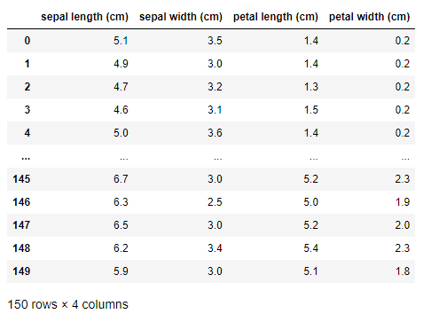

2. 데이터 타입 확인 및 변환

   ```python
   df = df.astype(float)
   ```

   

3. y값 지정 및 데이터 프레임에 추가

   ```python
   df['y'] = data.target
   df
   ```

   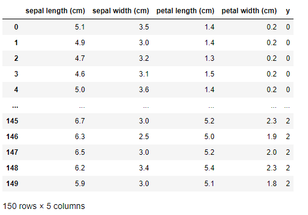


4. y값 네이밍(태그 값으로 변환)

   ```python
   df['y'] = df.y.replace(dict(enumerate(data.target_names)))
   df
   ```

   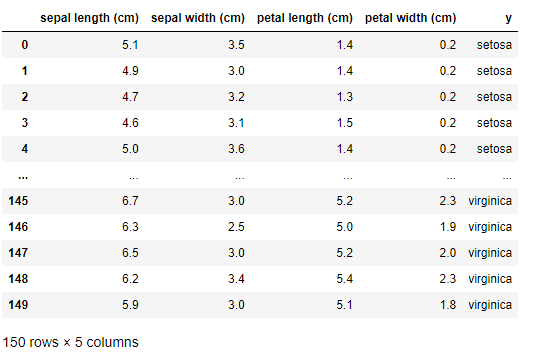

5. y값의 범주화(원-핫 인코딩)

   ```python
   Y = pd.get_dummies(df.y, prefix='Y')
   Y
   ```

   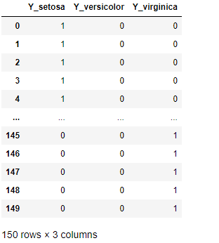

6. 범주화된 y를 본래 데이터 프레임에 join

   ```python
   df = pd.concat([df, Y], axis=1)
   df.drop(['y'], axis=1, inplace=True) # 원래의 y열 drop
   df
   ```

   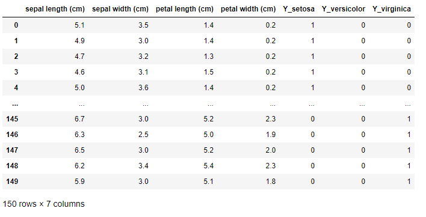

   

7. X_data와 Y_data 생성

   ```python
   X_data = df[['sepal length (cm)', 'sepal width (cm)', 'petal length (cm)', 'petal width (cm)']]
   Y_data = df[['Y_setosa', 'Y_versicolor', 'Y_virginica']]
   X_data, Y_data
   ```

   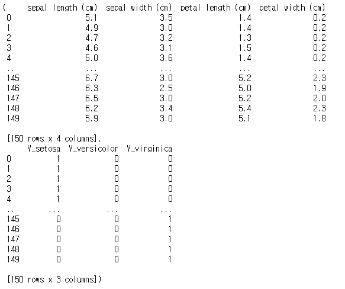

8. X_data와 Y_data의 구조를 학습하기 알맞은 형태로 바꿈

   - np.asarray() : 데이터의 형태에 맞게 변형

   ```python
   X_data = np.asarray(X_data)
   Y_data = np.asarray(Y_data)
   X_data, Y_data
   ```

   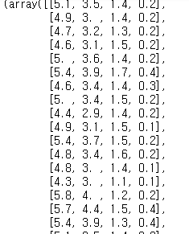

   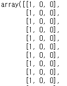

9. X_data와 Y_data의 구조 확인 : 입력과 출력의 형태 지정을 위함

   ```python
   X_data.shape, Y_data.shape
   ```

   ```
   ((150, 4), (150, 3))
   ```


10. 모델 생성 및 Layer 쌓기

    - BatchNormalization : 배치 정규화

    1) 배치 정규화 적용 x

       ````python
       from tensorflow.keras.models import Sequential
       from tensorflow.keras.layers import Dense, BatchNormalization
       
       m = Sequential()
       m.add(Dense(64, input_shape=(4,), activation='relu')) # 입력층
       m.add(Dense(128, activation='relu')) # 은닉층 1
       m.add(Dense(128, activation='relu')) # 은닉층 2
       m.add(Dense(64, activation='relu')) # 은닉층 3
       m.add(Dense(64, activation='relu')) # 은닉층 4
       m.add(Dense(3, activation='softmax')) # 출력층
       m.summary()
       ````

       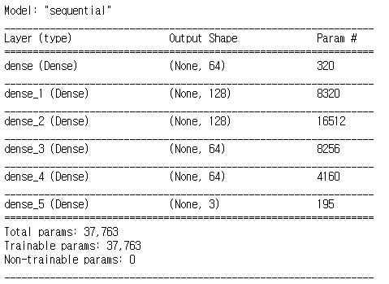

    2) 데이터 분리 : 7:3, 8:2

       - train : test = 7 : 3
       - train : validation = 8 : 2

       ```python
       t_x, tt_x, t_y, tt_y = train_test_split(X_data, Y_data, test_size=0.3, random_state=42)
       ```

11. 학습 방법 설정 및 학습

    - validation_split : 직접적으로 validation 비율 지정(자동 분리)
    - batch_size : 기본값 32, 암묵적으로 기본 값의 2의 제곱승으로 설정
    - 먼저, 모델의 학습을 체크하기위해서 작은 에포치의 값으로 학습을 돌려본다.
    - verbose
      - 기본값은 게이지와 모양들
      - 1: 기본값
      - 0 : 표시 x
      - 2: 수치값만

    ```python
    m.compile(optimizer='adam', loss='categorical_crossentropy', metrics='accuracy')
    hy = m.fit(t_x, t_y, validation_split=0.2, batch_size=32, epochs=1000, verbose=2) 
    ```

    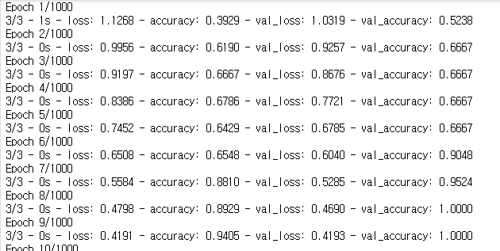

12. 결과 시각화

    ````python
    import matplotlib.pyplot as plt
    
    plt.plot(hy.history['accuracy'])
    plt.plot(hy.history['val_accuracy'])
    plt.plot(hy.history['loss'])
    plt.plot(hy.history['val_loss'])
    plt.show()
    ````

    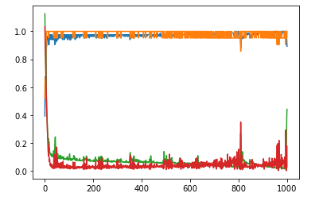

13. 테스트 데이터로 성능 평가

    ```python
    m.evaluate(tt_x, tt_y)
    ```

    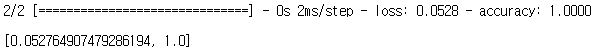

14. 결과 개선을 위한 배치 정규화 적용

    - 각 층마다 적용
    - 배치 정규화 층을 거치면 데이터가 정돈된다고 생각하면 된다.
    - momentum
      - 값에 대한 평균과 표준편차를 계산에 대한 수식의 값을 부여
    - epsilon
      - 0의 분산연산을 막기위한 최소한의 값
    - beta_initializer
      - 초기 가중치 값
      - 일반적으로 랜덤 값으로 설정
    - 배치 정규화 적용
      - 기울기 소멸 또는 폭발을 방지

    ```python
    from tensorflow.keras.initializers import RandomNormal, Constant
    
    m2 = Sequential()
    m2.add(Dense(64, input_shape=(4,), activation='relu')) # 입력층
    m2.add(BatchNormalization())
    m2.add(Dense(128, activation='relu')) # 은닉층 1
    m2.add(BatchNormalization())
    m2.add(Dense(128, activation='relu')) # 은닉층 2
    m2.add(BatchNormalization())
    m2.add(Dense(64, activation='relu')) # 은닉층 3
    m2.add(BatchNormalization())
    m2.add(Dense(64, activation='relu')) # 은닉층 4
    m2.add(BatchNormalization(momentum=0.95, epsilon=0.005, beta_initializer=RandomNormal(mean=0.0, stddev=0.05), 
                             gamma_initializer=Constant(value=0.9)))
    m2.add(Dense(3, activation='softmax')) # 출력층
    m2.summary()
    ```

    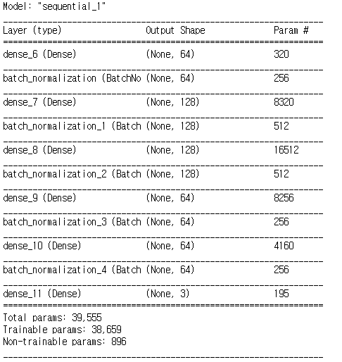

15. 모델 학습

    ```python
    m2.compile(optimizer='adam', loss='categorical_crossentropy', metrics='accuracy')
    hy2 = m2.fit(t_x, t_y, validation_split=0.2, batch_size=32, epochs=1000, verbose=2) 
    ```

    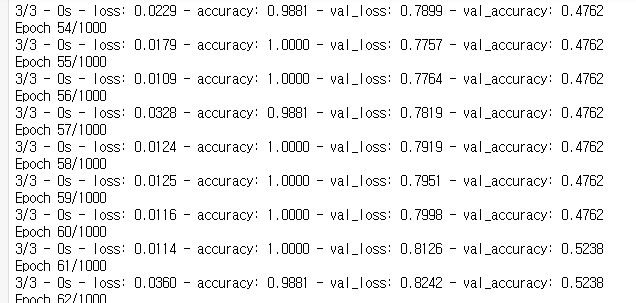

16. 결과 시각화

    ```python
    import matplotlib.pyplot as plt
    
    plt.plot(hy2.history['accuracy'])
    plt.plot(hy2.history['val_accuracy'])
    plt.plot(hy2.history['loss'])
    plt.plot(hy2.history['val_loss'])
    plt.show()
    ```

    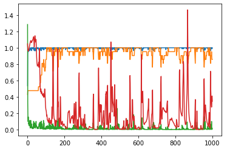

17. 결과 평가

    ```python
    m2.evaluate(tt_x, tt_y)
    ```

    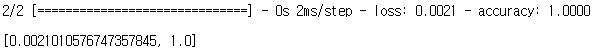

    - 분석(배치 정규화)
      - 기울기의 폭발을 억제한다.
      - 안정적인 학습이 진행된다.


