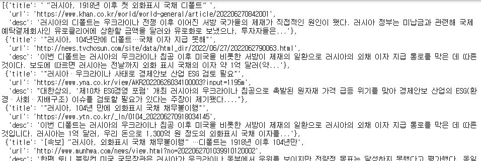
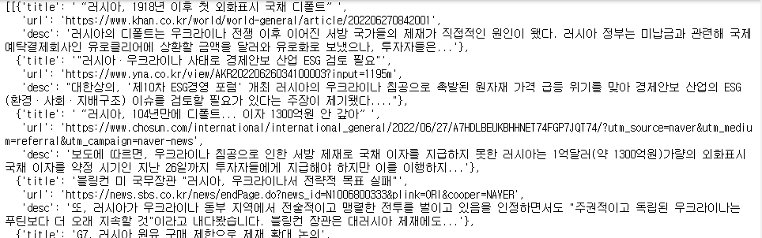

# Request를 활용한 크롤링 실습


## 1. 우크라이나 러시아 키워드로 뉴스리스트를 가져온다.

```
{
    'title' :'제목',
    'url' : 'https//~',
    'desc' : '러시아의 디폴트는~'
}

Q1. 1페이지 크롤링
Q2. 10페이지까지 크롤링
Q3. 해당 url (신문사) 들어가서 본문도 크롤링(html)
```


### 1) 1 페이지 크롤링

```python
import requests
from bs4 import BeautifulSoup

resp = requests.get('https://search.naver.com/search.naver', params={'where':'news', 'query':'우크라이나+러시아'})

soup = BeautifulSoup(resp.text)

news_area = soup.select('div.news_area')

news_dict = [{'title' : i.select_one('a.news_tit').text,
             'url' : i.select_one('a.news_tit').get('href'),
             'desc' : i.select_one('.dsc_wrap .api_txt_lines.dsc_txt_wrap').text} for i in news_area]
news_dict
```




### 2) 10 페이지 크롤링

```python
news_dict_list = []

for i in range(1, 91, 10):
    resp = requests.get(f'https://search.naver.com/search.naver', params={'where':'news', 'query':'우크라이나+러시아', 'start' : f'{i}'})
    soup = BeautifulSoup(resp.text)
    news_area = soup.select('div.news_area')
    news_dict = [{'title' : i.select_one('a.news_tit').text,
             'url' : i.select_one('a.news_tit').get('href'),
             'desc' : i.select_one('.dsc_wrap .api_txt_lines.dsc_txt_wrap').text} for i in news_area]
    news_dict_list.append(news_dict)
    
news_dict_list
```




### 3) 신문사 들어가서 내용(html)까지 크롤링

```python
import time
from tqdm import tqdm_notebook

news = []
headers = {'User-Agent':'Mozilla/5.0 (Windows NT 10.0; Win64; x64) AppleWebKit/537.36 (KHTML, like Gecko) Chrome/103.0.5060.53 Safari/537.36'}

for i in tqdm_notebook(range(1, 91, 10)):
    resp = requests.get(f'https://search.naver.com/search.naver', 
                        params={'where':'news', 'query':'우크라이나+러시아', 'start' : f'{i}'},
                       headers=headers)
    soup = BeautifulSoup(resp.text)
    news_area = soup.select('div.news_area')
    
    for j in news_area:
        news_dict = dict()
        
        news_dict['title'] = j.select_one('a.news_tit').text
        news_dict['url'] = j.select_one('a.news_tit').get('href')
        news_dict['desc'] = j.select_one('.dsc_wrap .api_txt_lines.dsc_txt_wrap').text
        
        resp2 = requests.get(news_dict['url'], headers=headers)
        soup2 = BeautifulSoup(resp2.text)
        news_dict['content_soup'] = soup2
    
        news.append(news_dict)
        
        #time.sleep(1)
```


## 2. 네이버 주가 데이터 가져오기

- target_url = https://finance.naver.com/item/sise.nhn?code=005930


```python
base_url = 'https://finance.naver.com'
resp = requests.get('https://finance.naver.com/item/sise.nhn?code=005930', headers=headers)

# iframe scr 얻기
soup = BeautifulSoup(resp.text)
iframe_tags = soup.find_all('iframe')

for i in iframe_tags: # 일별 시세를 나타내는 iframe의 src 얻기
    if i.get('title') == '일별 시세':
        target_url = i.get('src')

# iframe request
resp2 = requests.get(base_url + target_url, headers=headers)
soup2 = BeautifulSoup(resp2.text)

tr_tags = soup2.find_all('tr')

f_infos = []

for tr_tag in tr_tags:
    if tr_tag.select('td.num') != []: # 가격 정보를 담고있는 td 태그만 골라내기
        f_info = []
        
        span_tags = tr_tag.find_all('span')
        for span_tag in span_tags:
            f_info.append(span_tag.text.strip())
        f_infos.append(f_info)


result = [{'날짜' : i[0], '종가' : i[1], '전일비' : i[2], '시가' : i[3], '고가' : i[4], '저가' : i[5], '거래량' : i[6]} for i in f_infos]
```


