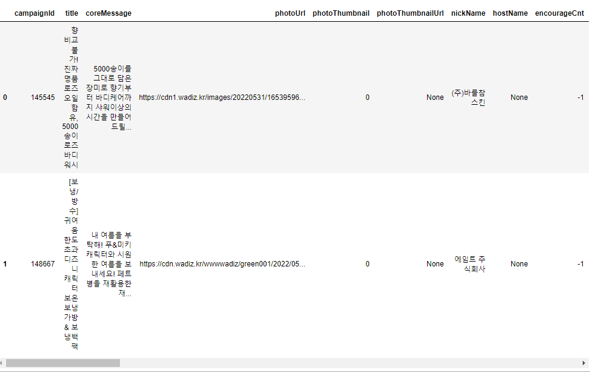

# Request 심화 실습 2

*와디즈*와 같이 동적 스크롤 형식의 웹사이트 크롤링하기


## 1. request 형식 확인

- 스크롤 다운 시 데이터가 계속 request 된다.
- Ajax 형태 / F12 -> Fetch/XHR, Doc에 표시가 되고 여기에 표시되지 않으면 찾아봐야 한다.
- 찾으면 해당 request가 온 URL을 찾는다.


## 2. 코드

```python
import pandas as pd
from tqdm import tqdm_notebook
import requests
```


```python
base_url = 'https://www.wadiz.kr/web/wreward/main?keyword=&endYn=ALL&order=recommend'

request_url = 'https://www.wadiz.kr/web/wreward/ajaxGetCardList?startNum=48&limit=48&order=recommend&keyword=&endYn=ALL'

params = dict(
    startNum = 0,
    limit = 100, # limit을 바꾸면서 최대 가져올 수 있는 개수를 파악
    order = 'recommend',
    keyword = '',
    endYn = 'ALL'
)
data = []
for i in tqdm_notebook(range(10)):
    params.update({'startNum':i*100, 'limit':'100'})
    resp = requests.get('https://www.wadiz.kr/web/wreward/ajaxGetCardList', params=params)
    data.extend(resp.json()['data'])
    
df = pd.DataFrame(data)
df.head(2)
```

