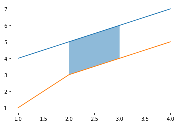
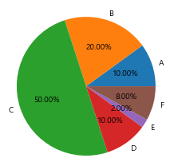
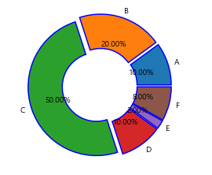
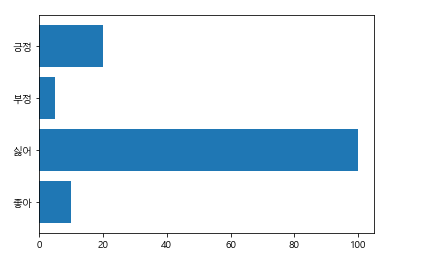
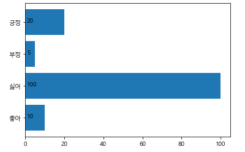
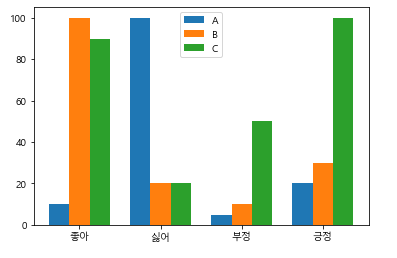
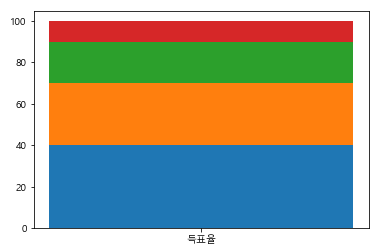
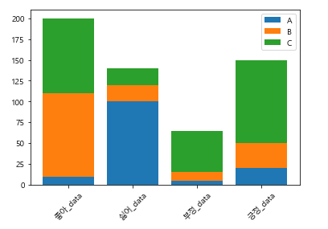
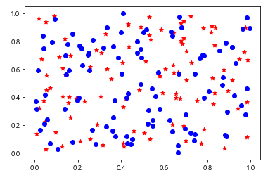
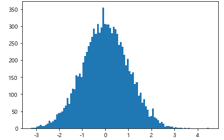

# 1. Matplot을 이용한 데이터 시각화


## 1) Matplot

- 정의 : 데이터를 시각화하기위한 여러가지 도구들이 들어있는 데이터 시각화 모듈

- 초기설정

  ```python
  # plot을 사용하기 위한 모듈
  import matplotlib.pyplot as plt
  
  # 한글을 사용하기 위한 설정 - Windows
  import matplotlib
  import matplotlib.font_manager
  
  # 폰트설정 - 한글사용
  matplotlib.rcParams['font.family']='Malgun Gothic'
  # 음수표기를 위한 속성값 변경
  matplotlib.rcParams['axes.unicode_minus']=False
  ```

### (1) plot

- 선언

  ``plt.plot({x좌표 리스트},{y좌표 리스트})``: x좌표와 y좌표에 맞게 좌표를 찍고 잇는다.

- 출력

  ``plt.show()`` : matplot을 출력한다. 단, data로 테이블을 만들면 그 데이터는 더이상 남아있지 않게된다.

- 그래프 설정

  ```python
  # plot 객체 생성
  ax=plt.subplots()
  # data 전달
  ax.plot(X,Y)
  # 그래프 설정
  '''
  title : 그래프 이름 설정
  xlabel : x축의 이름 설정
  ylabel : y축의 이름 설정
  '''
  ax.set(title='title',xlabel='X',ylabel='Y')
  
  # title,xlabel,ylabel의 폰트 및 색,크기,위치지정
  '''
  fontdict : 개별적인 폰트 설정
  size : 글자의 크기 설정
  color : 글자의 색 설정
  loc : 글자의 위치 설정
  <위치>
  가로 : left,center,right
  세로 : top,center,bottom
  '''
  plt.title('꺽은선 그래프',color='#0000aa',fontdict={'family':"Malgun Gothic","size":25},loc='left')
  plt.xlabel('가로축',color='#00aa00',fontdict={'family':'Malgun Gothic','size':25},loc='left')
  plt.ylabel('세로축',color='#aa0000',fontdict={'family':'Malgun Gothic','size':25},loc='bottom')
  ```

- 출력범위 지정

  - ``plt.xticks()`` : x축의 범위를 지정

  - ``plt.yticks()``: y축의 범위를 지정

  - 예시

    ```python
    plt.xticks([1,2,3,6])
    plt.yticks([4,6,8,10])
    ```

    

- 영역을 나누어 그래프 생성

  - 영역 생성

    - ``plt.subplots(nrows=행,ncols=열)``: 행x열 만큼의 영역을 생성

  - 영역 지정

    - 2차원 배열로의 접근

      ```python
      ax[0,0].plot(x,y1)
      ax[0,1].plot(x,y2)
      ax[1,0].plot(x,y3)
      ax[1,1].plot(x,y4)
      ```

    - 데이터를 각각 배치

      ```python
      ax1=plt.subplot(222)
      plt.plot(x,y1)
      ax2=plt.subplot(221)
      plt.plot(x,y2)
      ax3=plt.subplot(212)
      plt.plot(x,y3)
      ```

- 그래프 각각에 이름 부여

  - 이름 붙이기

    - ``plt.plot(x,y,label="그래프이름")``

  - label로 부여한 이름 표시

    - plt.legend(loc='위치')

    - 위치

      ```python
      best
      upper right
      upper left
      lower left
      lower right
      right
      center left
      center right
      lower center
      upper center
      center
      ```

- 그래프 선 모양 지정

  - 옵션-linestyle
    - ``plt.plot(x,y,linestyle='선모양')``
    - 선모양
      - dashed : 점선
      - dotted : 촘촘한 점선
  - 선 굵기 지정
    - ``plt.plot(x,y,linewidth=굵기)``
  - 선 효과 추가
    - ``plt.plot(x,y,shadow=True)`` : 그림자효과 추가
  - 점의 형태 변경
    - plt.plot(x,y,marker='모양')
    - 모양
      - o : 큰 동그라미
      - \* : 별
      - v : 벡터

- 여러가지 기능

  1. x값 자동 매핑

     - y의 값만 입력해도 x의 값이 자동으로 매핑된다. 이는 y=wx라는 함수의 특성에 의한 것이다.
     - ``plt.plot(y)``

  2. 출력 범위 설정

     - ``plt.xlim([최소,최대])`` : x축의 범위를 지정
     - ``plt.ylim([최소,최대])`` : y축의 범위를 지정
     - ``plt.axis([x최소,x최대,y최소,y최대])``: x,y 축의 범위를 한번에 지정

  3. 선의 모양을 지정하는 간단한 키워드

     - ``plt.plot(x,y,'키워드')``
     - 키워드
       - '-' : 점선
       - '--' : 굵은 점선
       - ':' : 일반 선
       - '-.' : 중간에 점이 있는 점선

  4. 키워드를 이용한 스타일 축약형태

     - ``plt.plot(x,y,'색점선')``
     - 예시) ``plt.plot(x,y,'g*-')``
       - 초록색 별모양 점 점선

  5. 그래프 영역표시

     - ``plt.fill`` 

       - ``plt.fill([x1,x2,x3,x4],[y1,y2,y3,y4])``:
         - (x1,y1) ~ (x4,y4) 까지의 점을 순서대로 이은 영역

     - ``plt.fill_between``

       - 수평영역을 지정
       - ``plt.fill_between(x[시작:끝],y[시작:끝])``

     - ``plt.fill_betweenx``

       - 수직영역을 지정
       - ``plt.fill_betweenx(y[시작:끝],x[시작:끝])``

     - 서로 다른 y값으로부터 그래프의 범위

       - ``plt.fill_between(x[1:3],y[1:3],y1[1:3],alpha=0.5)``

         

  6. 축의 크기 조절

     - ``plt.xscale('키워드')``
       - 키워드 : symbol, log 등
       - x축의 크기를 조절
     - ``plt.yscale('키워드')``
       - y축의 크기를 조절

  7. 격자표시

     - ``pit.grid(True,axis='축')``
       - axit 옵션에 x 또는 y의 값을 지정해서 해당 축의 격자를 생성할 수 있다

  8. 수평선과 수직선

     - ``plt.axhine(시작,시작점%,끝점%)`` : 축 수평
     - ``plt.axvline(시작,시작점%,끝점%)`` : 축 수직
     - ``plt.hlines(시작,시작점,끝점)`` : 점 수직
     - ``plt.vlines(시작,시작점,끝점)`` : 점 수평

### (2) 원 그래프

- 선언

  - ``plt.pie(데이터,labels=이름구조,autopct='%.자리수f%%')``

  - 예시

    ```python
    data=[10,20,50,10,2,8]
    name=['A','B','C','D','E','F']
    plt.pie(data,labels=name,autopct='%.2f%%')
    ```

    

- 옵션

  - 간격부여

    - ``explode``

    ```python
    e=[0.05]*6
    plt.pie(data,labels=name,autopct='%.2f%%',explode=e)
    ```

  - width 간격

    ```python
    # width : 간격, edgecolor : 경계선 색상, linewidth : 경계선 굵기
    w={'width':0.5,'edgecolor':'b','linewidth':1.5}
    plt.pie(data,labels=name,autopct='%.2f%%',explode=e,wedgeprops=w)
    ```

    

### (3) 막대 그래프

- 선언
  - ``plt.bar(x,y)``
  - 막대 그래프의 옵션부여는 plot과 동일하다.
  - 다른 기능들 역시 동일하다.
- 축 문자 돌리기
  - ``plt.xticks(rotation=각도)`` : 각도만큼 x축 문자를 돌린다
  - ``plt.yticks(rotation=각도)`` : 각도만큼 y축 문자를 돌린다

- 가로 막대 그래프

  - ``plt.barh(범위,y)``

  - ``plt.yticks(범위,x)``

  - 사용예시

    ```python
    단어=['좋아','싫어','부정','긍정']
    회수=[10,100,5,20]
    d=np.arange(4)
    plt.barh(d,회수)
    plt.yticks(d,단어)
    ```

    

- 막대별 값 표시

  - ``pit.text(데이터.get_height(),i,회수[i])``

    ```python
    b=plt.barh(단어,회수)
    # (좌표,데이터)
    for i,d in enumerate(b):
        plt.text(d.get_height(),i,회수[i])
    ```

    

- 심화기능

  - 여러개의 대상을 한번에 표시

  - 예시

    ```python
    단어=['좋아','싫어','부정','긍정']
    x=np.arange(0,8,2)
    A_횟수=[10,100,5,20]
    B_횟수=[100,20,10,30]
    C_횟수=[90,20,50,100]
    plt.bar(x+0.00,A_횟수,width=0.5,label='A')
    plt.bar(x+0.50,B_횟수,width=0.5,label='B')
    plt.bar(x+1.00,C_횟수,width=0.5,label='C')
    plt.xticks(x+0.5,단어)
    plt.legend(loc='best')
    ```

    

  - 누적량 표시

  - 예시

    ```python
    # 누적
    x='득표율'
    y1=[10]
    y2=[20]
    y3=[30]
    l_d=[40]
    plt.bar(x,l_d)
    plt.bar(x,y3,bottom=l_d)
    plt.bar(x,y2,bottom=y3[0]+l_d[0])
    plt.bar(x,y1,bottom=y2[0]+y3[0]+l_d[0])
    ```

    

  - 여러 x 값의 누적량 표시

  - 예시

    ```python
    단어=['좋아_data','싫어_data','부정_data','긍정_data']
    A_횟수=np.array([10,100,5,20])
    B_횟수=np.array([100,20,10,30])
    C_횟수=np.array([90,20,50,100])
    plt.bar(단어,A_횟수,label='A')
    plt.bar(단어,B_횟수,bottom=A_횟수,label='B')
    plt.bar(단어,C_횟수,bottom=A_횟수+B_횟수,label='C')
    plt.xticks(rotation=45)
    plt.legend()
    ```

    

### (4) 산점도

- 선언

  - ``plt.scatter(x축,y축)``

  - 그림

    

### (5) 히스토그램

- 선언

  - ``plt.hist(X,bins=표시수)``

  - 예시

    ```python
    n=10000
    X=np.random.normal(size=n)
    plt.hist(X,bins=100)
    plt.show()
    ```

    

    