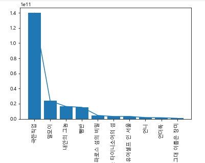
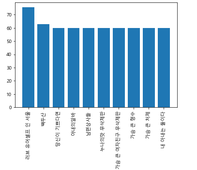
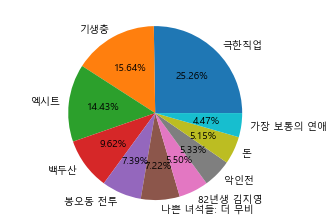
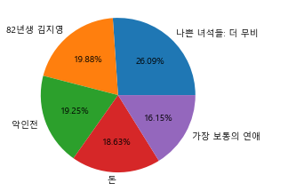
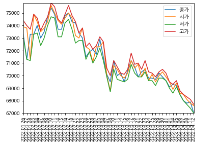
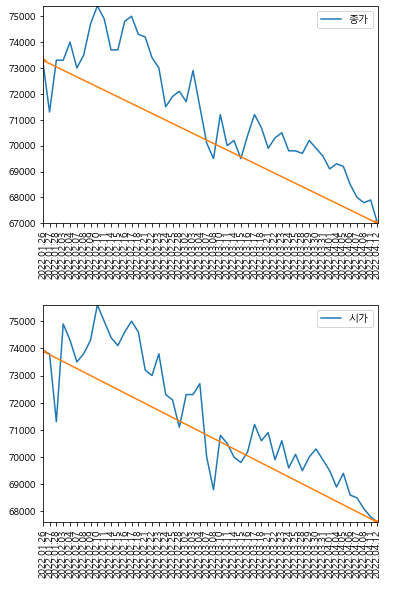
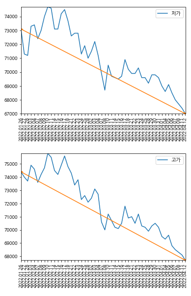

# 1. 데이터 시각화 예제 - 박스오피스 Data 분석

## * 분석방법

1. 박스오피스 2019년 한국 박스오피스 data를 엑셀로 받고 데이터 프레임을 완성하시오.
2. 개봉일 기준 월별 매출순위(1~10)를 막대그래프와 꺽은선 그래프로 같이 표시하시오
3. 스크린수 대비 매출액을 산출하여 1~10위까지를 시각화 하시오
4. 상영횟수 대비 관객수를 계산하여 1회 상영시 평균 관객수를 이용하여 1~10위를 시각화 하시오
5. 관객수 대비 누적매출액을 계산하여 평균 1명당 영화 관람에 사용한 금액을 계산하여 1~10위까지의 순위를 시각화 하시오
6. 스크린수 대비 상영횟수를 계산하여 평균 1개의 스크린에서 상영한 횟수를 통한 1~10위 순위를 시각화 하시오
7. 매출액 점유 기준 1~10위를 선별하고 원그래프를 만드시오
8. 위 문제에서 만든 data에서 5위까지의 점유를 제외한 6~10위까지의 점유율을 원그래프로 나타내시오


- 코드

  - 모듈 선언

    ```python
    import matplotlib
    import matplotlib.pyplot as plt
    import pandas as pd
    import numpy as np
    from pandas import DataFrame
    ```

  - matplot의 서식 지정

    ```python
    # 폰트지정
    matplotlib.rcParams['font.family']='Malgun Gothic'
    # 마이너스 표기 설정
    matplotlib.rcParams['axes.unicode_minus']=False
    ```

  - Data 전처리

    ```python
    # 파일 읽어오기
    df=pd.read_excel('KOBIS_기간별박스오피스_2022-04-12.xls.xlsx')
    
    # 데이터프레임 전처리
    df = df[3:] # 필요없는 데이터를 제거한다. 이는 read_excel의 skiporows 옵션으로도 가능하다
    df.reset_index(drop=True,inplace=True)
    df.columns=df.iloc[0] # 첫 행을 열의 타이틀로 지정
    df.rename(columns={'매출액':'매출액점유율'},inplace=True) # 열의 타이틀을 지정하여 변경
    df=df[2:] # 불필요 데이터 제거
    df.reset_index(drop=True,inplace=True)
    
    # 2019년 이전에 개봉했던 영화들을 제거
    df_2019=DataFrame(df)
    df_2019.reset_index(drop=True,inplace=True)
    df_2019=df_2019.astype({'개봉일':str})
    df_2019=df_2019[df_2019['개봉일'].str.contains('2019')] # 개봉일 중 2019를 포함하는 데이터프레임의 행만 추출
    ```

  - 1번문제

    ```python
    # 월별 매출액 순위 1~10
    for i in range(1,13):
        if i < 10:
            _str=f'2019-0{str(i)}'
        else:
            _str=f'2019-{str(i)}'
        tmp=df_2019[df_2019['개봉일'].str.contains(_str)]
        tmp.sort_values('매출액 ')
        name=tmp['영화명'][:10]
        data=tmp['매출액 '][:10]
        plt.plot(name,data)
        plt.bar(name,data)
        plt.xticks(rotation=90)
        plt.show()
    ```

    실행결과 :  1월 ~ 12월 별 매출순위를 나타낸 12개의 그래프가 생성된다.

    

  - 2번문제

    ```python
    # 스크린수 대비 매출액를 계산하여 평균 1개의 스크린에서 상영한 횟수를 통한 1~10위 순위를 시각화
    tmp=df_2019
    tmp['매출액/스크린수']=df_2019['매출액 ']/df_2019['스크린수 '] # numpy 배열이므로 연산이 가능하다.
    tmp.sort_values('매출액/스크린수',ascending=False,inplace=True)
    plt.bar(tmp['영화명'][:10],tmp['매출액/스크린수'][:10])
    plt.xticks(rotation=90)
    plt.show()
    ```

    

  - 3번문제~6번문제

    - 2번문제와 비슷한 구조를 가진다.(실행결과를 생략)

    ```python
    # 상영횟수 대비 관객수를 계산하여 1회 상영시 평균 관객수를 이용하여 1~10위를 시각화
    tmp=df_2019
    tmp['관객수/상영횟수']=df_2019['관객수 ']/df_2019['상영횟수 ']
    tmp.sort_values('관객수/상영횟수',ascending=False,inplace=True)
    plt.bar(tmp['영화명'][:10],tmp['관객수/상영횟수'][:10])
    plt.xticks(rotation=90)
    plt.show()
    
    # 관객수 대비 누적매출액을 계산하여 평균 1명당 영화 관람에 사용한 금액을 계산하여 1~10위까지의 순위를 시각화
    tmp=df_2019
    tmp['누적매출액/관객수']=df_2019['누적매출액 ']/df_2019['관객수 ']
    tmp.sort_values('누적매출액/관객수',ascending=False,inplace=True)
    plt.bar(tmp['영화명'][:10],tmp['누적매출액/관객수'][:10])
    plt.xticks(rotation=90)
    plt.show()
    
    # 스크린수 대비 상영횟수를 계산하여 평균 1개의 스크린에서 상영한 횟수를 통한 1~10위 순위를 시각화
    tmp=df_2019
    tmp['상영횟수/스크린수']=df_2019['상영횟수 ']/df_2019['스크린수 ']
    tmp.sort_values('상영횟수/스크린수',ascending=False,inplace=True)
    plt.bar(tmp['영화명'][:10],tmp['상영횟수/스크린수'][:10])
    plt.xticks(rotation=90)
    plt.show()
    ```

    

  - 7번문제

    ```python
    # 매출액 점유 기준 1~10위를 선별하고 원그래프 생성
    tmp=df_2019
    tmp.sort_values('매출액점유율',ascending=False,inplace=True)
    _sum = tmp['매출액점유율'][:10].sum() # 매출액점유율의 1~10까지의 합
    data=tmp['매출액점유율'][:10]/_sum # 각 데이터가 가지는 매출액점유율의 합이 100이되도록 조정
    name=tmp['영화명'][:10]
    plt.pie(data,labels=name,autopct='%.2f%%')
    plt.show()
    ```

    

  - 8번문제

    ```python
    # 위 문제에서 만든 data에서 5위까지의 점유를 제외한 6~10위까지의 점유율을 원그래프
    tmp=df_2019
    tmp.sort_values('매출액점유율',ascending=False,inplace=True)
    _sum=tmp['매출액점유율'][5:10].sum()
    data=tmp['매출액점유율'][5:10]/_sum
    name=tmp['영화명'][5:10]
    plt.pie(data,labels=name,autopct='%.2f%%')
    plt.show()
    ```

    

# 2. 데이터 시각화 예제2 - 증권 데이터를 크롤링 후 시각화

## * 분석방법

1. 동적 크롤링을 이용하여 증권(data1개) 내용을 일자별로 5page 수집하여 엑셀로 저장하시오
2. 저장된 data를 이용하여 데이터 프레임을 구축하시오
3. 일자별 4가지(종가,시가,저가,고가) 가격을 이용하여 꺽은선 그래프로 표현하시오

- 코드 

  - 모듈 선언

    ```python
    from selenium import webdriver
    from bs4 import BeautifulSoup
    import pandas as pd
    from pandas import DataFrame
    import numpy as np
    import matplotlib
    import matplotlib.pyplot as plt
    ```

  - 텍스트 공백 제거 함수 선언

    ```python
    def f_1(x):
        return x.text.strip().replace("\t", "").replace("\n", "").replace(',',"") # 원할한 계산을 위해서 숫자형 텍스트의 ,를 제거
    ```

  - 폰트 설정

    ```python
    matplotlib.rcParams['font.family']='Malgun Gothic'
    matplotlib.rcParams['axes.unicode_minus']=False
    ```

  - 데이터 크롤링

    ```python
    # 동적 크롤링을 이용하여 증권(data1개) 내용을 일자별로 5page 수집하여 엑셀로 저장
    b=webdriver.Chrome()
    b.get('http://naver.com')
    b.implicitly_wait(10)
    
    # '네이버 금융'검색
    b.find_element_by_xpath('//*[@id="query"]').send_keys('네이버금융\n')
    b.implicitly_wait(10)
    
    # '네이버 금융' 클릭
    b.find_element_by_xpath('//*[@id="main_pack"]/section[1]/div/div/div[1]/div/div[2]/a').click()
    b.implicitly_wait(10)
    
    # 브라우저 스위칭
    b.switch_to.window(b.window_handles[1])
    
    # 삼성전자 검색
    b.find_element_by_xpath('//*[@id="stock_items"]').send_keys('삼성전자\n')
    b.implicitly_wait(10)
    
    # 삼성전자 클릭
    b.find_element_by_xpath('//*[@id="content"]/div[4]/table/tbody/tr[1]/td[1]/a').click()
    b.implicitly_wait(10)
    
    # 시세 클릭
    b.find_element_by_xpath('//*[@id="content"]/ul/li[2]/a').click()
    b.implicitly_wait(10)
    
    # frame 변경 : iframe의 id가 같을 때, xpath를 통해서 지정해도된다.
    element=b.find_element_by_xpath('//*[@id="content"]/div[2]/iframe[2]')
    b.switch_to.frame(element)
    b.execute_script('window.scrollTo(0,document.body.scrollHeight)')
    b.implicitly_wait(10)
    
    # Data 추출(1~5page 추출)
    l_data = []
    for page in range(2, 8):
        if page != 3:
            # get html
            html = b.page_source
            s = BeautifulSoup(html, 'html.parser')
    
            # 페이지 이동
            b.find_element_by_xpath(f'/html/body/table[2]/tbody/tr/td[{page}]/a').click()
            b.implicitly_wait(10)
    
            # data 수집
            data = s.select('body tr')
            for i in data:
                if i.select_one('span.tah'):
                    l_data.append(list(map(f_1, i.select('span.tah'))))
        
        #data 저장
        df = pd.DataFrame(l_data, columns=['날짜','종가','전일비','시가','고가','저가','거래량'])
        df.to_excel('Quiz2.xlsx',index=False)
    ```

  - 데이터 불러오기

    ```python
    # data 불러오기
    df=pd.read_excel('Quiz2.xlsx')
    df.sort_values('날짜',inplace=True) # data를 불러온 직후 사용하기 편하게하기위해 날짜를 오름차순으로 정렬
    df.reset_index(drop=True,inplace=True)
    ```

  - 일자별 4가지(종가, 시가, 저가, 고가)를 하나의 plot으로 표현

    ```python
    plt.plot(df['날짜'],df['종가'],label='종가')
    plt.plot(df['날짜'],df['시가'],label='시가')
    plt.plot(df['날짜'],df['저가'],label='저가')
    plt.plot(df['날짜'],df['고가'],label='고가')
    plt.legend()
    plt.xticks(rotation=90)
    plt.axis([min(df['날짜']),max(df['날짜']),min(df['저가']),max(df['고가'])]) # x,y축을 오름차순으로 정렬
    plt.show()
    ```

    

  - 일자별 4가지(종가, 시가, 저가, 고가)를 4개의 plot으로 표현 + 시작~끝을 하나의 선으로 이음

    ```python
    # 4개의 그래프로 출력
    title=['날짜','종가','시가','저가','고가']
    df_1 = df[['날짜','종가','시가','저가','고가']]
    for i in range(4):
        plt.plot(df_1['날짜'],df_1.iloc[:,i+1],label=title[i+1])
        plt.plot([df_1.iloc[0,0], df_1.iloc[-1,0]],[df_1.iloc[0,i+1],df_1.iloc[-1,i+1]],'->')
        plt.legend()
        plt.xticks(rotation=90)
        plt.axis([min(df_1['날짜']), max(df_1['날짜']), min(df_1.iloc[:,i+1]),max(df_1.iloc[:,i+1])])
        plt.show()
    ```

    

    

    


