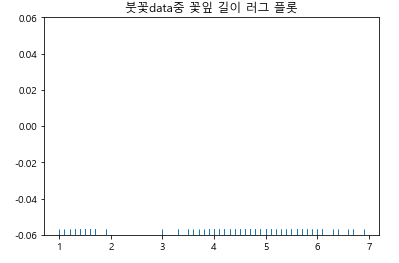
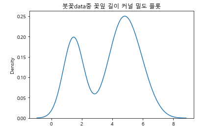
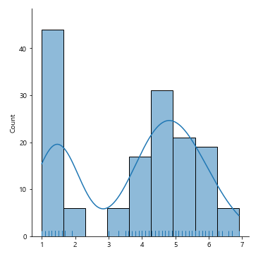
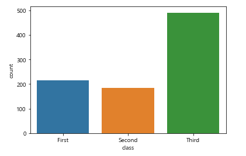
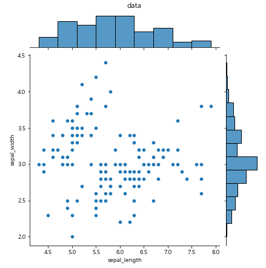
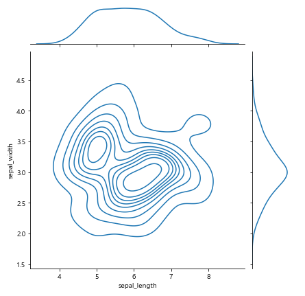
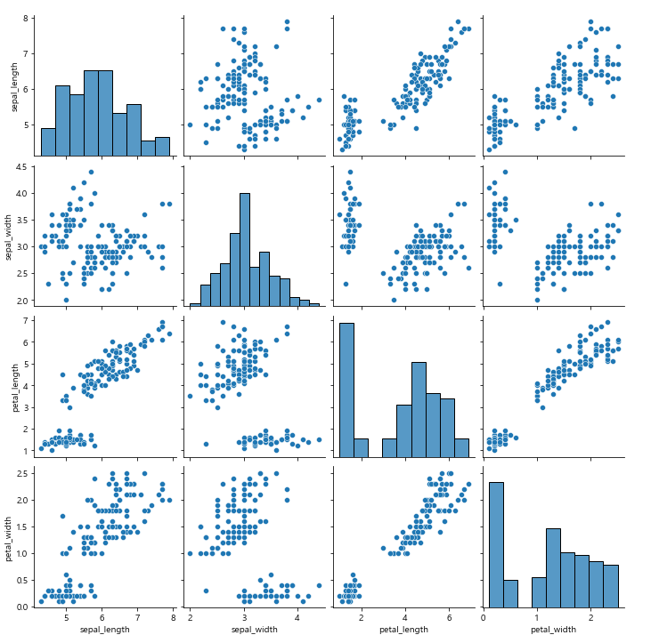
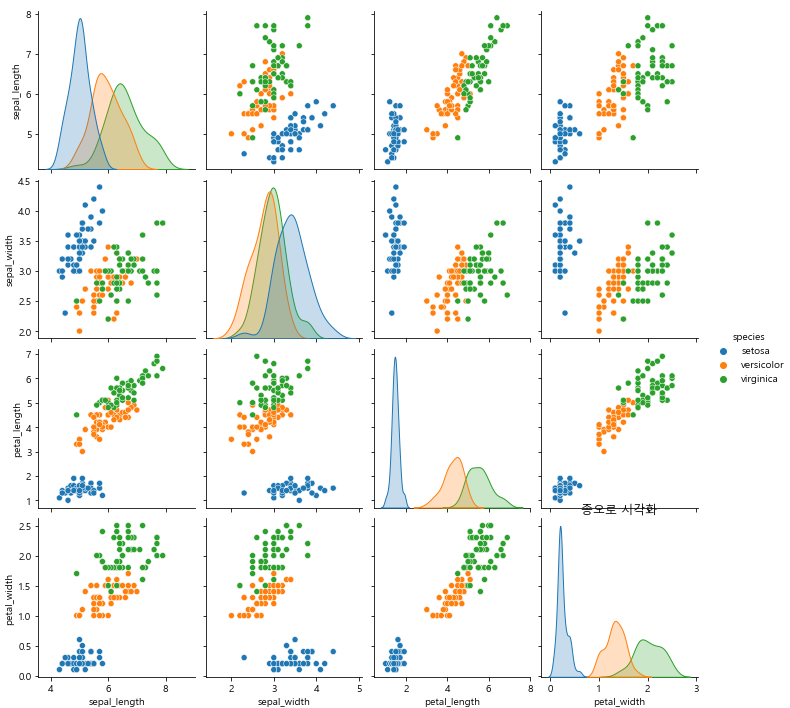
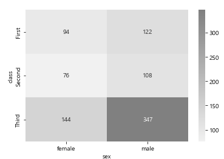
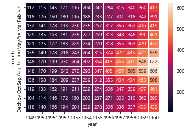

# 1. 데이터 셋을 활용한 다양한 그래프 표현(seaborn)

## 1) rugplot

- 사용예시

  ```python
  # 1. 데이터 셋 로드
  붓꽃data = sns.load_dataset('iris')
  # 2. 붓꽃의 petal_length의 값을 가져온다.
  x = 붓꽃data.petal_length.values
  # 3. rugplot을 그린다.
  sns.rugplot(x)
  # 4. 타이틀 설정
  plt.title("붓꽃data중 꽃잎 길이 러그 플롯")
  # 5. 그래프 출력
  plt.show()
  ```

- 실행결과

  

## 2) kdeplot

- 커널 밀도 추정을 사용하여 일변량 또는 이변량 분포를 플로팅한다.

- 사용예시

  ```python
  # 1. 데이터 셋 로드
  붓꽃data = sns.load_dataset('iris')
  # 2. 붓꽃의 petal_length의 값을 가져온다.
  x = 붓꽃data.petal_length.values
  # 3. kdeplot을 그린다.
  sns.kdeplot(x)
  # 4. 타이틀 설정
  plt.title("붓꽃data중 꽃잎 길이 커널 밀도 플롯")
  # 5. 그래프 출력
  plt.show()
  ```

- 실행결과

  

## 3) displot

- 여러 그래프와 함께 표현하기위해 사용한다.

- 사용예시

  ```python
  # 1. 데이터 셋 로드
  붓꽃data = sns.load_dataset('iris')
  # 2. 붓꽃의 petal_length의 값을 가져온다.
  x = 붓꽃data.petal_length.values
  # 3. displot을 그린다 : kde와 rug를 함께 표현
  sns.displot(x, kde=True, rug=True)
  # 4. 그래프 출력
  plt.show()
  ```

- 실행결과

  

## 4) countplot

- 막대를 사용하여 각 범주형 빈도의 관측값 개수를 표시한다.

- 사용예시

  ```python
  sns.countplot(x='class', data=타이타닉data)
  ```

  class 라는 속성의 값을 기준으로 구분

- 실행결과

  

## 5) jointplot

- 이변량 및 일변량 그래프를 사용하여 두 변수의 plot을 그린다.

- 사용예시

  ```python
  # x, y, data set 지정
  sns.jointplot(x='sepal_length', y='sepal_width' ,data=붓꽃data)
  # 지정된 축에 이름을 부여
  plt.suptitle('data', y=1.02) 
  # 그래프 출력
  plt.show()
  ```

- 실행결과

  

- kind 옵션을 활용한 예시

  ```python
  # kind : 표현할 그래프의 형태를 지정
  sns.jointplot(x='sepal_length', y='sepal_width' ,data=붓꽃data, kind='kde')
  # 그래프 출력
  plt.show()
  ```

- 실행결과

​	

### 6) pairplot

- 데이터프레임을 인자로 받아서 각 그래프 형태를 모두 나타낸다.

- 사용예시

  ```python
  sns.pairplot(붓꽃data)
  ```

- 실행결과

  

- hue 옵션을 통한 분류

  ```python
  sns.pairplot(붓꽃data, hue='species')
  plt.title('종으로 시각화')
  plt.show()
  ```

- 실행결과

  

### 7) heatmap

- 특징
  - 중요한 부분이 강조되어 쉽게 파악할 수 있다

- 옵션

  - annot=True : 각 히트를 수치로 표현한다
  - fmt='d' : 수치를 정수로 표현한다
  - linewidths : 각 히트마다의 거리를 지정한다
  - cmap=sns.light_palette('색', as_cmap=True) : 히트맵이 표현할 색을 지정한다

- 사용예시

  ``sns.heatmap(타이타닉_sub_data, cmap=sns.light_palette('gray', as_cmap=True), annot=True, fmt='d')``

- 실행결과

  

- 사용예시-2

  ```python
  sns.heatmap(data, annot=True, fmt='d', linewidths=1)
  plt.show()
  ```

- 실행결과

  

  