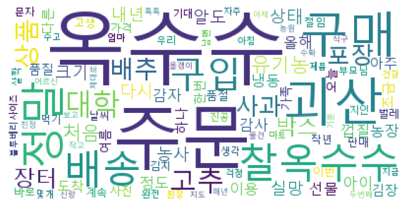

# 1. WordCloud

- import

  ```python
  # wordcloud 모듈 
  from wordcloud import WordCloud, STOPWORDS
  # 그래프 모듈
  import matplotlib.pyplot as plt
  # 횟수적용 모듈
  from collections import Counter
  # 형태소 분석 모듈
  from konlpy.tag import Okt
  ```

- 설정

  1.  font 설정

     ```python
     # 폰트를 가져올 경로지정
     f_path = 'C:\Windows\Fonts\malgun.ttf'
     # WordCloud 객체 생성
     wc = WordCloud(font_path=f_path, background_color='white')
     ```

     - 여러가지 설정

       ```python
       '''
       WordCloud(max_words="최대 수용 단어 개수",
                background_color='배경색상',
                font_path='폰트설정(사용할 파일의 경로)',
                width='넓이',
                height='높이값')
       '''
       ```

  2.  generate

     ```python
     # 지정 text로 워드 클라우드를 생성한다.
     wc = wc.generate(text)
     ```

     단, 워드클라우드는 띄워쓰기를 기준으로 생성하기 때문에 일반적인 문장을 나타내기 위해서는 형태소 분석을 해야한다.

  3. 이미지 생성

     ```python
     plt.figure(figsize=(10, 10))
     plt.imshow(wc, interpolation='lanczos')
     plt.axis('off') # 축표시 off
     plt.show()
     ```

- 고급설정

  - 제외단어 설정

    ```python
    st_w = set(STOPWORDS)
    st_w.add('파이썬')
    wc = WordCloud(font_path=f_path, background_color='white', stopwords=st_w).generate(text)
    ```

- 여러가지 표현방식

  - 횟수만을 강조한 표현

    ```python
    wc2 = wc2.generate_from_text(text2) # 횟수만 고려해서 강조를 결정
    ```

  - 문자의 우선순위를 고려한 표현

    ```python
    ck = {'파이썬' : 3, '공부' : 1, '나는' : 2}
    wc2 = wc2.generate_from_frequencies(ck) # 문자의 우선순위를 고려하여 표현
    ```

- Counter을 통한 우선순위 표현

  ```python
  l = ['안녕', '안녕', '안녕', '안녕', '안녕', '나는', '나는', '나는', '나는', '파이썬', '파이썬', '파이썬']
  c = Counter(l)
  wc3 = WordCloud(font_path=f_path)
  g_data = wc3.generate_from_frequencies(c)
  plt.figure()
  plt.imshow(g_data)
  plt.axis('off') # 축을 표현하지 않는다
  plt.show()
  ```

  

# 2. CSV를 통한 실습예제

```python
from wordcloud import WordCloud, STOPWORDS # 워드클라우드 모듈
import matplotlib.pyplot as plt # 그래프 모듈
from collections import Counter # 횟수적용 모듈
from konlpy.tag import Okt # 형태소 분석 모듈
import pandas as pd

# csv 읽기
df = pd.read_csv('ex2_data.csv', encoding='cp949')

# wordcloud로 표현할 text 추출
text = df['내용']

# 데이터를 명사로 분해 후 리스트로 저장
ok_t = Okt()
data1 = []
for i in text:
    t = ok_t.nouns(i)
    data1.extend(t)

# 데이터 중 한글자 데이터 제거    
data2 = [i for i in data1 if len(i) > 1]

# 각 명사마다 빈도수를 dict형태로 변환
data3 = Counter(data2)

# 빈도수가 높은순으로 100개 정렬 후 (명사, 빈도수) 형태로 변환
data4 = data3.most_common(100)

# dict형으로 변환
data5 = dict(data4)

# wordcloud 생성
wc = WordCloud(font_path='C:\Windows\Fonts\malgun.ttf', background_color='white')
g_data = wc.generate_from_frequencies(data5)
plt.figure(figsize=(10,10))
plt.axis('off')
plt.imshow(g_data)
plt.show()
plt.savefig('데이터이름.png') # 그림 저장
```

- 실행결과

  

  