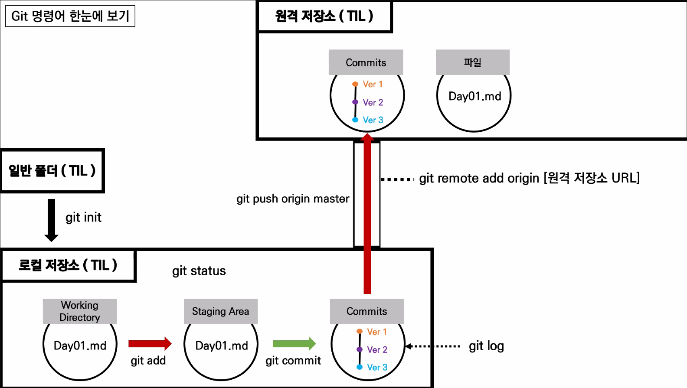

# Git 특강 1일차 정리

## 1. Git

#### 정의

- 분산 버전 관리 시스템(Version Control System)

#### 장점

- 수정일자, 내용, 이유를 즉각 확인 가능하여 효율적인 협업이 가능하다.
- 분산 시스템이므로 데이터 복구에 유리하다.

#### 용어

- commit : 이유를 적는 것
- delta 방식 : 변경사항과 원본만 저장하는 방식
- snapshot 방식 : 변경사항과 그때마다의 원본을 각각 저장하는 방식

## 2. CLI(Command Line Interface)

#### 정의

- 터미널을 통해 사용자와 컴퓨터가 상호 작용하는 방식

#### 명령어

- **ls** 
  - 현재 디렉토리의 폴더 및 파일을 확인
  - ``ls -a`` 은 숨겨진 폴더 및 파일까지 모두 확인
- **cd**
  - 디렉토리를 이동
  - ``cd .``는 현재의 디렉토리
  - ``cd ..``은 부모 디렉토리로 이동
- **mkdir**
  - 디렉토리 생성
- **rm**
  - 디렉토리/파일 제거
  - ``rm -r`` 디렉토리 제거

## 3. Git + vsCode 사용법

#### 명령어

- Git에 이름과 메일주소 등록

  ```
  git config --global user.name {이름/GitHub닉네임}
  git config --global user.email {GitHub의 email}
  ```

  ``git config --global --list``를 통해서 적용된 이름과 이메일을 확인할 수 있다.

- Git 초기 설정

  1) Working Directory 지정

     ``git init``

  2) 파일을 Staging Area로 올리기

     ``git add {파일이름}``

     ``git add .`` 은 Working Directory에 있는 모든 파일을 staging Area로 올린다.

  3. Commits

     ``git commit -m "commit의 이유"``

     기본형은 ``git commit``이지만 위의 형태를 기본적으로 사용한다.

  *주의사항: 파일수정 후 반드시 저장하고 add 할 것!!*

- 기타 명령어
  - ``git log`` : commit의 기록 전체를 보여준다.
  - ``git log --oneline``: commit의 기록을 한 줄로 보여준다.
  - ``git remote add {별명} {Url}`` : github의 Url에 원격접속하고 Url의 별명을 지정
  - ``git remote -v``: 원격접속 확인
  - ``git push {별명/Url} master``: github에 commit한 것을 업로드 

## 4. Git 명령어 한눈에 보기



