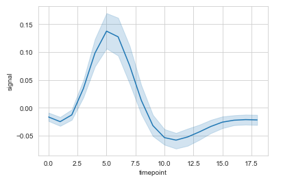
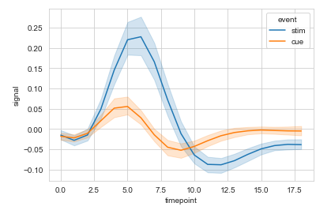
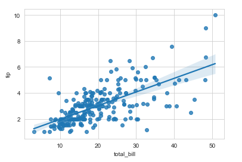
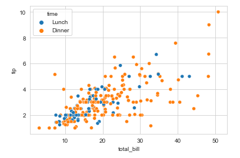
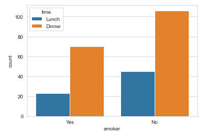
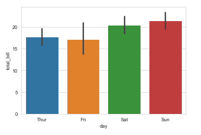
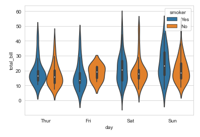
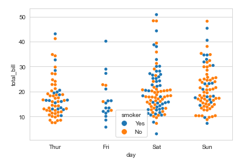
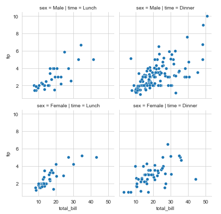

# 1. seaborn

## 1) 필요모듈

- ``import seaborn``
  - 보통 ``import seaborn as sns``로 사용한다

## 2) 기본 설정

- ``fmri  = sns.load_dataset('fmri')``

  - seaborn이 가지고 있는 데이터 셋을 로드한다.
  - 보통 테스트를 할 때에는 기존의 데이터 셋을 이용한다.

- ``sns.set_style('whitegrid')`` 

  - 그래프의 배경을 흰색 그리드로 설정한다

- ``sns.lineplot(x='timepoint', y='signal', data=fmri)``

  - x 축은 'timepoint'라는 속성의 값으로 y축은 'signal'이라는 속성의 값으로 설정한다. 
  - data 옵션은 사용할 데이터 셋을 지정하는 것이다.

- 기본설정 실행결과

  

- 추가 옵션

  - ``sns.lineplot(x='timepoint',y='signal', hue='event' ,data=fmri)``

    - hue 옵션은 데이터를 구분하는 기준 속성을 설정한다.

    - 실행결과

      

## 3) 여러형태의 그래프

1. 회귀 그래프

   - 사용예시

   ```python
   # 1. 기존 데이터 셋을 가져온다.
   t = sns.load_dataset('tips')
   # 2. 회귀 그래프를 그린다.
   sns.regplot(x='total_bill', y='tip', data=t)
   ```

   - 실행결과

     

2. 산점도

   - 사용예시

     ```python
     # 1. 기존 데이터 셋을 가져온다.
     t = sns.load_dataset('tips')
     # 2. 산점도를 그린다. (time을 기준으로 구분)
     sns.scatterplot(x='total_bill', y='tip', hue='time', data=t)
     ```

   - 실행결과

     

3. Countplot (수치를 비교)

   - 사용예시

     ```python
     # 1. 기존 데이터 셋을 가져온다.
     t = sns.load_dataset('tips')
     # 2. countplot을 그린다.(time을 기준으로 구분)
     sns.countplot(x='smoker', hue='time', data=t)
     ```

   - 실행결과

     

4. 막대그래프

   - 사용예시

     ```python
     # 1. 기존 데이터 셋을 가져온다.
     t = sns.load_dataset('tips')
     # 2. 막대그래프를 그린다.
     sns.barplot(x='day', y='total_bill', data=t)
     ```

   - 실행결과

     

5. 바이올린 플롯

   - 분포를 나타내는데 용이한 그래프이다.

   - 사용예시

     ```python
     # 1. 기존 데이터 셋을 가져온다.
     t = sns.load_dataset('tips')
     # 2. 바이올린 플롯을 그린다. : x축은 범주, y축은 범위
     sns.violinplot(x='day', y='total_bill', hue='smoker', data=t)
     ```

   - 실행결과

     

6. 스윔 플롯

   - 바이올린 플롯과 마찬가지로 분포를 나타내는데 용이한 그래프이다.

   - 사용예시

     ```python
     # 1. 기존 데이터 셋을 가져온다.
     t = sns.load_dataset('tips')
     # 2. 스웜 플롯을 그린다.
     sns.swarmplot(x='day', y='total_bill', hue='smoker', data=t)
     ```

   - 실행결과

     

     

## * 기타 기능

- ``fmri.sample(n=10, random_state=1)``
  - fmri 라는 데이터 셋에서 셈플로 10개의 데이터를 1의 랜덤 형식으로 가져온다.

- FacetGrid

  - 그래프의 틀만 제공하여 적당한 그래프를 그려주는 클래스이다.

  - 사용예시

    ```python
    # time과 sex를 기준으로 하여 그래프를 나눈다.
    g = sns.FacetGrid(t, col='time', row='sex')
    # map(적용할 그래프형태, x 값, y 값)
    g.map(sns.scatterplot, 'total_bill', 'tip')
    ```

  - 실행결과

    

    

    - map_datafram
      - DataFrame을 data 키워드 인수로 받아드린다.