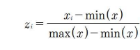
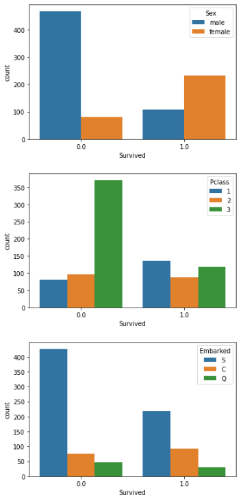
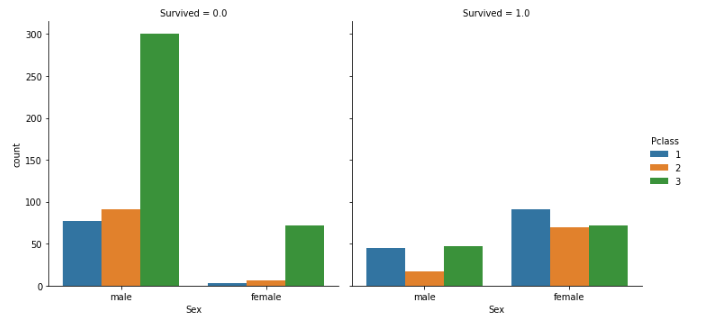
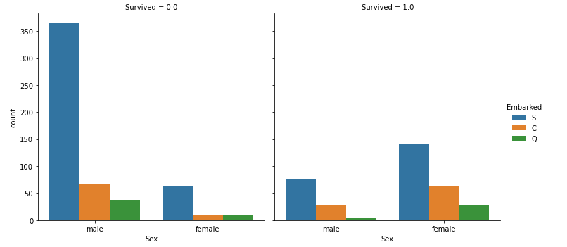
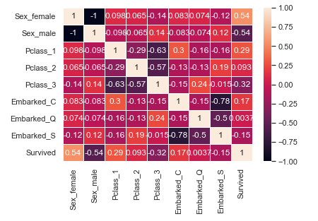

# 1. 데이터의 전처리

- 데이터 전처리란?
  - 머신러닝 모델에 훈련 데이터를 입력하기 전에 데이터를 가공하는것

- 데이터의 전처리가 필요한 경우
  1. 데이터 분포가 지나치게 차이가 나는 경우
     - 데이터의 Scale을 맞춰줌으로 해결한다
  2. 기수형 데이터와 서수형 데이터가 함께 존재하는 경우
     - 기수형 데이터와 서수형 데이터를 숫자 형태의 정보로 변환한다
  3. 결측치가 존재하는 경우
     - 여러 전략에 맞게 처리한다.
  4. 이상치가 존재하는 경우
     - 데이터의 오기입이나 특이현상 때문에 발생한다.


## 1) 결측치의 전처리

- 결측치의 확인

  - ``isnull``  함수를 사용한다

    - NaN 값이 존재하면 True 그렇지 않으면 False

  - 결측치의 비율 구하기

    ```python
    # df는 구하고자하는 데이터프레임 객체이다.
    df.isnull().sum()/len(df)
    ```

    - 실행결과로 각 열별 결측치의 비율이 출력된다

- 결측치의 삭제(Drop)

  - ``df.dropna()`` : 행의 원소 중 하나라도 결측치가 존재하면 그 행을 삭제한다.
    - 만약, 결과를 반영하고 싶다면 새 변수에 담거나, inplace 옵션의 값을 True로 부여한다.
  - how 옵션을 통한 결측치 선택 삭제
    - ``df.dropna(how='all')`` 또는 ``df.dropna(how='any')``
    - any : 결측치가 하나만 존재해도 삭제한다(or)
    - all : 모두 결측치이면 삭제한다(and)

  - 결측치 부여
    - numpy 함수의 ``np.nan`` 는 NaN 즉, 결측치의 값을 나타낸다.
  - 결측치가 존재하는 열을 삭제
    - ``df.dropna(axis=1, how='all')``
      - axis = 0이면 행, 1이면 열을 가리킨다
    - 결측치가 존재하는 열을 삭제한다.
  - 데이터의 개수를 기준으로 열 또는 행을 삭제
    - ``df.dropna(axis=0, thresh=1)``
      - thresh는 데이터의 수를 나타내고 만약, thresh = 1이면 데이터가 1개 이상 존재하는 경우를 제외하고 삭제한다는 것을 의미한다
  - dropna의 중첩사용
    - ``df.dropna(thresh=2).drop(axis=1, thresh=1)``
      - 위의 코드는 먼저 행을 기준으로 데이터가 2개이상인 행을 제외하고 모두 삭제한 후,  열을 기준으로 데이터가 1개이상 존재하는 경우를 제외하고 그 열을 삭제한다.

- 결측치 채우기(fillna)

  - 결측치를 채우는 것은 처음에 결측치를 제거한 후에 사용하는 것이 바람직하다.
  - ``df.fillna(0)`` : 데이터 프레임에 존재하는 결측치에 0을 채운다.
  - 열을 선택하여 결측치 채우기
    - ``df['이름'].fillna('희선')`` : 이름이라는 열에 결측치가 존재하면 '희선'으로 채운다
    - ``df['나이'].fillna(df['나이'].mean())`` : 나이라는 열에 결측치가 존재하면 '나이' 열의 평균 값으로 채운다

- 열의 분포를 고려하여 결측치 채우기

  - 그룹별 평균에 따른 결측치 채우기

    ```python
    df4['시험점수'].fillna(df4.groupby('성별')['시험점수'].transform('mean'), inplace=True)
    ```

    - 위의 코드는 '시험점수' 열에 결측치가 존재하면 해당 성별의 평균값을 채우는 코드이다. 다르게 해석하면 성별 데이터를 가지고 있는 행의 '시험점수' 열에만 그 값을 채운다
    - transform : 매개변수의 함수를 적용하여 같은 축 모양을 가진 DataFrame을 생성하는 그 자체를 호출한다.

## 2) 범주형 데이터의 전처리

- one-hot-encoding

  - ``pd.get_dummies()`` : 범주형 데이터를 0(없음), 1(있음) 데이터로 나누어 표현하게하도록 처리한다

    - 예시코드

      ```python
      data = pd.DataFrame({
          '점수' : [0, 1, 2],
          '타겟' : [2, 3, 2],
          '색' : ['red', 'blue', 'red'],
          '크기' : [1, 5, 10]
      })
      
      pd.get_dummies(data)
      ```

    - 실행결과

      

      '색' 이라는 범주형 데이터를 열을 분리하여 0과 1로 나타낸다.

    - 사이킨 런의 LabelEncoder과 OneHotEncoder도 동일한 기능을 수행한다

  - 특정값만 원핫 인코딩하기

    ```python
    pd.get_dummies(end_df['성별'])
    ```

    - '성별' 열의 데이터만 원핫 인코딩을 진행하여 새로운 데이터 프레임 객체를 반환한다

- 바인딩(binding)

  - 바인딩이란?

    - 연속형 데이터를 범주형 데이터로 변환하는 작업이다

  - 예시코드

    ```python
    # 범주지정 0~10, 10~20, 20~50
    bin_data = [0, 10, 20, 50]
    
    # 영역의 이름 지정
    bin_name = ['아동', '청소년', '성인']
    
    # 연속형 -> 범주형 변환
    pd.cut(end_df['나이'], bins=bin_data, labels=b_name)
    ```

    - ``pd.cut()`` : 데이터 값을 구간차원으로 분할하고 정렬해야 할 때 사용하는 메서드이다
    - 옵션
      - bins : 범주를 지정
      - labels : 범주의 이름 지정

## 3) 스케일링

- 스케일링(scaling)이란?

  - 데이터 간의 범위를 맞춰줌으로써 특정 데이터의 값이 과도하게 영향을 끼치는 경우를 방지한다
  - 즉, x1과 x2의 변수 범위가 다를 때 하나의 변수 범위로 통일시켜 처리한다.

- 최솟값-최댓값 정규화(min-max normalization)

  - 최솟값과 최댓값을 기준으로 0에서 1, 또는 0에서 지정 값까지의 값의 크기로 변환시킨다.

  - 식

    

  - 예시코드

    ```python
    (data['나이'] - data['나이'].min()) / (data['나이'].max() - data['나이'].min())
    ```

- z - 스코어 정규화

  - 기존 값을 표준 정규분포 값으로 변환하여 처리

  - 식 : zi = (xi - 평균) / 편차

  - 예시코드

    ```python
    ((data['시험점수'] - data['시험점수'].mean()) / data['시험점수'].std())
    ```

    - mean() : 해당 열(시리즈)의 평균값을 구한다
    - std() : 해당 열(시리즈)의 편차 값을 구한다


# 2. 타이타닉 데이터를 활용한 데이터 전처리

- 데이터 구하는 곳 

  - [캐글](https://www.kaggle.com/)

- import

  ```python
  import pandas as pd
  import numpy as np
  import matplotlib.pyplot as plt
  import seaborn as sns
  import os # 운영체제에 대한 접근
  ```

- 파일 Load

  ```python
  # os method를 통한 파일 Load
  # os.listdir() : 폴더 내의 정보를 확인하여 리스트화해서 출력
  f_l = [i for i in os.listdir() if '.csv' in i]
  f_l.reverse()
  add_l = []
  for i in f_l:
      add_l.append(pd.read_csv(i))
  new_df = pd.concat(add_l)
  ```

  - 일반적인 Load

    ```python
    # 데이터 가져오기
    test_d = pd.read_csv('test.csv')
    train_d = pd.read_csv('train.csv')
    ```

- DataFrame으로 변환

  ```python
  df = pd.concat([train_d, test_d])
  df = df.reset_index(drop=True)
  ```

  * 값의 정보를 체크할 때에는 ``df.T`` 를 통해 전치하여 확인하면 가시성이 좋다.

- 데이터 전처리

  - 각 속성의 데이터에 대한 정보 확인

    ```python
    # 각각의 속성의 데이터에 대한 정보를 확인 할 수 있다.
    df.info()
    ```

  - NaN 값 확인

    ```python
    # notnull : 데이터가 null이 아닌 있는 것만 취급
    n_of_t_d_dataset = df.Survived.notnull().sum()
    # isnull : 데이터가 있는 것만 취급
    n_of_test_d_dataset = df.Survived.isnull().sum()
    ```

  - Y 값 추출

    ```python
    # n_of_t_d_dataset 의 의미를 가지는 것들만 꺼낸 후 제거
    Y_true = df.pop('Survived')[:n_of_t_d_dataset]
    ```

  - 결측치의 비율 확인

    ```python
    # 실수형의 포멧을 변경
    pd.options.display.float_format = '{:.2f}'.format
    df.isnull().sum() / len(df) * 100
    ```

    - ``pd.options.display.float_format = '{:.2f}'.format`` : 판다스가 표현할 실수형의 포멧을 지정한다
    - 결측치의 비율을 확인하는 이유는 해당 값의 전처리 방법에 대해 결정하기 위해서이다.

  - 'Age' 의 결측치 채우기

    ```python
    df['Age'].fillna(df.groupby('Pclass')['Age'].transform('mean'), inplace=True)
    ```

    결측치가 존재하면 각 'Pclass'의 평균 Age 값을 각각 채운다.(Pclass가 존재하지 않는다면 채우지 않는다)

  - 'Embarked'의 결측치 채우기

    ```python
    df.loc[61, 'Embarked'] = 'S'
    df.loc[829, 'Embarked'] = 'S'
    ```

    결측치가 극소수이며 그 위치를 알고 있다면 지정하여 채워도 관계없다.

  - 데이터를 구분하여 데이터프레임 재정립

    ```python
    # 데이터의 구분
    범주형 = ['PassengerId', 'Pclass', 'Name', 'Sex', 'Ticket', 'Cabin', 'Embarked']
    숫자형 = ['Age', 'SibSp', 'Parch', 'Fare']
    
    # 데이터의 타입 변경
    for i in 범주형:
        df[i] = df[i].astype(object)
    for i in 숫자형:
        df[i] = df[i].astype(float)
    df['SibSp'] = df['SibSp'].astype(int)
    df['Parch'] = df['Parch'].astype(int)
    
    # 데이터 결합 함수 (concat의 작업을 함수화)
    def f(ldf, rdf, on, how='inner', index='None'):
        if index is True:
            return pd.merge(ldf, rdf, how=how, left_index=True, right_index=True)
        else:
            return pd.merge(ldf, rdf, how=how, on=on)
    
    # 데이터 결합
    one_hot_df = f(df, pd.get_dummies(df['Sex'], prefix='Sex'), on=None, index=True)
    one_hot_df = f(one_hot_df, pd.get_dummies(df['Pclass'], prefix='Pclass'), on=None, index=True)
    one_hot_df = f(one_hot_df, pd.get_dummies(df['Embarked'], prefix='Embarked'), on=None, index=True)    
    ```

  - 데이터를 시각화하여 확인하기

    ```python
    ck1 = ['Sex', 'Pclass', 'Embarked']
    for i in ck1:
        ck_df = pd.merge(one_hot_df[i], Y_true, left_index=True, right_index=True)
        sns.countplot(x='Survived', hue=i, data=ck_df)
        plt.show()
    ```

    

    ```python
    ck1 = ['Sex', 'Pclass', 'Embarked']
    ck_df2 = pd.merge(one_hot_df[ck1], Y_true, left_index=True, right_index=True)
    g = sns.catplot(x='Sex', hue='Pclass', col='Survived', kind='count', data=ck_df2)
    ```

    

    ```python
    g = sns.catplot(x='Sex', hue='Embarked', col='Survived', kind='count', data=ck_df2)
    ```

    

  - 범주형 데이터들의 상관계수 확인

    ```python
    # '_'가 들어가 있는 이름과 'Sex'를 포함한 이름 리스트
    new_ck_l = [name for name in one_hot_df.columns.to_list() if name.split('_')[0] in ck1 and '_' in name] + ['Sex']
    
    # 앞에서 걸러진 이름과 결과(Y)프레임을 병합
    pt_df = pd.merge(one_hot_df[new_ck_l], Y_true, left_index=True, right_index=True)
    
    # corr() 함수 : 상관계수 계산
    # 각 속성간의 상관계수를 계산하여 데이터 프레임으로 반환한다.
    corr = pt_df.corr()
    
    # corr을 히트맵으로 나타내기
    sns.set() # 기본 인터페이스로 설정
    ax = sns.heatmap(corr, annot=True, linewidths=.5)
    ```

    - 옵션

      - annot : True 이면 각 셀에 데이터 값을 표시
      - linewidths : 셀 간의 간격을 지정

    - 실행결과

      

      