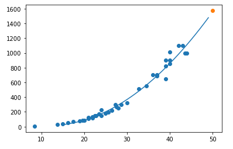
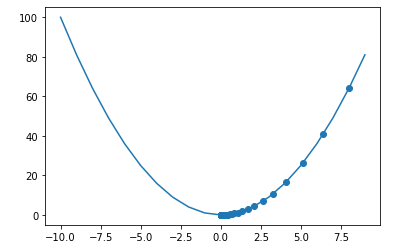
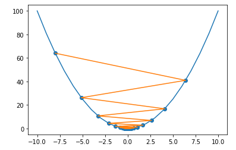
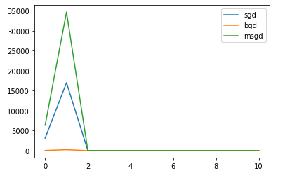

# 1. 선형회귀 모델 분석

## 1) 선형회귀란?

- 정의

  - y = ax + b 꼴의 수식을 만들고 a와 b의 값을 찾아내는것
  - 기존 데이터를 활용하여 연속형 변수값을 예측하는것

- sklearn의 선형회귀 모델

  - KNeighborsRegressor 모델

    - 회귀를 기반으로한 k-최근접 이웃 모델
    - 타겟은 훈련 데이터 셋의 가장 가까운 값으로 예측된다

    - 코드

      ```python
      from sklearn.neighbors import KNeighborsRegressor
      from sklearn.metrics import mean_absolute_error
      import numpy as np
      
      # 데이터 셋 임의 설정
      X = np.array(
          [8.4, 13.7, 15.0, 16.2, 17.4, 18.0, 18.7, 19.0, 19.6, 20.0, 
           21.0, 21.0, 21.0, 21.3, 22.0, 22.0, 22.0, 22.0, 22.0, 22.5, 
           22.5, 22.7, 23.0, 23.5, 24.0, 24.0, 24.6, 25.0, 25.6, 26.5, 
           27.3, 27.5, 27.5, 27.5, 28.0, 28.7, 30.0, 32.8, 34.5, 35.0, 
           36.5, 36.0, 37.0, 37.0, 39.0, 39.0, 39.0, 40.0, 40.0, 40.0, 
           40.0, 42.0, 43.0, 43.0, 43.5, 44.0]
           )
      Y = np.array(
          [5.9, 32.0, 40.0, 51.5, 70.0, 100.0, 78.0, 80.0, 85.0, 85.0, 
           110.0, 115.0, 125.0, 130.0, 120.0, 120.0, 130.0, 135.0, 110.0, 
           130.0, 150.0, 145.0, 150.0, 170.0, 225.0, 145.0, 188.0, 180.0, 
           197.0, 218.0, 300.0, 260.0, 265.0, 250.0, 250.0, 300.0, 320.0, 
           514.0, 556.0, 840.0, 685.0, 700.0, 700.0, 690.0, 900.0, 650.0, 
           820.0, 850.0, 900.0, 1015.0, 820.0, 1100.0, 1000.0, 1100.0, 
           1000.0, 1000.0]
           )
      
      # 학습용과 테스트용 데이터를 분리
      t_x,tt_x,t_y,tt_y = train_test_split(X,Y,random_state=43)
      
      # 데이터 처리
      n_t_x = t_x.reshape(-1,1)
      n_tt_x = tt_x.reshape(-1,1)
      
      # 모델 생성 및 학습
      knr = KNeighborsRegressor()
      knr.fit(n_t_x,t_y)
      
      # 테스트_x 로 테스트결과_y 예측
      end_tt_y = knr.predict(n_tt_x)
      
      # 테스트_y(정답)과 테스트결과_y의 MAE(평균-절대-오차)를 구함
      mae = mean_absolute_error(tt_y,end_tt_y)
      ```

  - LinearRegression 모델

    - 일반적인 최소제곱 선형회귀 모델이다

    - 1개 이상의 w를 이용하여 모델을 학습시키고 관찰된 목표와 선형 근사에 의해 예측된 목표사이의 제곱합을 최소화한다

    - 코드 (LinearRegression 을 사용하여 방정식 구하기)

      ```python
      # 데이터 셋은 KNeighborsRegressor 모델에서 사용한 것과 동일하게 사용
      from sklearn.linear_model import LinearRegression
      
      # 학습용 x와 테스트용 x값 생성
      # column_stack : 1차원 배열을 2차원 배열에 열로 쌓는다
      p_t_x = np.column_stack((n_t_x**2, n_t_x))
      p_tt_x = np.column_stack((n_tt_x**2, n_tt_x))
      
      # 모델 생성 및 학습
      lr = LinearRegression()
      lr.fit(p_t_x, t_y)
      
      # w의 값 list 및 잔차 확인
      # lr.coef : 가중치 w의 값 순서대로
      # lr.intercept_ : 독립항 (잔차)
      print(lr.coef_, lr.intercept_)
      
      '''
      print문의 결과
      [  1.05682431 -24.53340579] 157.67745303390137
      '''
      
      # 방정식 구하기 + 시각화
      p = np.arange(15, 50) # 표기할 x의 값
      plt.scatter(n_t_x, t_y)
      
      # 방정식 : 1.05w^2 - 24.5w + 157.6
      plt.plot(p, 1.05 * p**2 - 24.5 * p + 157.6)
      plt.scatter([50], [1573.06])
      plt.show()
      ```

      - 실행결과

        

## 2) 경사하강법

- 정의 

  - 경사를 하강하면서 수식을 최소화하는 매개변수의 값을 찾아내는 방법

- 코드(경사하강법을 통한 최적의 매개변수를 찾는 모습을 시각화)

  ```python
  import numpy as np
  import matplotlib.pyplot as plt
  
  # 표현할 수식 설정
  x = np.arange(-10, 10, 1)
  fx = x**2
  
  # 시작 지점 설정(경사하강법을 실행할 시작점)
  x_new = 10
  d = [] # 변화량을 기록하기 위한 변수 (변화된 a(x)기록)
  y = [] # 변화량의 결과를 기록하기 위한 변수(y 기록)
  learning_rate = 0.1 # 학습률 - 하이퍼 파라메터(설계자가 설정, 최소 0.1) = a 값
  for i in range(100):
      x_old = x_new
      x_new = x_old - learning_rate * (2 * x_old)
      d.append(x_new)
      y.append(x_new**2)
  plt.plot(x, fx) # 곡선
  plt.scatter(d, y)
  plt.show()
  ```

- 실행결과

  

  다음 그래프를 보면 경사면을 따라서 하강하며 0에 수렴하는것을 알 수 있다. 즉, 목표 0에 근사하는 매개변수의 값을 찾는것이다.

- 학습률(learning rate)를 0.9로 설정했을 때의 결과

  

  학습률의 조정을 잘못하면 0에 수렴하는것이 아닌 무한대로 발산하는 모습을 볼 수 있다. (해당 그래프는 아님)


## 3) 선형회귀 클래스를 구축하고 코드분석

- 전체코드

  ```python
  import numpy as np
  class LinearRegressionGD(object):
      '''
      <생성자의 매개변수>
      fit_intercept : 모형에 상수항이 있는지 없는지를 결정하는 인수
      copy_X : (사용되지 않음)??
      eta0 : 학습률(learning rate)
      epochs : 학습 반복 횟수
      weight_decay : 과적합을 방지하기위한 패널티 텀의 값
      batch_size : 몇 개의 샘플데이터로 가중치를 업데이트할지 설정하는 인자
      shuffle : 섞을 것인지 말 것인지를 결정하는 인수
      '''
      def __init__(self, fit_intercept=True, copy_X=True,
                   eta0=0.001, epochs=1000, batch_size = 1, # eta0 : learning_rate, epochs : 학습 반복 횟수
                   weight_decay=0.9, shuffle = True):
          self.fit_intercept = fit_intercept
          self.copy_X = copy_X
          self._eta0 = eta0
          self._epochs = epochs
  
          self._cost_history = [] # cost의 변화량을 저장할 변수
  
          self._coef = None
          self._intercept = None
          self._new_X = None # 갱신되는 기울기 값을 담는 변수
          self._w_history = None # w의 변화량을 저장할 변수
          self._weight_decay = weight_decay
          self._batch_size = batch_size
          self._is_SGD = shuffle
  	
      # 학습 함수(지도학습)
      '''
      입력 : X
      결과 : y
      '''
      def fit(self, X, y):
          self._new_X = np.array(X) # 입력 값을 new_X에 넘파이 배열 형태로 저장
          y = y.reshape(-1, 1) # 결과값인 y를 2차원 넘파이 배열로 변환
  		
          # 모형의 방정식에 상수항이 있다면 실행
          # 밑의 과정이 코드적으로는 무엇을 하는지 알겠으나 왜 하는지 모르겠다.
          if self.fit_intercept:
              intercept_vector = np.ones([len(self._new_X), 1])
              self._new_X = np.concatenate(
                      (intercept_vector, self._new_X), axis=1)
  
          theta_init = np.random.normal(0, 1, self._new_X.shape[1])   
  
          # weight값 초기화
          self._w_history = [theta_init]
          self._cost_history = [self.cost(
                          self.hypothesis_function(self._new_X, theta_init), y)]
  
          theta = theta_init
  		
          # 학습의 반복 : 반복횟수는 epochs의 값에 따름
          for epoch in range(self._epochs):
              X_copy = np.copy(self._new_X)
  			
              # shuffle 이 True 이면 확률적 경사하강법을 적용하기 위해서 입력값 X을 섞는다.
              if self._is_SGD:
                  np.random.shuffle(X_copy)
  
              batch = len(X_copy) // self._batch_size 
  
  
              for batch_count in range(batch):
                  X_batch = np.copy(
                              X_copy[batch_count * self._batch_size : (batch_count+1) & self._batch_size])
  
                  gradient = self.gradient(X_batch  , y, theta).flatten()
                  theta = theta - self._eta0 * gradient
  
              if epoch % 100 == 0:
                  self._w_history.append(theta)
                  cost = self.cost(
                      self.hypothesis_function(self._new_X, theta), y)
                  self._cost_history.append(cost)
              self._eta0 = self._eta0 * self._weight_decay
  
          if self.fit_intercept:
              self._intercept = theta[0]
              self._coef = theta[1:]
          else:
              self._coef = theta
      
      def gradient(self, X, y, theta):
          return X.T.dot(self.hypothesis_function(X, theta)-y) / len(X)
      
      def cost(self, h, y):
          return 1/(2*len(y)) * np.sum((h-y).flatten() ** 2)
  
      def hypothesis_function(self, X, theta):
          return X.dot(theta).reshape(-1, 1)
  
      def gradient(self, X, y, theta):
          return X.T.dot(self.hypothesis_function(X, theta)-y) / len(X)
  
      def predict(self, X):
          test_X = np.array(X)
  
          if self.fit_intercept:
              intercept_vector = np.ones([len(test_X), 1])
              test_X = np.concatenate(
                      (intercept_vector, test_X), axis=1)
  
              weights = np.concatenate(([self._intercept], self._coef), axis=0)
          else:
              weights = self._coef
  
          return test_X.dot(weights)
  	
      # 아래의 함수들은 변수의 값을 반환하는 함수이다.
      @property
      def coef(self):
          return self._coef
  
      @property
      def intercept(self):
          return self._intercept
  
      @property
      def weights_history(self):
          return np.array(self._w_history)
  
      @property
      def cost_history(self):
          return self._cost_history
  ```

### (1) 전체-배치 경사하강법(full-batch gradient desent)

- 정의 

  - 모든 데이터를 한번에 입력하는 경사하강법

  - 여기서 배치는 하나의 데이터 셋을 말한다

- 장점 
  - 학습이 매우 잘된다
- 단점
  - 과적합의 문제가 있들  수 있다
  - 시간이 오래걸린다
  - 지역 최적화에 빠질 수 있다(그래프의 최솟점을 찾지 못하는 것)


### (2) 확률적 경사하강법(Stochastic Gradient Decent, SGD)

- 정의
  - 학습용 데이터에서 샘플들을 랜덤하게 뽑아서 사용
  - 대상 데이터를 섞은 후. 일반 경사하강법의 방식을 따름
- 장점
  - 모델의 빠른 성능 변화
  - 데이터의 특성에 따른 빠른 결과값 도출
  - 지역 최적화의 회피
- 단점
  - 대용량의 데이터를 다룰 경우 시간이 오래걸림
  - 결과의 마지막 값을 확인하기 어렵다
  - 루프의 종료지점을 확인하기 어렵다


### (3) 미니-배치 경사하강법(mini-batch gradient descent)

- 정의
  - 데이터의 랜덤한 일부분만 입력해서 경사도 평균을 구해 가중치 업데이트
  - 에포크와 배치 사이즈를 데이터 분석가가 직접설정하므로 설정한 값에 따라 성능이 좌우된다
    - 에포크 : 데이터를 한번에 학습시키는 횟수
    - 배치 사이즈 : 한번에 학습되는 데이터의 개수


### (4) 각 경사하강법을 시각화하여 확인

- 코드

  ```python
  sgd_lr = LinearRegressionGD(batch_size=1, shuffle=True) # 확률적 경사하강법
  bgd_lr = LinearRegressionGD(batch_size=len(X), shuffle=False) # 전체-배치 경사하강법
  msgd_lr = LinearRegressionGD(batch_size=200, shuffle=True) # 미니-배치 경사하강법
  
  sgd_lr.fit(X, Y)
  bgd_lr.fit(X, Y)
  msgd_lr.fit(X, Y)
  
  plt.plot(range(len(sgd_lr.cost_history)), sgd_lr.cost_history, label='sgd')
  plt.plot(range(len(bgd_lr.cost_history)), bgd_lr.cost_history, label='bgd')
  plt.plot(range(len(msgd_lr.cost_history)), msgd_lr.cost_history, label='msgd')
  
  plt.legend()
  plt.show()
  ```

- 실행결과

  

  


