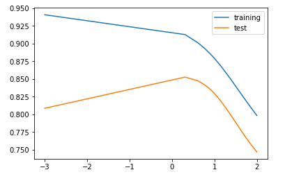
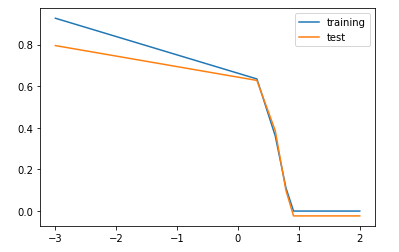
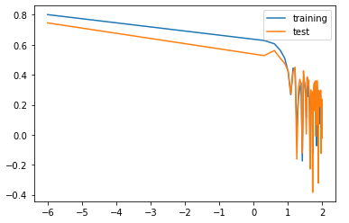
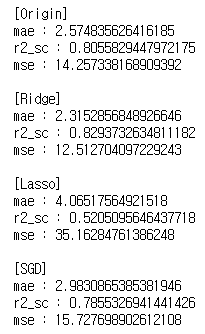
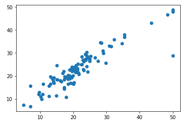

# 1. 선형회귀 기초 예제

## 1) LinearRegression 클래스를 이용한 선형회귀 머신러닝 예제

- 코드

  1. import

     ```python
     from sklearn.linear_model import LinearRegression
     import numpy as np
     import matplotlib.pyplot as plt
     ```

  2. 데이터 생성(수집 대체)

     ```python
     # 데이터 생성
     X = [174, 152, 138, 128, 186]
     Y = [71, 55, 46, 38, 88]
     
     # 입력 데이터의 형변환(차원 확장)
     n_X = np.array(X).reshape(-1, 1)
     # n_Y = np.array(Y).reshape(-1, 1) : X는 피쳐이기 때문에 차원을 확장해야하나 Y는 단일 값이기 때문에 확장할 필요가 없다
     ```

  3. 모델 생성 및 학습

     ```python
     lr = LinearRegression()
     lr.fit(n_X, Y)
     ```

  4. 임의의 x 값으로 예측값 확인

     ```python
     # 1. 키가 165cm 일때 예측값
     print(lr.predict([[165]]))
     '''
     결과
     [67.30998637 71.41104294]
     '''
     ```

  5. 그래프로 표현

     ```python
     # 모범답안
     lr = LinearRegression()
     lr.fit(n_X, Y)
     plt.scatter(n_X, Y, c='r')
     Y_pred = lr.predict(n_X)
     plt.plot(n_X, Y_pred)
     plt.show()
     ```

     


## 2) 다중선형회귀

- 정의 

  - 데이터의 피처가 2개 이상인 데이터의 선형회귀를 다루는 모델

- 사용모델

  - LinearRegression(최소자승법)
    - 기본적인 선형회귀 알고리즘을 사용
  - Ridge(최소자승법)
    - L2 정규화를 사용하는 모델
    - 좌표평면의 원점에서 점까지의 거리를 나타내어 벡터의 크기를 측정하는 기법
  - Lasso(최소자승법)
    - L1 정규화를 사용하는 모델
    - 기존 수식에 L1 놈 페널티를 추가하여 계산한다
  - SGDRegressor(SGD)
    - 학률적 경사 하강법을 사용하는 회귀 모델

- 코드

  1. import

     ```python
     import numpy as np # 데이터 계산을 위한 모듈
     import pandas as pd # data 로드를 위한 모듈
     from sklearn.model_selection import train_test_split # 학습데이터와 테스트데이터 분할을 위한 모듈
     from sklearn.preprocessing import PolynomialFeatures # 피처 증가를 위한 모듈(다중모델 전처리)
     from sklearn.linear_model import LinearRegression, Lasso, Ridge, SGDRegressor # 선형 회귀 모델 모듈
     from sklearn.preprocessing import StandardScaler # 데이터 전처리(중복 정보 정리) -> 밸런싱 작업
     import matplotlib.pyplot as plt # 데이터 시각화를 위한 모듈
     from sklearn.preprocessing import MinMaxScaler # min-max 방식 스케일링
     ```

  2. 데이터 셋 가져오기(수집 대체)

     ```python
     from sklearn.datasets import load_boston
     '''
     boston data 특징
     - 피처 : 13개
     '''
     
     b_data = load_boston()
     print(b_data.keys()) # 데이터의 특징 확인 // data : x, target : y
     
     X = b_data.data
     Y = b_data.target
     
     print(Y.shape) # Y-데이터의 크기 확인
     print(X.shape) # X-데이터의 크기 확인
     
     # 데이터의 형태 재지정
     y_data = Y.reshape(-1, 1) # Y data의 차원을 늘림 -> X data와 맞추기 위함 (굳이 안해도 되지만 되도록 맞추는 것이 좋다)
     ```

  3. 데이터 전처리 - 1 (피쳐증가시키기)

     ```python
     p_m = PolynomialFeatures(include_bias=False).fit(X)
     p_X = p_m.transform(X)
     ```

  4. 데이터 전처리 - 2 (밸런싱)

     ```python
     # min-max 방식
     mm_m = MinMaxScaler(feature_range=(0, 5)).fit(p_X) # min-max 모델객체 생성 : feature_range : 최솟값과 최댓값을 정의
     sc_x_data = mm_m.transform(p_X) # 변환
     ```

  5. 데이터 분류(학습용과 테스트용 분리)

     ```python
     # 데이터 분류
     t_x, tt_x, t_y, tt_y = train_test_split(sc_x_data, Y, test_size=0.2, random_state=42)
     ```

  6. 최적의 하이퍼 파라메터 값 찾기 (Ridge)

     ```python
     # 릿지 모델의 하이퍼 파라미터 값 찾기
     t_l = []
     tt_l = []
     ap_l = np.linspace(0.001, 100)
     for i in ap_l:
         f_rg = Ridge(alpha=i).fit(t_x, t_y)
         t_l.append(f_rg.score(t_x, t_y))
         tt_l.append(f_rg.score(tt_x, tt_y))
     plt.plot(np.log10(ap_l), t_l, label='training')
     plt.plot(np.log10(ap_l), tt_l, label='test')
     plt.legend()
     plt.show()
     
     best_alpha_rg = 5
     ```

     

     위의 그래프로 보아 약 5의 alpha 값이 최적을 이루는 것을 알 수 있다.

  7. 최적의 하이퍼 파라메터 값 찾기(Lasso)

     ```python
     # 라쏘 모델의 하이퍼 파라미터 값 찾기
     t_l = []
     tt_l = []
     ap_l = np.linspace(0.001, 100)
     for i in ap_l:
         f_rg = Lasso(alpha=i).fit(t_x, t_y)
         t_l.append(f_rg.score(t_x, t_y))
         tt_l.append(f_rg.score(tt_x, tt_y))
     plt.plot(np.log10(ap_l), t_l, label='training')
     plt.plot(np.log10(ap_l), tt_l, label='test')
     plt.legend()
     plt.show()
     
     best_alpha_lso = 3
     ```

     

     위의 그래프를 보아 3 정도의 값이 최적의 파라메터임을 알 수 있다.

  8. 최적의 하이퍼 파라미터 값 찾기(SGD)

     ```python
     # SGD 모델의 하이퍼 파라미터 값 찾기
     t_l = []
     tt_l = []
     ap_l = np.linspace(0.000001, 100)
     for i in ap_l:
         f_rg = SGDRegressor(alpha=i).fit(t_x, t_y)
         t_l.append(f_rg.score(t_x, t_y))
         tt_l.append(f_rg.score(tt_x, tt_y))
     plt.plot(np.log10(ap_l), t_l, label='training')
     plt.plot(np.log10(ap_l), tt_l, label='test')
     plt.legend()
     plt.show()
     
     best_alpha_sgd = 0.000001
     ```

     

     위의 그래프를 보아 10^-6 의 값이 가장 최적의 값을 이루는 것을 알 수 있다.

  9. 모델 생성 및 학습

     ```python
     '''
     옵션 :
     1. fit_intercept 절편을 사용할지 말지를 선택 -> 실제 데이터 처럼 그래프를 그림(0, 0)에서 시작하지 않음(사용시 학습이 잘됨)
     2. normalize : 학습할 때 값들을 정규화 할지 말지 -> 이미 정규화가 되어있다면 중복하는것은 오히려 성능 낮아짐
     3. copy_X : 학습 시 데이터를 복사한 후 학습을 할지 결정
     4. n_jobs : 연산을 위해 몇 개의 CPU를 사용할지 결정
     5. alpha : 라쏘 회귀, 리지 회귀, SGD에 있음. 패널티 값을 지정
     '''
     
     '''
     SGD의 매개변수
     1. max_iter : 최대 반복 횟수를 지정
     2. tol : 더 이상 비용이 줄어들지 않을 때 반복이 멈추는 최솟값의 기준
     3. eta0 : 한 번에 실행되는 학습률
     4.
     '''
     
     # 일반 선형 모델
     lr = LinearRegression(fit_intercept=True, normalize=False)
     lr.fit(t_x, t_y)
     
     # 릿지 모델
     rg = Ridge(alpha=best_alpha_rg, fit_intercept=True, normalize=False)
     rg.fit(t_x, t_y)
     
     # 라쏘 모델
     lso = Lasso(alpha=best_alpha_lso, fit_intercept=True, normalize=False)
     lso.fit(t_x, t_y)
     
     # SGD 모델
     sgd = SGDRegressor(alpha=best_alpha_sgd, fit_intercept=True)
     sgd.fit(t_x, t_y)
     ```

  10. 각 모델 테스트 및 검증

      ```python
      # 일반 선형회귀 모델
      print(f'[Original]\nTraining Score : {lr.score(t_x, t_y)}\nTest Score : {lr.score(tt_x, tt_y)}')
      print()
      # 릿지 모델
      print(f'[Ridge]\nTraining Score : {rg.score(t_x, t_y)}\nTest Score : {rg.score(tt_x, tt_y)}')
      print()
      # 라쏘 모델
      print(f'[Lasso]\nTraining Score : {lso.score(t_x, t_y)}\nTest Score : {lso.score(tt_x, tt_y)}')
      print()
      # sgd 모델
      print(f'[SGD]\nTraining Score : {sgd.score(t_x, t_y)}\nTest Score : {sgd.score(tt_x, tt_y)}')
      ```

      

  11. 추가적인 검증(r2_score,mean_absolute_error,mean_squared_error)

      ```python
      # 추가적인 검증을 위한 모듈
      from sklearn.metrics import r2_score, mean_absolute_error, mean_squared_error
      ```

      ```python
      # 일반 선형 모델
      end_tt_y_lr = lr.predict(tt_x)
      mae_lr = mean_absolute_error(tt_y, end_tt_y_lr)
      r2_sc_lr = r2_score(tt_y, end_tt_y_lr)
      mse_lr = mean_squared_error(tt_y, end_tt_y_lr)
      print("[Origin]")
      print(f"mae : {mae_lr}\nr2_sc : {r2_sc_lr}\nmse : {mse_lr}")
      print()
      # 릿지 모델
      end_tt_y_rg = rg.predict(tt_x)
      mae_rg = mean_absolute_error(tt_y, end_tt_y_rg)
      r2_sc_rg = r2_score(tt_y, end_tt_y_rg)
      mse_rg = mean_squared_error(tt_y, end_tt_y_rg)
      print("[Ridge]")
      print(f"mae : {mae_rg}\nr2_sc : {r2_sc_rg}\nmse : {mse_rg}")
      print()
      # 라쏘 모델
      end_tt_y_lso = lso.predict(tt_x)
      mae_lso = mean_absolute_error(tt_y, end_tt_y_lso)
      r2_sc_lso = r2_score(tt_y, end_tt_y_lso)
      mse_lso = mean_squared_error(tt_y, end_tt_y_lso)
      print("[Lasso]")
      print(f"mae : {mae_lso}\nr2_sc : {r2_sc_lso}\nmse : {mse_lso}")
      print()
      # sgd 모델
      end_tt_y_sgd = sgd.predict(tt_x)
      mae_sgd = mean_absolute_error(tt_y, end_tt_y_sgd)
      r2_sc_sgd = r2_score(tt_y, end_tt_y_sgd)
      mse_sgd = mean_squared_error(tt_y, end_tt_y_sgd)
      print("[SGD]")
      print(f"mae : {mae_sgd}\nr2_sc : {r2_sc_sgd}\nmse : {mse_sgd}")
      ```

      

  12. 다중선형회귀 모델의 시각화

      - 방법
        - loss 함수
        - cost 함수
        - 모델 자체를 표현

      - 코드

        ```python
        # 산점도를 이용한 시각화 -> 학습이 잘 될 수록 선의 모양을 띄게된다.
        plt.scatter(tt_y, end_tt_y_sgd)
        plt.show()
        ```

        

        

​	