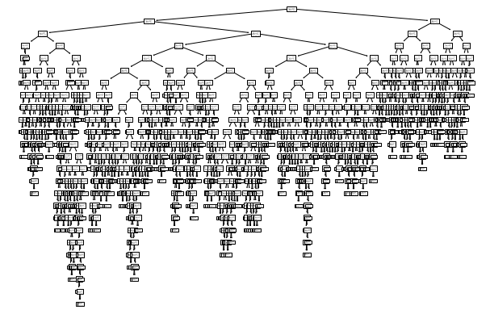

# 1. 결정트리 기초

- 코드예시

  ```python
  import pandas as pd
  import numpy as np
  
  wine = pd.read_csv('day5_data4.csv')
  wine.info() # 데이터의 정보 확인
  
  wine.describe() # 데이터의 전체적인 정보 출력
  
  X = wine[['alcohol', 'sugar', 'pH']].to_numpy()
  Y = wine['class'].to_numpy()
  
  # 데이터 스케일링
  from sklearn.preprocessing import StandardScaler
  x_data = StandardScaler().fit_transform(X)
  
  # 데이터 분류
  from sklearn.model_selection import train_test_split
  t_x, tt_x, t_y, tt_y = train_test_split(x_data, Y, random_state=42)
  
  # 데이터 확인
  t_x.shape, t_y.shape
  
  # 모델 학습 및 생성
  from sklearn.linear_model import LogisticRegression
  lo_g = LogisticRegression()
  lo_g.fit(t_x, t_y)
  lo_g.score(t_x, t_y), lo_g.score(tt_x, tt_y) # 모델 평가
  
  # 분류트리 가져오기(의사결정 분류기)
  from sklearn.tree import DecisionTreeClassifier
  
  dt = DecisionTreeClassifier(random_state=42)
  dt.fit(t_x, t_y)
  dt.score(t_x, t_y), dt.score(tt_x, tt_y) # 모델 평가
  
  import matplotlib.pyplot as plt
  from sklearn.tree import plot_tree # 트리의 구조를 시각화하는 사이킷런 내부의 기능
  
  plt.figure(figsize=(10, 7))
  plot_tree(dt)
  plt.show()
  ```

  

  - 과대적합을 방지하기 위한 가지치기

    ```python
    # 과대적합을 방지하기 위한 가지치기
    dt1 = DecisionTreeClassifier(max_depth=3, random_state=42) # max_depth : 학습으로 기억할 특징에 제약을 둔다
    dt1.fit(t_x, t_y)
    dt1.score(t_x, t_y), dt1.score(tt_x, tt_y) # 모델 평가
    
    # 결정트리는 불순도를 기준으로 분류한다
    plt.figure(figsize=(10, 7))
    plot_tree(dt1, max_depth=5, filled=True, feature_names=['alcohol', 'sugar', 'pH'])
    plt.show()
    ```

    

  - 기능 중요도

    ```python
    # feature_importances_ : 기능 중요도를 반환한다
    dt1.feature_importances_
    ```

    