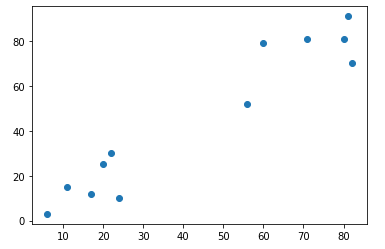
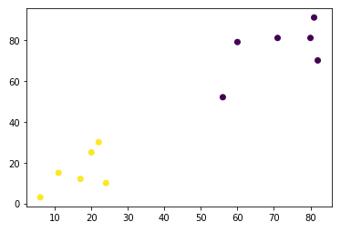
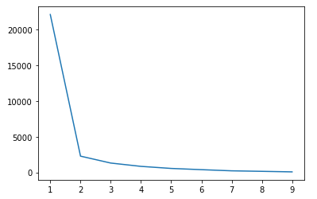

# 1. 비지도학습 - 군집화


## 1) k-Nearest Neighbor 알고리즘

- 정의
  - k 만큼의 클래스를 묶어서 그 묶음 중 더 많은 클래스로 분류하는 간단한 알고리즘


## 2) K-Means 알고리즘

- 정의
  - 주어진 n개의 관측값을 k개의 클러스터로 분할하는 알고리즘으로, 관측값들은 거리가 최소인 군집으로 분류된다

- 코드

  1. import

     ```python
     import matplotlib.pyplot as plt
     import numpy as np
     from sklearn.cluster import KMeans # K-means 모델
     ```

  2. 데이터 Load

     ```python
     # 입력데이터
     X = np.array([[6, 3], [11, 15], [17, 12], [24, 10], [20, 25], [22, 30],
                  [82, 70], [71, 81], [60, 79], [56, 52], [81, 91], [80, 81]])
     
     plt.scatter(X[:, 0], X[:, 1])
     plt.show()
     ```

     

  3. 모델 학습 및 데이터 구분

     ```python
     km = KMeans(n_clusters=4) # n_clusters : 군집의 수 지정(과도하게 지정하면 군집화가 안된다(과적합))
     km.fit(X)
     km.cluster_centers_ # 군집의 중심정의 좌표 반환
     km.labels_ # 데이터의 구분
     plt.scatter(X[:, 0], X[:, 1], c=km.labels_) # 데이터 구분
     plt.show()
     ```

     - n_clusters의 값은 지정하지 않으면 자동으로 지정되나 추천되지 않는 방법이다.

     

  4. elbows method를 이용한 n_cluseters의 최적값 찾기

     ```python
     # k 개수에 따른 오차율 변화 시각화
     n = range(1, 10)
     km_l = [KMeans(n_clusters=i) for i in n]
     sc = [km_l[i].fit(X).inertia_ for i in range(len(km_l))]
     plt.plot(n, sc)
     plt.show()
     ```

     - km.inertia_  : 전체적인 구성의 값 / 제곱오차

     

     오차가 꺾이는 2의 지점이 최적의 n_clusters 값임을 알 수 있다.