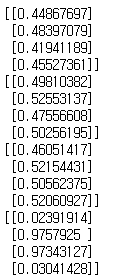
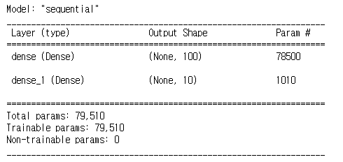
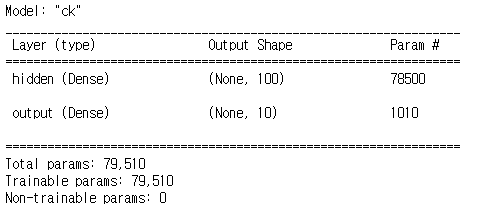
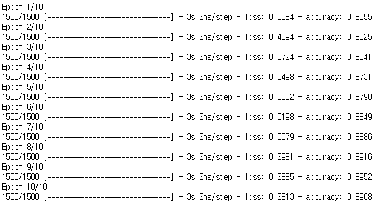
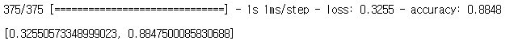
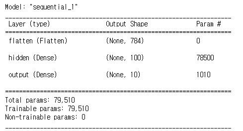

# 1. 멀티 레이어 퍼셉트론(MLP)


## 1) 함수 구축을 통한 MLP 코드(XOR연산)

1. 모듈 import

   ```python
   import numpy as np # 연산을 수행하기 위함
   ```

2. Sigmoid 함수

   ```python
   # 시그모이드 함수
   def actf(x):
       return 1 / (1 + np.exp(-x))
   
   # 미분된 활성함수 (시그모이드) : 사용공식마다 고정되어있음
   def d_actf(x):
       return x * (1 - x)
   ```

3. 입력 출력 데이터 설정 및 초기값 설정

   ```python
   # 입력 출력 데이터 설정
   # 3번째 값은 Bias의 값이다 (1로 주어짐)
   X = np.array([[0, 0, 1], [0, 1, 1], [1, 0, 1], [1, 1, 1]])
   y = np.array([[0], [1], [1], [0]]) # XOR의 정답
   
   in_n = 3 # 입력되는 노드의 수(x1, x2, b)
   h_n = 6 # 은닉층의 노드의 수 = 입력층의 2배 (일반적)
   out_n = 1 # 출력할 결과의 수
   np.random.seed(5) # 시드 값 고정
   
   # 초기값 부여(시작값) : 반드시 존재해야하는 값이다
   # 가중치 : -1 ~ 1
   w0 = 2 * np.random.random((in_n, h_n)) - 1 # 초기 가중치 값 (in_n, h_n) = 3열 6행
   w1 = 2 * np.random.random((h_n, out_n)) - 1
   ```

4. 학습 함수

   ```python
   # 학습
   for i in range(10000):
       # 1. 순전파 생성
        # 1-1. layer 1의 연산
       l0 = X # 입력층
       net1 = np.dot(l0, w0) # in * w0
       l1 = actf(net1) # 활성함수
       l1[:, -1] = 1 # bias 값 수정
       
        # 1-2. layer 2의 연산
       net2 = np.dot(l1, w1)
       l2 = actf(net2) # 결과
       
       # 2. 역전파 생성
        # 2-1. 오차값 계산
       l2_e = l2 - y # 출력오차
       
        # 2-2. 미분 : 활성함수 거치기
       l2_d = l2_e * d_actf(l2) # 출력단의 델타값
       
        # 2-3. layer 1의 오차값 계산
       l1_e = np.dot(l2_d, w1.T) # 은닉오차
       
        # 2-4. layer 1의 연산
       l1_d = l1_e * d_actf(l1) # 미분(은닉단의 델타값)
       
        # 2-5. 가중치 변화
       w1 += -0.2 * np.dot(l1.T, l2_d) # 0.2 : learning_rate 
       w0 += -0.2 * np.dot(l0.T, l1_d)
       
       # 값 확인
       if i == 10:
           print(l2)
       if i == 100:
           print(l2)
       if i == 1000:
           print(l2)
       if i == 10000:
           print(l2)
   print(l2)
   ```

   실행결과 :

   

   학습을 통해서 결과값의 추출의 확률이 달라지는 것을 알 수 있다.


## 2) 텐서플로우(tensorflow)를 활용한 다중 신경망 코드

### *본 코드는 이미지 데이터를 분류하는 신경망을 구축하였다*


1. import

   ```python
   import tensorflow as tf
   from tensorflow import keras # 신경망 구축을 위한 모듈
   import numpy as np
   from sklearn.model_selection import train_test_split # 데이터 분리를 위한 모듈
   ```

2. 데이터 로드 및 전처리

   ```python
   # 데이터 로드(학습용, 테스트용) 7:3
   (t_x, t_y), (tt_x, tt_y) = keras.datasets.fashion_mnist.load_data()
   # 데이터 전처리
   s_t_x = t_x / 255.0
   s_t_x = s_t_x.reshape(-1, 28 * 28)
   # 데이터 분류(학습용, 검증용) 8:2
   t_x, v_x, t_y, v_y = train_test_split(s_t_x, t_y, test_size=0.2, random_state=42)
   ```

3. Layer를 각각 선언하여 쌓기 후 모델 생성

   ```python
   # 층 쌓기
   # 이진분류 : sigmoid, 다중분류 : softmax
   # Layer 1 : 은닉층에서는 softmax 사용불가 -> sigmoid or relu
   dense1 = keras.layers.Dense(100, activation='sigmoid', input_shape=(784,)) 
   # Layer 2 : 출발단이 아니면 입력은 받지 않는다 -> layer 층을 쌓을때는 별도의 입력을 받지 않는다. 출력단의 수만 지정
   dense2 = keras.layers.Dense(10, activation='softmax')
   # 모델 생성 : 레이어층의 정보를 전달
   model = keras.Sequential([dense1, dense2])
   ```

4. 모델 정보확인

   ```python
   # 모델의 정보를 확인
   model.summary()
   ```

   실행결과 :

   

5. 모델 생성과 Layer를 동시에 쌓기

   ```python
   # 모델 생성시 층을 함께 쌓는 방법
   # name : Layer에 이름을 부여
   model = keras.Sequential([
       keras.layers.Dense(100, activation='sigmoid', input_shape=(784,), name='hidden'),
       keras.layers.Dense(10, activation='softmax', name='output'),
   ], name = 'ck') # 모델의 이름을 부여
   model.summary()
   ```

   실행결과 :

   

6. 모델 생성후 Layer을 삽입하기

   ```python
   # 모델에 레이어를 삽입하는 방법
   model = keras.Sequential(name='ck') # 모델 생성
   model.add(keras.layers.Dense(100, activation='sigmoid', input_shape=(784,), name='hidden')) # Layer 추가
   model.add(keras.layers.Dense(10, activation='softmax', name='output')) # Layer 추가
   model.summary()
   ```

7. 모델의 학습 방법 지정 및 학습

   ```python
   # 모델 학습 방법 지정 및 학습
   '''
   정수 분류 학습 방법
   '''
   model.compile(loss='sparse_categorical_crossentropy', metrics='accuracy') 
   model.fit(t_x, t_y, epochs=10)
   ```

   

8. 모델의 오차 및 정확성 검증

   ```python
   # 모델 검증
   model.evaluate(v_x, v_y)
   ```

   

9. 이미지 데이터를 reshape 하지않고 입력 형태를 지정해서 바로 입력층을 만드는 방법

   ```python
   model = keras.Sequential() # 모델 생성
   # relu : 이미지 분류에서 좋은 성능을 낸다 -> 선형적
   # Flatten : 입력단 설정
   model.add(keras.layers.Flatten(input_shape=(28, 28))) # 입력 Layer의 형상을 미리 주어서 별도로 reshape 하지않아도된다
   model.add(keras.layers.Dense(100, activation='relu', input_shape=(784,), name='hidden')) # Layer 추가
   model.add(keras.layers.Dense(10, activation='softmax', name='output')) # Layer 추가
   model.summary()
   ```

   

   