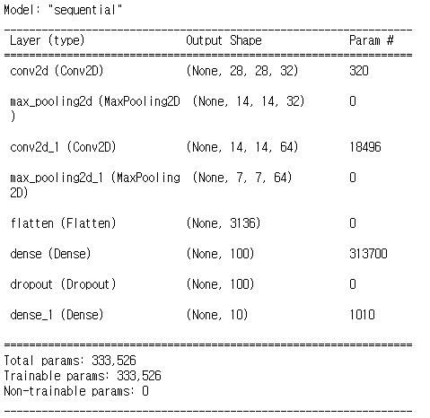
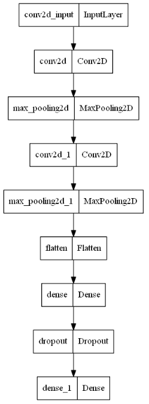
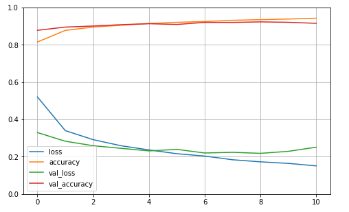

# 1. 합성곱 신경망(CNN)


## 1) CNN(Convolutional neural network)이란?

- 데이터의 특징을 추출하고 샘플링과 풀링의 과정을 통해서 데이터를 구분하는 최적의 특징을 찾아내는 방법의 신경망이다.

- 이미지 분류에서 주로 사용된다.
- 합성곱 계층과 풀링 계층이 존재한다.


## 2) CNN을 이용한 코드

1. import 및 데이터로드

   ```python
   from tensorflow import keras
   from sklearn.model_selection import train_test_split
   from keras.datasets.fashion_mnist import load_data
   
   (x_data, y_data), (tt_x, tt_y) = load_data()
   x_data = x_data.reshape(-1, 28, 28, 1) / 255.0
   t_x, v_x, t_y, v_y = train_test_split(x_data, y_data, random_state=42, test_size=0.2)
   ```

2. 모델 생성 및 CNN layer 형성

   ```python
   m = keras.Sequential()
   m.add(keras.layers.Conv2D(32, kernel_size=3, activation='relu', padding='same', input_shape=(28, 28, 1))) # 샘플링
   m.add(keras.layers.MaxPooling2D(2)) # 풀링
   m.add(keras.layers.Conv2D(64, kernel_size=(3, 3), activation='relu', padding='same'))
   m.add(keras.layers.MaxPooling2D(2))
   ```

3. 입력 및 출력 Layer 형성

   ```python
   m.add(keras.layers.Flatten())
   m.add(keras.layers.Dense(100, activation='relu'))
   m.add(keras.layers.Dropout(0.4))
   m.add(keras.layers.Dense(10, activation='softmax'))
   m.summary()
   ```

   

4. 모델의 정보 이미지화

   ```python
   keras.utils.plot_model(m)
   ```

   

5. 최적의 모델 기록 및 조건달성 시 정지

   ```python
   # 모델 학습 방식 지정 및 학습
   m.compile(optimizer='adam', loss='sparse_categorical_crossentropy', metrics='accuracy')
   
   # 최적의 모델을 기록하기 위한 checkpoint
   ck_p = keras.callbacks.ModelCheckpoint('best_cnn_model.h', save_best_only=True)
   
   # 중단지점 설정
   e_st = keras.callbacks.EarlyStopping(patience=2)
   
   # 학습
   histoty_m = m.fit(t_x, t_y, epochs=20, validation_data=(v_x, v_y), callbacks=[ck_p, e_st])
   ```

6. 검증 data를 이용한 모델 평가

   ```python
   m.evaluate(v_x, v_y)
   ```

   - 측정결과 : loss: 0.2511 - accuracy: 0.9154

7. 학습된 모델의 정보를 시각화

   ```python
   import pandas as pd
   import matplotlib.pyplot as plt
   
   pd.DataFrame(histoty_m.history).plot(figsize=(8, 5))
   plt.grid(True)
   plt.gca().set_ylim(0, 1)
   plt.show()
   ```

   

   