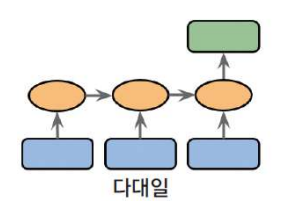
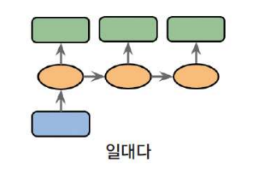
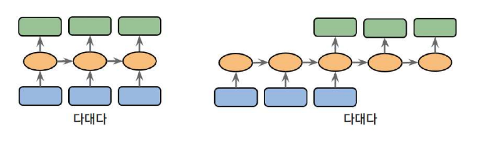
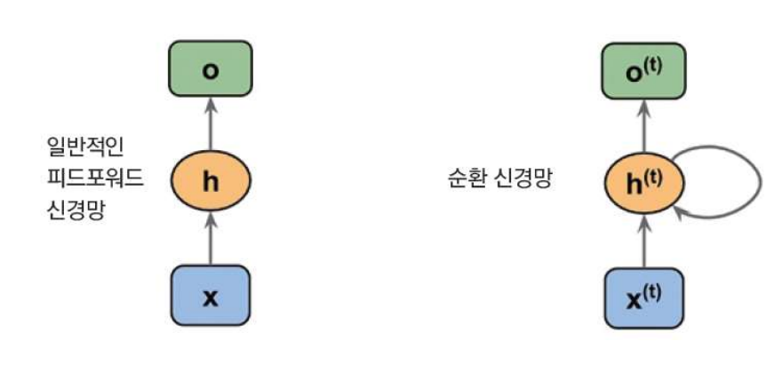
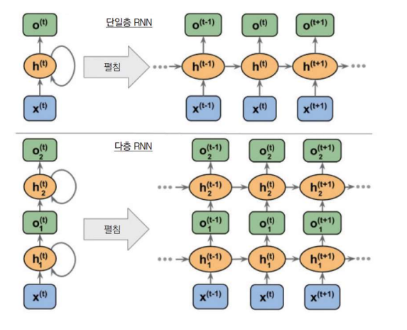
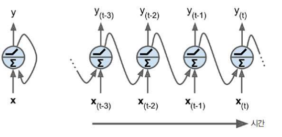

# RNN (Recurrent Neural Network)

## 1. RNN이란?

- RNN은 반복적이고 순차적인 데이터 학습에 특화된 인공신경망의 한 종류로써 내부에 순환구조가 있다.
- 순환구조를 이용하여 과거 학습의 가중치를 현재 가중치를 학습하는데 반영한다.
- RNN은 텍스트의 앞, 뒤 문맥을 고려할 때 자주 사용되는 알고리즘이다.
  - ex. 언어 번역, 텍스트 생성, 이미지 캡셔닝 등

## 2. RNN 모델의 다양한 구조

### 1) 다대일(many-to-one)

- 입력 데이터가 시퀀스이지만 출력은 시퀀스가 아닌 고정이다.
- ex. 감성 분석에서 입력은 텍스트이고 출력이 부정, 긍정의 클래스로 분류되는 경우

### 2) 일대다(one-to-many)

- 입력 데이터가 시퀀스가 아닌 일반적인 형태이며, 출력은 시퀀스이다.
- ex. 이미지 캡셔닝
  - 입력은 이미지이고 출력은 이미지 내용을 요약한 영어문장이 될 수 있다.

### 3) 다대다(many-to-many)

## 3. RNN의 반복구조

- 기본 피드포워드 네트워크에서의 정보는 입력 -> 은닉층 -> 출력층 으로 전달되는 구조를 가진다.
- 반면에 순환 네트워크에서는 은늑층이 현재 타임 스템의 입력층과 이전 타임 스템의 은닉층으로부터 정보를 받는다.
  - 인접한 타임 스텝의 정보가 은닉층에 흐르기 때문에 네트워크가 이전 이벤트를 기억할 수 있다.
  - 이 정보의 흐름을 보통 loop로 표시한다.
  - 그래프 표기법에서는 순환 에지(recurrent edge)라고도 하기 때문에  RNN구조의 이름이 여기에서 유래되었다.

- 순환 신경망은 피드포워드 신경망과 매우 비슷하지만 뒤쪽으로 순환하는 연결도 있다는 점에서 차이가 있다.

- vector-to-sequence network

  - 각 타임 스템에서 하나의 입력 벡터를 반복해서 네트워크에 주입하고, 하나의 시퀀스를 출력한다.

  - 인코더, 디코더 구조

    

## 4. RNN의 문제점

- 불안정한 Gradient 문제
- 학습이 지속되면 이전 기억을 소실한다.
- 과거 학습요소 상실
- 단기 기억 문제
  - 해결
    - LSTM(장단기 메모리) 셀
    - 핍홀 연결
    - GRU(게이트 순환 유닛) 셀
    - 1D 합성곱 층을 사용해 시퀀스 처리
    - WAVENET

