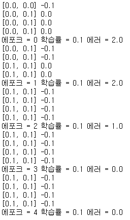

# 1. 딥러닝 이론


## 1) 딥러닝이란?

- 인공 신경망을 통해서 컴퓨팅 구조를 만든 것
- 머신러닝이 구현된 모델을 사용하는것이라면 딥러닝은 모델을 구현하는것에 가깝다
- 인공신경망과 역전파 알고리즘을 활용한 머신러닝


## 2) 퍼셉트론이란?

- 가장 간단한 인공 신경망 중 하나로 다수의 신호를 받아 하나의 신호를 출력한다.
- 출력은 0과 1 둘 중 하나로 표현된다.
- 스스로 학습하는 능력을 가지고 있다.


### (1) 퍼셉트론의 동작흐름

1. 입력 값이 들어오면 각 입력마다 가중치를 곱해서 합한다.
2. '1'의 값이 활성화 함수의 임계값 수치를 넘으면 활성화되어 1이 출력되고 그렇지 못하면 0이 출력된다.


### (2) 퍼셉트론의 한계

1. 직선 하나로 나눈 영역만 표현할 수 있다. 즉, XOR의 연산을 수행하지 못한다.
2. 이는 하나의 뉴런만을 가지고 있기 때문이다.
3. 퍼셉트론의 한계는 다층 퍼셉트론과 역전파 알고리즘의 등장으로 개선되었다.


### (3) 다층 퍼셉트론(MLP)

- 입력층과 출력층 사이에 은닉층을 가지고 있는 신경망이다.
- 다층 퍼셉트론의 핵심은 역전파 알고리즘이다. 역전파 알고리즘은 입력이 주어지면 순방향으로 계산하여 출력을 만들고, 기존의 출력과 비교하여 오차를 계산하고 이 오차를 역방향으로 전파하면서 오차를 줄이는 방향으로 가중치를 변경하는 알고리즘이다.
  - 역전파 알고리즘에서 가중치는 신경망의 가중치를 작은 난수로 초기화한다.

- 오차
  - 손실함수를 통해서 계산된다.
  - 전체 오차는 목표 출력값에서 실제 출력값을 빼서 제곱한 값을 모든 출력 노드에 대하여 합한 값이다.


### (4) 활성화 함수

- 내부에서 입력받은 데이터를 근거로 다음 계층으로 출력할 값을 결정하는 함수
- 활성화 함수는 딥러닝의 목적과 계층에 따라 다른 함수를 사용한다.
- 은닉 계층의 활성화 함수
  - relu : 이미지 분류에서 좋은 성능을 내는 함수
  - sigmoid : 가장 기본적인 함수
- 출력 계층의 활성화 함수
  - 이진분류목적 : sigmoid
  - 다중분류목적 : softmax


### (5) 최적화 함수

- 손실함수의 결과 값을 최소화하는 함수
- 경사하강법, 확률적 경사하강법, RMSProp 등이 있다.


# 2. 딥러닝 기초 코드


## 1) 퍼셉트론 기초코드


1. 활동 함수

   ```python
   def n_f(in_data):
       global w # 가중치
       global b # 바이어스 (임계값)
       at_v = b # 활성도 : b 값을 임의로 부여
       
       for i in range(2):
           at_v += w[i] * in_data[i] # 활성도 산출
       if at_v >= 0: # 경계치 설정
           return 1
       else:
           return 0
   ```

2. 트레이닝 함수

   ```python
   # 트레이닝 함수
   '''
   epch : 반복횟수
   l_r : 학습률(수정하는방법론)
   '''
   def t_f(X, y, l_r, epch):
       global w
       global b
       for en in range(epch): # 반복횟수만큼 반복
           sum_e = 0.0 # sum of error
           for r, t in zip(X, y) : # 결과값과 타겟값
               at = n_f(r) # 예측값
               err = t - at # 결과값과 예측값의 차이 : 오차계산
               b = b + l_r * err # 임계값 갱신
               sum_e += err**2 # 제곱오차 -> 오차의 방향성은 중요하지 않기때문
               # 가중치를 오차를 통해서 조정
               for i in range(2):
                   w[i] = w[i] + l_r * err * r[i]
               print(w, b)
           print(f'에포크 = {en} 학습률 = {l_r} 에러 = {sum_e}')
       return w # 업데이트된 가중치를 반환
   ```

3. 입력 및 출력 데이터 임의 지정

   ```python
   # 데이터 준비
   X = [[0, 0], [0, 1], [1, 0], [1, 1]]
   Y = [0, 1, 1, 1]
   w = [0.0, 0.0] # 초기 가중치 값 설정
   b = 0.0 # 초기 임계값 설정(w0)
   l_r = 0.1 # 학습률 설정
   e = 5 # 에포크 값 설정(반복 수)
   ```

4. 가중치 값 업데이트 과정 확인

   ```python
   w = t_f(X, Y, l_r, e) # 가중치 값 구하기
   ```

   

5. 학습결과 확인

   ```python
   # 트레이닝 후 결과값
   
   # y = w0x0 + w1x1 + b
   # y = 0.2 x 0.0 + 0.1 x 1 - 0,200000000000004
   # 학습 후에는 정확한 결과값을 도출하는 것을 알 수 있다
   n_f(X[0]), n_f(X[1]), n_f(X[2]), n_f(X[3])
   ```

   실행결과 : (0, 0, 0, 1)

6. XOR 게이트 - 멀티퍼셉트론(MLP)

   ```python
   # AND 게이트 퍼셉트론
   def AND(X):
       # 연산을 통해 찾은 w, b 제시
       and_w = [0.2, 0.1]
       and_b = -0.20000000000000004
       at_f = and_b
       for i in range(2):
           at_f += and_w[i] * X[i] # 활성도 산출
       if at_f >= 0: # 경계치 설정
           return 1
       else:
           return 0
           
   # OR 게이트 퍼셉트론
   def OR(X):
       # 연산을 통해 찾은 w, b 제시
       or_w = [0.1, 0.1]
       or_b = -0.1
       at_f = or_b
       for i in range(2):
           at_f += or_w[i] * X[i] # 활성도 산출
       if at_f >= 0: # 경계치 설정
           return 1
       else:
           return 0
       
   # XOR 게이트 퍼셉트론 : 멀티레이어 퍼셉트론
   def XOR(X):
       o_1 = not AND(X)
       o_2 = OR(X)
       return AND([o_1, o_2])
   
   XOR(X[0]), XOR(X[1]), XOR(X[2]), XOR(X[3])
   ```

   실행결과 : (0, 1, 1, 0)

7. 사이킷런 퍼셉트론 모듈을 이용한 코드

   ```python
   # 딥러닝 : 인공신경망을 이용한 머신러닝
   from sklearn.linear_model import Perceptron # 퍼셉트론을 사용하기위한 모듈
   
   # 데이터
   X = [[0, 0], [0, 1], [1, 0], [1, 1]]
   Y = [0, 0, 0, 1]
   
   # 퍼셉트론 객체 생성
   '''
   tol : 종료조건설정 (오차의 값이 이 값에 도달하면 학습을 종료)
   '''
   p = Perceptron(tol=1e-3, random_state=10) 
   p.fit(X, Y) # 학습
   p.predict(X) # 값 예측
   ```

   실행결과 : array([0, 0, 0, 1])