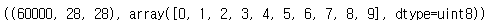
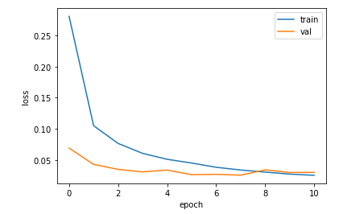
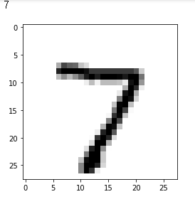
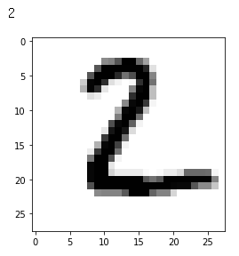
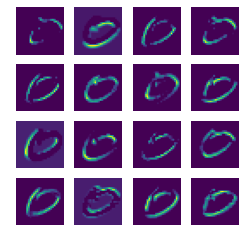
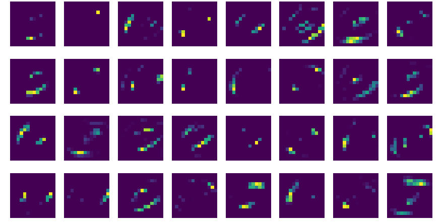

# 1. 딥러닝 - 이미지 학습


## 1) 코드

1. import

   ```python
   from keras.datasets.mnist import load_data # 데이터 셋 Load
   import matplotlib.pyplot as plt # 데이터 시각화
   from tensorflow import keras # 딥러닝 모델
   from sklearn.model_selection import train_test_split # 데이터 분류
   import tensorflow as tf # 딥러닝
   import numpy as np
   import pandas as pd
   ```

2. 데이터 Load

   ```python
   # 원본 데이터에서 테스트용 데이터 분리 7:3
   (x_data, y_data), (tt_x_data, tt_y_data) = load_data()
   ```

3. seed 값 고정 (고정된 데이터 사용을 위함)

   ```python
   np.random.seed(42)
   tf.random.set_seed(42)
   ```

4. 입력 데이터와 출력 데이터 구조 확인(입력단과 출력단의 형태를 결정하기 때문에 매우 중요한 과정이다.)

   ```python
   x_data.shape, np.unique(y_data)
   ```

   실행결과 :

   

5. 데이터 전처리

   ```python
   # 이미지 데이터 이므로 28 x 28 1장씩 불러오기 위해 reshape 과정을 거친다.
   x_data = x_data.reshape(-1, 28, 28, 1) / 255.0
   tt_x = tt_x_data.reshape(-1, 28, 28, 1) / 255.0
   tt_y = tt_y_data
   
   # 학습용 데이터와 검증용 데이터 분리 8:2
   t_x, v_x, t_y, v_y = train_test_split(x_data, y_data, test_size=0.2, random_state=42)
   ```

6. 모델 생성 및 컨벌루션 Layer 쌓기

   ```python
   cnn_m = keras.Sequential()
   cnn_m.add(keras.layers.Conv2D(16, kernel_size=3, activation='relu', padding='same', input_shape=(28, 28, 1)))
   cnn_m.add(keras.layers.MaxPooling2D(2))
   cnn_m.add(keras.layers.Conv2D(32, kernel_size=3, activation='relu', padding='same'))
   cnn_m.add(keras.layers.MaxPooling2D(2))
   ```

7. Hidden Layer 쌓기

   ```python
   cnn_m.add(keras.layers.Flatten())
   cnn_m.add(keras.layers.Dense(80, activation='relu'))
   cnn_m.add(keras.layers.Dropout(0.4)) # 뉴런 가지치기
   cnn_m.add(keras.layers.Dense(10, activation='softmax')) # 다중 분류이므로 종단의 활성함수는 softmax 함수로 지정한다
   ```

8. 학습방법 지정 및 학습

   ```python
   # 옵티마이저는 분류문제에 적합한 adam과 loss 함수는 다중분류함수로 지정
   cnn_m.compile(optimizer='adam', loss='sparse_categorical_crossentropy', metrics='accuracy')
   # 최적의 모델 저장 call-back 함수 정의
   ck_best = keras.callbacks.ModelCheckpoint("best_model_Q2.h5", save_best_only=True)
   # 중단 call-back 함수 정의
   ea_st = keras.callbacks.EarlyStopping(patience=3) # 3번동안 성능이 개선되지 않으면 종료
   
   # 모델 학습
   history = cnn_m.fit(t_x, t_y, epochs=20, validation_data=(tt_x, tt_y), callbacks=[ck_best, ea_st])
   ```

9. 검증 및 평가 - 시각화

   ```
   # 검증 데이터 - 점수
   cnn_m.evaluate(v_x, v_y)
   ```

   실행결과 : [0.03837166726589203, 0.9916666746139526]

   ```python
   # 테스트 데이터 평가 시각화
   plt.plot(history.history['loss'])
   plt.plot(history.history['val_loss'])
   plt.xlabel('epoch')
   plt.ylabel('loss')
   plt.legend(['train', 'val'])
   plt.show()
   ```

   

10. 테스트 데이터 예측값 이미지화

    ```python
    tt_pred = cnn_m.predict(tt_x)
    
    classes = ['0', '1', '2', '3', '4', '5', '6', '7', '8', '9']
    
    y_l = cnn_m.predict(tt_x[0:10]) 
    for i in range(len(y_l)):
        print(classes[np.argmax(y_l[i:i+1])])
        plt.imshow(tt_x[i].reshape(28, 28), cmap='gray_r')
        plt.show()
    ```

    - argmax : 축을 따라 최대값의 인덱스를 반환






=> 좋은 예측성능을 보인다.


11. 컨벌루셔 층의 필터 시각화

    ```python
    conv_act1 = keras.Model(cnn_m.input, cnn_m.layers[0].output)
    f_map = conv_act1.predict(t_x[1:2]) # 시각화할 데이터 선택
    fig, axs = plt.subplots(4, 4, figsize=(4, 4))
    for i in range(4):
        for j in range(4):
            axs[i, j].imshow(f_map[0, :, :, i*4 + j])
            axs[i, j].axis('off')
    ```

    

    - '0'에 대한 필터

    ```python
    # 컨벌루션 2층 이미지
    fig, axs = plt.subplots(4, 8, figsize=(15, 8))
    for i in range(4):
        for j in range(8):
            axs[i, j].imshow(f2_map[0, :, :, i*8 + j])
            axs[i, j].axis('off')
    ```

    

    

=> 데이터의 주요 특징만 추출됨을 알 수 있다.