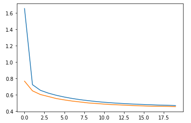

# 1. 딥러닝을 이용한 회귀문제해결


## 1) 딥러닝과 회귀문제

- 딥러닝에서 회귀문제를 해결할 때, 종단의 출력개수는 절대적으로 1개이다.


## 2) 딥러닝 - 회귀문제 코드

1. import

   ```python
   from sklearn.datasets import fetch_california_housing
   from sklearn.model_selection import train_test_split
   from sklearn.preprocessing import StandardScaler
   from tensorflow import keras
   import tensorflow as tf
   import numpy as np
   import pandas as pd
   import matplotlib.pyplot as plt
   ```

2. 초기설정

   ```python
   np.random.seed(42)
   tf.random.set_seed(42)
   ```

   - 난수의 시드 값을 고정하여 사용되는 데이터를 일치시킨다.

3. 데이터 Load 및 전처리

   ```python
   # 데이터 로드
   data = fetch_california_housing()
   
   # 데이터 분류
   x_data, tt_x, y_data, tt_y = train_test_split(data.data, data.target, random_state=42)
   t_x, v_x, t_y, v_y = train_test_split(x_data, y_data, random_state=42, test_size=0.2)
   
   # 데이터 전처리
   s = StandardScaler()
   t_x = s.fit_transform(t_x)
   tt_x = s.fit_transform(tt_x)
   v_x = s.fit_transform(v_x)
   ```

4. 모델 생성 및 Layer 형성

   ```python
   m = keras.models.Sequential()
   m.add(keras.layers.Flatten(input_shape=t_x.shape[1:]))
   m.add(keras.layers.Dense(30, activation='relu'))
   m.add(keras.layers.Dense(1))
   ```

5. 모델의 정보를 이미지로 기록

   ```python
   keras.utils.plot_model(m, 'm.png', show_shapes=True)
   ```

   

6. 모델의 학습방법 지정 및 학습 및 평가

   ```python
   m.compile(optimizer=keras.optimizers.SGD(learning_rate=1e-3), loss='mean_squared_error')
   history_m = m.fit(t_x, t_y, epochs=20, validation_data=(v_x, v_y))
   histoty_tt = m.evaluate(tt_x, tt_y)
   ```

   - 회귀문제이기 때문에 손실함수의 방식을 MSE로 설정

7. 모델의 정보 시각화

   ```python
   plt.plot(pd.DataFrame(history_m.history))
   plt.show()
   ```

   

   - 그래프 분석
     - 학습은 되었으나 정확하지 않은 것을 확인할 수 있다.

   - 더 나은 성능을 위한 개선방향
     - Optimizer의 선정, 적절한 하이퍼 파라미터, 적절한 Layer와 뉴런 등