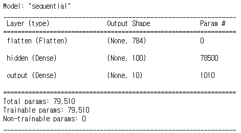
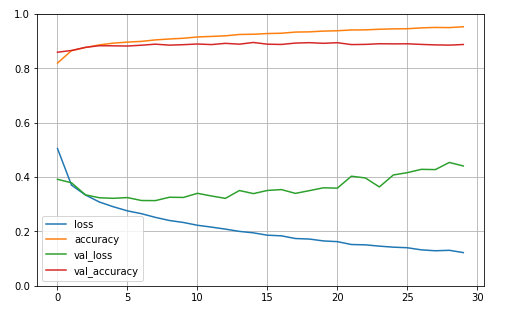
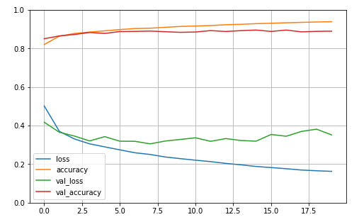
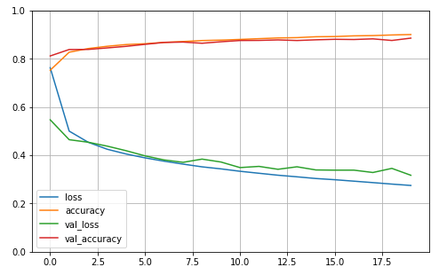
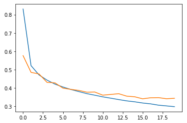
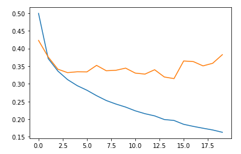
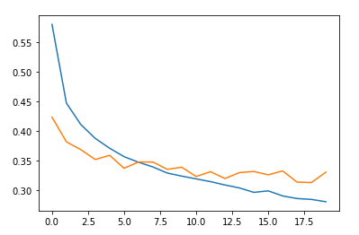

# 1. 딥러닝 모델의 성능향상 방법


## 1) 기본적인 코드로 성능 측적 (개선 성능과 비교하기 위함)


1. import

   ```python
   import tensorflow as tf
   from tensorflow import keras # 신경망 구축을 위한 모듈
   import numpy as np
   from sklearn.model_selection import train_test_split # 데이터 분리를 위한 모듈
   ```

2. 데이터 Load

   ```python
   # 데이터 로드(학습용, 테스트용) 7:3
   (t_x, t_y), (tt_x, tt_y) = keras.datasets.fashion_mnist.load_data()
   # 데이터 전처리
   s_t_x = t_x / 255.0
   s_tt_x = tt_x/255.0
   # 데이터 분류(학습용, 검증용) 8:2
   t_x, v_x, t_y, v_y = train_test_split(s_t_x, t_y, test_size=0.2, random_state=42)
   ```

3. 모델 생성 및 Layer 형성

   ```python
   model = keras.Sequential() # 모델 생성
   # Flatten : 입력단 설정
   model.add(keras.layers.Flatten(input_shape=(28, 28))) # 입력 Layer의 형상을 미리 주어서 별도로 reshape 하지않아도된다
   model.add(keras.layers.Dense(100, activation='relu', input_shape=(784,), name='hidden')) # Layer 추가
   model.add(keras.layers.Dense(10, activation='softmax', name='output')) # Layer 추가
   model.summary()
   ```

   - relu 활성화함수 : 이미지 분류에서 좋은 성능을 낸다
   - softmax 활성화함수 : 종단의 활성화함수로 다중분류에서 사용된다.

   - 생성된 모델의 summary 확인

     

     

4. 딥러닝 모델의 학습방법 지정 및 학습

   ```python
   model.compile(loss='sparse_categorical_crossentropy', metrics='accuracy') 
   model.fit(t_x, t_y, epochs=5) # 학습의 반복횟수는 필수적으로 지정해야한다.
   ```

5. 구축된 딥러닝 모델의 성능 평가

   ```python
   model.evaluate(v_x, v_y)
   ```

   - loss 값이 하강곡선을 그린다면 학습횟수를 늘려서 성능을 높이는 판단이 가능하다.
   - 측정된 성능 : loss: 0.3830 - accuracy: 0.8722


## 2) Optimizer을 설정하여 성능을 향상시키기


- 모델의 Optimizer를 지정하여 모델을 컴파일하는 방법

  ```python
  model.compile(optimizer='sgd', loss='sparse_categorical_crossentropy', metrics='accuracy')
  model.fit(t_x, t_y, epochs=5)
  model.evaluate(v_x, v_y)
  ```

  - sgd는 확률적 경사하강법으로 해당 모델의 Optimizer를 확률적 경사하강법으로 설정
  - 측정된 성능 : loss: 0.3191 - accuracy: 0.8912
  - Default로 Optimizer가 설정된 모델보다 더 나은 성능지표를 보여준다.
  - 즉, 데이터의 학습에 알맞은 Optimizer를 설정하므로써 딥러닝 모델의 성능을 향상시킬 수 있다

- 모델의 Optimizer의 알고리즘을 객체로 선언하여 모델에 제시하는 방법

  ```python
  sgd = keras.optimizers.SGD(learning_rate=0.1) 
  model.compile(optimizer=sgd, loss='sparse_categorical_crossentropy', metrics='accuracy') 
  model.fit(t_x, t_y, epochs=5)
  model.evaluate(v_x, v_y)
  ```

  - Optimizer로 사용될 알고리즘의 객체를 생성하여 제시하는방법은 사용되는 알고리즘의 하이퍼파라미터 값을 직접 조정하여 제시할 수 있기 때문에 더 나은 성능 향상을 기대할 수 있다
  - 단, 이 방법은 적절한 하이퍼파라미터의 설정이 성능을 결정하는데 중요한 요소가 되므로 신중해야한다
  - 측정된 성능 : loss: 0.3293 - accuracy: 0.8840

- SGD(확률적 경사하강법)의 모멘텀 설정

  ```python
  sgd = keras.optimizers.SGD(momentum=0.9, nesterov=True, learning_rate=0.1)
  model.compile(optimizer=sgd, loss='sparse_categorical_crossentropy', metrics='accuracy')
  model.fit(t_x, t_y, epochs=5)
  model.evaluate(v_x, v_y)
  ```

  - momentum은 경사하강법에서 가속도를 나타낸다.
  - nesterov는 경사하강법에서 가속경사방식을 사용할지를 나타낸다.
  - 위의 방법은 경사하강법에서 최저점을 찾기위한 방법이다.
  - 측정된 성능 : loss: 0.5701 - accuracy: 0.8020

- 여러가지 Optimizer

  - RMSprop : ``keras.optimizers.RMSprop()``
  - Adagrad : ``keras.optimizers.Adagrad()``

- 모델의 Optimizer를 Adam 방식으로 설정

  ```python
  model1.compile(optimizer='adam', loss='sparse_categorical_crossentropy', metrics='accuracy') 
  model1.fit(t_x, t_y, epochs=5)
  model1.evaluate(v_x, v_y)
  ```

  - 측정된 성능 : loss: 0.3325 - accuracy: 0.8791


## 3) 3가지의 모델을 생성하여 성능비교


- 1번 모델

  ```python
  # 모델 생성 및 Layer 형성
  m1 = keras.Sequential()
  m1.add(keras.layers.Flatten(input_shape=(28, 28)))
  m1.add(keras.layers.Dense(100, activation='relu', name='h1'))
  m1.add(keras.layers.Dense(300, activation='relu', name='h2'))
  m1.add(keras.layers.Dense(10, activation='softmax', name='y'))
  
  # 모델 학습
  m1.compile(optimizer='adam', loss='sparse_categorical_crossentropy', metrics='accuracy')
  history = m1.fit(t_x, t_y, epochs=30, validation_data=(v_x, v_y)) # 학습시 검증 데이터를 함께 전달
  
  # 학습된 모델의 정보를 확인
  print(history.params) # 파라미터 값 확인
  print(history.history.keys()) # 키 값 확인
  
  # 학습된 모델의 데이터를 시각화
  import pandas as pd
  import matplotlib.pyplot as plt
  
  pd.DataFrame(history.history).plot(figsize=(8, 5))
  plt.grid(True) # 격자 활성화
  plt.gca().set_ylim(0, 1) # y 범위 설정
  plt.show()
  ```

  

  - 그래프 분석
    - 검증데이터의 loss값이 상승곡선 즉, 발산한다. 이는 이 모델이 과적합된 모델임을 의미한다
    - 원인은 과도한 뉴런의 개수이다.

- 2번모델

  ```python
  # 모델 생성 및 Layer 형성
  m2 = keras.Sequential()
  m2.add(keras.layers.Flatten(input_shape=(28, 28)))
  m2.add(keras.layers.Dense(300, activation='relu', name='h2'))
  m2.add(keras.layers.Dense(100, activation='relu', name='h1'))
  m2.add(keras.layers.Dense(10, activation='softmax', name='y'))
  
  # 모델 학습
  m2.compile(optimizer='adam', loss='sparse_categorical_crossentropy', metrics='accuracy')
  history = m2.fit(t_x, t_y, epochs=20, validation_data=(v_x, v_y))
  
  # 학습된 모델 시각화
  pd.DataFrame(history.history).plot(figsize=(8, 5))
  plt.grid(True)
  plt.gca().set_ylim(0, 1)
  plt.show()
  ```

  

  - 그래프 분석
    - 2번모델 역시 검증데이터의 loss 값이 발산한다 -> 과대적합된 모델
    - 원인은 너무 많은 수식 즉, 뉴런의 개수이다.

- 3번모델

  ```python
  # 모델 생성 및 Layer 형성
  m3 = keras.Sequential()
  m3.add(keras.layers.Flatten(input_shape=(28, 28)))
  m3.add(keras.layers.Dense(300, activation='relu', name='h2'))
  m3.add(keras.layers.Dense(100, activation='relu', name='h1'))
  m3.add(keras.layers.Dense(10, activation='softmax', name='y'))
  
  # 모델 학습
  m3.compile(optimizer='sgd', loss='sparse_categorical_crossentropy', metrics='accuracy')
  history3 = m3.fit(t_x, t_y, epochs=20, validation_data=(v_x, v_y))
  
  # 학습된 모델 시각화
  pd.DataFrame(history3.history).plot(figsize=(8, 5))
  plt.grid(True)
  plt.gca().set_ylim(0, 1)
  plt.show()
  ```

  

  - 그래프 분석
    - 검증데이터의 loss 값과 학습 데이터의 loss 값의 오차가 적으며 하강곡선을 그린다. 이는 3번모델이 적절한 모델로 생성되었음을 알 수 있다.
    - 3번 모델은 Optimizer을 SGD로 설정했다. 이는 이 데이터에 대한 Optimizer로는 SGD가 더 적합하다는 것을 시사한다.


## 4) 과적합 모델의 성능향상

- 딥러닝 모델의 과적합 이유는 주로 과다한 뉴런의 개수에서 비롯된다.
- 이러한 과적합 모델은 뉴런의 가지치기를 통해서 개선될 수 있다.


### (1) 기본 모델 생성 및 성능 측정

```python
import tensorflow as tf
from tensorflow import keras # 신경망 구축을 위한 모듈
import numpy as np
from sklearn.model_selection import train_test_split # 데이터 분리를 위한 모듈
import pandas as pd
import matplotlib.pyplot as plt

# 데이터 로드(학습용, 테스트용) 7:3
(t_x, t_y), (tt_x, tt_y) = keras.datasets.fashion_mnist.load_data()
# 데이터 전처리
s_t_x = t_x / 255.0
s_tt_x = tt_x/255.0
# 데이터 분류(학습용, 검증용) 8:2
t_x, v_x, t_y, v_y = train_test_split(s_t_x, t_y, test_size=0.2, random_state=42)

# 모델 생성 및 Layer 쌓기
m = keras.Sequential()
m.add(keras.layers.Flatten(input_shape=t_x.shape[1:]))
m.add(keras.layers.Dense(100, activation='relu', name='h1'))
m.add(keras.layers.Dense(300, activation='relu', name='h2'))
m.add(keras.layers.Dense(10, activation='softmax', name='y'))
m.compile(optimizer='sgd', loss='sparse_categorical_crossentropy')

# 모델 학습
hy = m.fit(t_x, t_y, epochs=20, validation_data=(v_x, v_y))

# 학습된 모델의 정보 시각화
plt.plot(hy.history['loss'])
plt.plot(hy.history['val_loss'])
plt.show()
```



### (2) 과다학습 모델의 생성 및 성능 측정

```python
m1 = keras.Sequential()
m1.add(keras.layers.Flatten(input_shape=t_x.shape[1:]))
m1.add(keras.layers.Dense(100, activation='relu', name='h1'))
m1.add(keras.layers.Dense(300, activation='relu', name='h2'))
m1.add(keras.layers.Dense(10, activation='softmax', name='y'))

m1.compile(optimizer='adam', loss='sparse_categorical_crossentropy')
hy1 = m1.fit(t_x, t_y, epochs=20, validation_data=(v_x, v_y))

plt.plot(hy1.history['loss'])
plt.plot(hy1.history['val_loss'])
plt.show()
```



### (3) 과다학습 모델의 가지치기를 통한 성능 개선

```python
# 과다학습 모델의 뉴런 날리기
m2 = keras.Sequential()
m2.add(keras.layers.Flatten(input_shape=t_x.shape[1:]))
m2.add(keras.layers.Dense(100, activation='relu', name='h1'))

m2.add(keras.layers.Dropout(0.3)) # Layer 사이의 뉴런을 30% 제거한다.

m2.add(keras.layers.Dense(300, activation='relu', name='h2'))
m2.add(keras.layers.Dense(10, activation='softmax', name='y'))

m2.compile(optimizer='adam', loss='sparse_categorical_crossentropy', metrics='accuracy')
hy2 = m2.fit(t_x, t_y, epochs=20, validation_data=(v_x, v_y))

plt.plot(hy2.history['loss'])
plt.plot(hy2.history['val_loss'])
plt.show()
```

- 뉴런이 과다하게 많은 Layer 사이에 Dropout Layer을 형성하여 뉴런을 제거한다.

  

  

