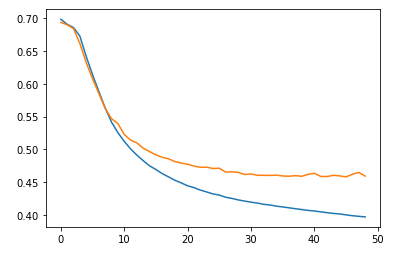
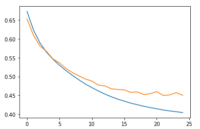
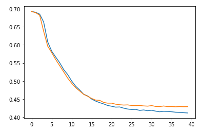

# 1. 딥러닝 - 순환신경망(RNN)


## 1) 순차 데이터

- 순서를 고려하는 데이터
- 상호 독립적이지 않다.
- 순차 데이터와 데이터 포인트 사이가 중요하다.


### (1) 시퀀스 모델링

1. 다대일
   - 입력 데이터는 시퀀스, 출력은 시퀀스 아니고 고정
   - 크기의 벡터나 스칼라
   - 입력 예로는 영화리뷰, 리뷰어가 좋아하는지 나타내는 레이블, 출력은 클래스
2. 일대다
   - 입력 데이터는 시퀀스가 아닌 일반적인 형태이고 출력이 시퀀스
   - 예로는 이미지 캡셔닝 : 입력이 이미지이고 출력은 이미지 내용을 요약한 영어문장


## 2) RNN 


### (1) RNN 반복구조

- 은닉층이 현재 타임 스텝의 입력층과 이전 타임 스텝의 은닉층으로부터 정보를 받음
- 네트워크가 이전 이벤트를 기억한다


### (2) RNN 단점

- 불안정한 Gradient 문제
- 학습이 지속될수록 이전의 기억을 소실
- 과거 학습요소 상실
- 단기기억


### (3) RNN 단기기억 해결

- LSTM(장단기 메모리) 셀
- 핍홀 연결
- GRU(게이트 순환 유닛) 셀
- 1D 합성곱 층을 사용해 시퀀스 처리
- WAVENET


## 3) 순환신경망을 이용한 텍스트 이진분류


## (1) 코드


1. import

   ```python
   from tensorflow.keras.datasets.imdb import load_data # 데이터 로드
   from sklearn.model_selection import train_test_split # 데이터 분리
   import numpy as np # 데이터 연산
   import matplotlib.pyplot as plt # 데이터 시각화
   from tensorflow.keras.preprocessing.sequence import pad_sequences # 시퀀스 데이터 전처리
   from tensorflow import keras # 딥러닝 모델
   ```

2. 데이터 Load

   ```python
   # 원본 데이터에서 테스트 데이터 분리 7:3
   # num_words=500 : 500개의 단어 종류만 가져옴
   (x_data, y_data), (tt_x, tt_y) = load_data(num_words=500)
   ```

3. 데이터 구조확인

   ```python
   x_data.shape, y_data.shape
   ```

   실행결과 : ((25000,), (25000,))

   ```python
   len(x_data[0]), len(x_data[1])
   ```

   실행결과 : (218, 189)

   => 데이터의 길이 즉, 문장의 길이가 각각 다르기 때문에 이를 통일해야한다.

   ```python
   y_data[:5] # 이진분류(긍정과 부정 리뷰) : 타겟 데이터
   ```

4. 데이터 전처리

   ```python
   # 데이터 분류 : 학습데이터와 검증데이터 8:2
   t_x, v_x, t_y, v_y = train_test_split(x_data, y_data, random_state=42, test_size=0.2)
   
   # 데이터 길이를 같게 한다.
   # 길이를 동일하게 100으로 조정
   # 길이가 작으면 확장, 크면 축소
   s_t_x = pad_sequences(t_x, maxlen=100)
   s_v_x = pad_sequences(v_x, maxlen=100)
   
   # 데이터 가변 Layer에 입력되는 형태로 가변
   # keras.utils.to_categorical : 클래스 벡터(정수)를 이진 클래스 행렬로 변환합니다
   t_ho = keras.utils.to_categorical(s_t_x)
   v_ho = keras.utils.to_categorical(s_v_x)
   ```

5. 모델 생성 및 RNN Layer 쌓기

   ```python
   # 모델 생성
   m = keras.Sequential()
   
   # Layer 쌓기
   m.add(keras.layers.SimpleRNN(8, input_shape=(100, 500))) # 8개의 출력공간과 출력형태
   m.add(keras.layers.Dense(1, activation='sigmoid')) # 이진분류이므로 출력단 1개
   ```

6. 모델 학습

   ```python
   ot = keras.optimizers.RMSprop(learning_rate=1e-4) # 학습률을 조정하기 위해 옵티마이저 객체를 선언
   m.compile(optimizer=ot, loss='binary_crossentropy', metrics='accuracy')
   
   ck_best = keras.callbacks.ModelCheckpoint("Ex2.h5", save_best_only=True) # 최적의 모델 저장
   ea_st = keras.callbacks.EarlyStopping(patience=3, restore_best_weights=True) # 성능이 3번이상 개선되지 않으면 종료
   
   hy = m.fit(t_ho, t_y, epochs=100, batch_size=64, validation_data=(v_ho, v_y), callbacks=[ck_best, ea_st])
   ```

7. 검증 데이터의 평가 점수 시각화

   ```python
   plt.plot(hy.history['loss'])
   plt.plot(hy.history['val_loss'])
   plt.show()
   ```

   

8. 성능 개선 - 임베딩 Layer 추가

   ```python
   m1 = keras.Sequential()
   m1.add(keras.layers.Embedding(500, 16, input_length=100)) # 임베딩작업을 하는 Layer
   m1.add(keras.layers.SimpleRNN(8)) # 입력형태 
   m1.add(keras.layers.Dense(1, activation='sigmoid')) # 이진분류이므로 출력단 1개
   
   ot = keras.optimizers.RMSprop(learning_rate=1e-4)
   
   m1.compile(optimizer=ot, loss='binary_crossentropy', metrics='accuracy')
   
   ck_best = keras.callbacks.ModelCheckpoint("Ex2_embedding.h5", save_best_only=True)
   ea_st = keras.callbacks.EarlyStopping(patience=3, restore_best_weights=True)
   
   hy1 = m1.fit(s_t_x, t_y, epochs=100, batch_size=64, validation_data=(s_v_x, v_y), callbacks=[ck_best, ea_st])
   ```

   - ``m1.add(keras.layers.Embedding(500, 16, input_length=100))``
     - 500 : 어휘의 크기
     - 16 : 조밀한 임베딩의 차원
     - input_length : 입력되는 시퀀스의 길이

   ```python
   plt.plot(hy1.history['loss'])
   plt.plot(hy1.history['val_loss'])
   plt.show()
   ```

   

   조금 개선됨

9. LSTM을 사용하여 성능 개선

   ```python
   m2 = keras.Sequential()
   m2.add(keras.layers.Embedding(500, 16, input_length=100)) # 임베딩작업을 하는 Layer
   
   m2.add(keras.layers.LSTM(8, dropout=0.3)) # 입력형태 
   m2.add(keras.layers.Dense(1, activation='sigmoid')) # 이진분류이므로 출력단 1개
   
   ot = keras.optimizers.RMSprop(learning_rate=1e-4) # 학습률을 조정하기 위해 옵티마이저 객체를 선언
   m2.compile(optimizer=ot, loss='binary_crossentropy', metrics='accuracy')
   
   ck_best = keras.callbacks.ModelCheckpoint("Ex2_lstm.h5", save_best_only=True)
   ea_st = keras.callbacks.EarlyStopping(patience=3, restore_best_weights=True)
   
   hy2 = m2.fit(s_t_x, t_y, epochs=100, batch_size=64, validation_data=(s_v_x, v_y), callbacks=[ck_best, ea_st])
   
   plt.plot(hy2.history['loss'])
   plt.plot(hy2.history['val_loss'])
   plt.show()
   ```

   

   성능이 더 개선됨

10. 기타 방법

    - 두개의 LSTM 층을 쌓기

      ```python
      # 두개의 lstm 층을 쌓기
      m3 = keras.Sequential()
      m3.add(keras.layers.Embedding(500, 16, input_length=100)) # 임베딩작업을 하는 Layer
      m3.add(keras.layers.LSTM(8, dropout=0.3, return_sequences=True)) # 여러개의 lstm 층을 쌓기위해서는 시퀀스로 넘겨준다는 명시가 필요
      m3.add(keras.layers.LSTM(8, dropout=0.3)) # 입력형태 
      m3.add(keras.layers.Dense(1, activation='sigmoid')) # 이진분류이므로 출력단 1개
      ```

    - GRU 셀 이용

      ```python
      # GRU 셀
      m4 = keras.Sequential()
      m4.add(keras.layers.Embedding(500, 16, input_length=100)) # 임베딩작업을 하는 Layer
      m4.add(keras.layers.GRU(8, dropout=0.3))
      m4.add(keras.layers.Dense(1, activation='sigmoid')) # 이진분류이므로 출력단 1개
      ```

      