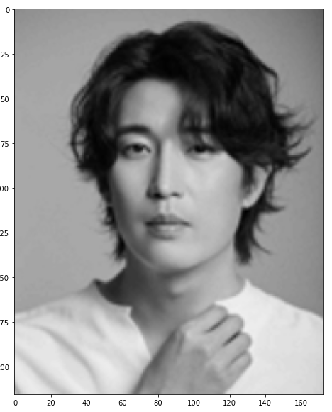
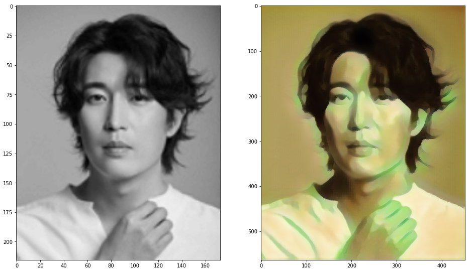
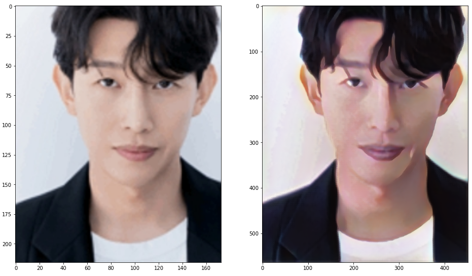
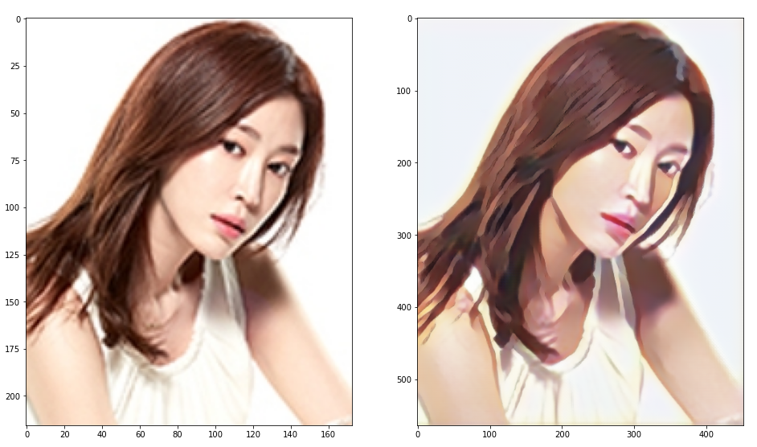
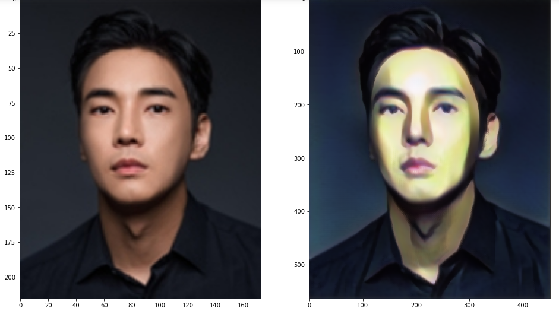
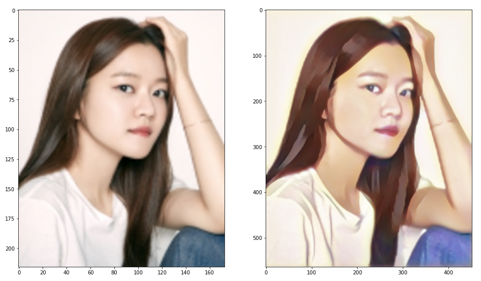
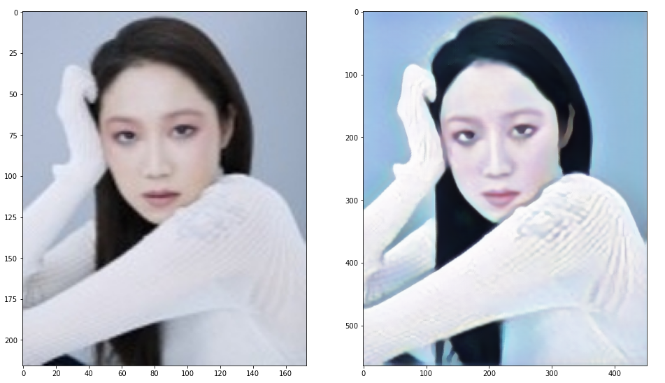

# Cartoon GAN을 이용한 배우 이미지 변환


## 1. CartoonGAN


- GAN 기반으로 만들어진 모델로 실사진을 학습된 화풍으로 변환시켜준다.
- 예시에서 사용할 모델은 Hayao, Hosoda, Shinkai 감독의 화풍이 학습되어있다.


## 2. 코드

### 1) 패키지 로드

```python
import torch
import torchvision.transforms as transforms
import cv2
import matplotlib.pyplot as plt
from network.Transformer import Transformer
```


### 2) cartoonGAN 모델 로드

```python
model = Transformer()
model.load_state_dict(torch.load('pretrained_model/Shinkai_net_G_float.pth'))
model.eval()
print('Model loaded!')
```

- 본 예시는 Shinkai 감독의 화풍으로 학습된 모델을 이용.


### 3) 이미지 전처리

```python
# 이미지 전처리 함수 정의 : 사이즈 조정, tensor 변환
def preprocessing_img(img_size, img_path):
    img = cv2.imread(img_path)

    T = transforms.Compose([
        transforms.ToPILImage(),
        transforms.Resize(img_size, 2),
        transforms.ToTensor()
    ])

    img_input = T(img).unsqueeze(0)

    img_input = -1 + 2 * img_input # 0 - 1 -> -1 - +1

    #plt.figure(figsize=(16, 10))
    #plt.imshow(img[:, :, ::-1])
    
    return img_input, img # 변환, 원본
```

```python
img_input, img = preprocessing_img(450, './image/강경준.jpg')
```



### 4) 이미지 변환

```python
def image_inference(img_input, img):
    img_output = model(img_input)

    img_output = (img_output.squeeze().detach().numpy() + 1.) / 2.
    img_output = img_output.transpose([1, 2, 0])

    fig, axes = plt.subplots(1, 2, figsize=(16, 16))
    axes[0].imshow(img[:, :, ::-1])
    axes[1].imshow(img_output[:, :, ::-1])
```

```python
image_inference(img_input, img)
```



### 5) for문 적용

```python
actor_name = ['강경준', '강기영', '강예원', '강지섭', '고아성', '공효진']

for name in actor_name:
    img_input, img = preprocessing_img(450, f'./image/{name}.jpg')
    image_inference(img_input, img)
```











